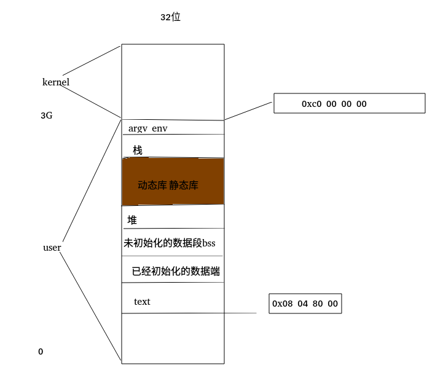

# 进程

## 环境变量

1.最早的main函数有三个参数，第三个为环境变量

2.查看环境变量

​	**key = value**

​	

​		ls的显示颜色

​         shell，home的路径

### 		2.1 shell外部命令

​				磁盘上的二进制文件

### 		2.2 shell的内部命令		

​				进程的调度 管道 

### 		2.3 环境变量的理解

​				程序员与管理员的约定。

​				如：	

​				date默认的格式是中文：

​				

​				是因为环境变量中有这样的定义:


​				可以改变：


​			

​				当然这只是当前终端的改变。

### 			2.4 environ

#### 				   2.4.1  数据结构

​					


#### 							2.4.2 getenv();

​						

#### 							**2.4.3 setenv();**

​									**问题：setenv()在覆盖原来的环境变量时，如果直接覆盖就会遇到大小不匹配的问题**

​									

#### 						    2.4.4 putenv();

​									没有const修饰，少用

## c程序的存储空间布局



### pmap 

pmap+进程ID 查看进程内存布局

## 库

### 动态库

### 手工装载库

动态模块加载

#### dlopen

#### dlclose

#### dlerror

#### dlsym


### void*注意

void* 转函数指针是一种未定义的行为


## 函数跳转

### 函数跳转的必要性

#### 1.异常抛出

#### 2.深度100层的查找算法，找到后需要直接返回

### 3.goto不能够跨函数使用，不能栈恢复。

### 4.setjmp() ;

设置跳转点

 **int setjmp(jmp_buf env);**

返回值：返回两次

设置跳转点时返回0

从longjmp返回的时候是非0值，也就是从别处跳回来返回非0

### 5.longjmp();

从某个位置跳回到跳转点

**void longjmp(jmp_buf env, int val);**

**如果程序员在val中错误地传递了值0，“假”返回将返回1。**

### 6.setjmp，longjmp安全的跳转，涉及到信号时除外

	

## 资源的获取及控制

	

	

### 1.getrlimit()

### 2.setrlimit()


## 进程的基本知识

### 1.进程标识符pid

#### 1.1类型 pid_t 

​	大小不确定最好longlong输出

​	顺次向下使用，不同于文件描述符的分配u

#### 1.2**命令ps**

​	

```
ps axf
TTY 所在的终端
STAT 进程状态
```

	


```
ps axm 查看线程之间的关系
```

	

```
ps ax -l 
LWP 线程编号
```

	


#### 1.3 getpid getppid

获取当前进程的id，获取父进程的pid


### 2.进程的产生

#### 2.1 fork

```
pid_t fork(void);
创建一个进程，复制当前的进程
什么是复制？
执行到的位置一模一样
```

失败返回-1

**调度器的调度策略来决定父子进程的执行顺序**


##### 2.1.1 fork后的父子进程的区别：

1.fork的返回值不一样

2.父子进程的pid不同，ppid不同

3.未决信号和文件锁不继承

4.资源利用量归零

##### 2.1.2 init进程

1号进程，所有进程的祖先进程


##### 2.1.3 fork与fflush

```
  5 int main()
  6 {
  7     pid_t pid;
  8 
  9     printf("[%d]:Begin!\n", getpid());
 10 
 11     pid = fork();
 12     if(pid < 0)
 13     {
 14         perror("fork error:");
 15         exit(-1);
 16     }
 17     if(pid == 0)//child
 18     {
 19         printf("[%d]:Child is working\n", getpid());
 20     }
 21     if(pid > 0)
 22     {
 23         printf("[%d]:Parent is working\n", getpid());
 24     }
 25 
 26     printf("[%d]:End!\n", getpid());
 27 
 28 
 29     return 0;
 30 }
```


1.现象：

上述Begin被打印两次

当printf语句去掉\n后终端上也是两次


2.解决：

​	**加上fflush(NULL);**

3.原因

1.终端是行缓冲，文件是全缓冲

在begin放到缓冲区当中，还没来得及写入到文件里，开始了fork。导致父子进程的缓冲区都有这样的一句缓存。当然进程号在缓冲区里就已经固定了，所以输出的进程号也是父进程的id。


##### 2.1.4 进程状态

父进程活着，子进程消亡，僵尸态。

僵尸态其实占用资源很少，其结构体存了进程id

父进程先于子进程结束，子进程会变为孤儿状态，由init进程来收尸。int进程等待孤儿进程正常结束，然后收尸


#### 2.2 vfork

fork使用了写时复制技术代替了vfork

### 3.进程的消亡及释放资源

#### 3.1 wait();

```
pid_t wait(int *wstatus);
status 可以是0

WIFEXITED(status) //进程正常结束返回真
WEXITSTAUS(status)//正常结束下的进程的退出值
WIFSIGALED(status)//被信号打断时为真
WTWEMSIG(status)//获取打断进程的信号
...
```


#### 3.2 waitpid();

```
pid_t waitpid(pid_t pid, int *wstatus, int options);
wait是死等
waitpid可以有多种等待方式

pid = 0 收同组的子进程
pid = -1 收任何一个子进程
pid < -1 
```

#### 3.3进程分块及交叉分配与池类算法

```
 7 #define LEFT  30000000
  8 #define RIGHT 30000200
  9 #define N 3
 10 
 11 int main()
 12 {
 13     pid_t pid;
 14     int mark;
 15 
 16     for(int n = 0; n < N; n++)
 17     {
 18         pid = fork();
 19         if(pid < 0)
 20         {
 21             perror("fork error:");
 22             for(int i = 0; i < n; i++)
 23                 wait(0);
 24             exit(0);
 25         }
 26         if(pid == 0)
 27         {
 28             for(int i = LEFT + n; i <= RIGHT; i += N)
 29             {
 30                 mark = 1;
 31                 for(int j = 2; j < i/2; j++)
 32                 {
 33                     if(i % j == 0)
 34                     {
 35                         mark = 0;
 36                         break;
 37                     }
 38                 }
 39 
 40                 //printf("[i]%d\n", i);
 41 
 42                 if(mark)
 43                 {
 44                     printf("[%d]%d is a primer\n", n, i);
 45                 }
 46             }
 47 
 48             exit(0);
 49         }
 50     }
 51 
 52 //  puts("run end!");
 53     for(int i = 0; i < N; i++)
 54         wait(NULL);
 55 }

```


### 4.exec函数族

### 5.用户权限及组权限

### 6.解释器文件

### 7.system

### 8.进程会计

### 9.进程时间

### 10.守护进程

会话session。标识sid

终端

setsid

getpgrp


### 11.系统日志


## 12.并发

### 一、信号

同步，异步

异步事件的处理方法：

查询法

通知法

#### 1.信号的概念


#### 2.signal

打断阻塞的系统调用

所有程序的都得重构

```
do
{
		sfd = open(argv[1], O_RDONLY);
		if(sfd < 0)
		{
				if(error != EINTR)
				{
						perror("open()");
						exit(1);	
				}	
		}		

}while(sfd < 0)
```

##### 2.1第二参数并非只能是行为

```
signal(SIGINT, SIG_IGN);
第二参数并非只能是行为
```

##### 2.2打断阻塞的系统调用

```
一直运行的程序，一直按ctrl + c 会被打断
```

##### 2.3让很多程序员崩溃的宏名 EINTR

```
While blocked waiting to complete an open of a slow device (e.g., a FIFO; see fifo(7)), the call was interrupted by a signal handler; see signal(7).
```


#### 3.信号的不可靠

执行现场由内核布置，第一次调用未结束的时候，可能发生第二次调用

#### 4.可重入函数

第一次调用没结束，发生第二次调用不会影响第一次调用的结果

所有的系统调用都是可重入的，一部分库函数也是可重入的。如memcopy


#### 5.信号的响应过程

内核当中有负责发出固定频率的中断的模块

**信号从接收到响应有一个不可避免的延迟。**

标准信号的相应没有一个严格的顺序。是按照信号严重程度的顺序来相应。

**信号依赖中断机制被响应的**


##### 信号如何被忽略掉的

将mask的位永远置为0

##### 标准信号为什么要丢失（因为位图机制）

**程序执行过程中的状态为10,收到信号为11,扎内核回归后，发现收到信号，响应的时候变成00去相应。回来之后变为10,再次判断。**

相应的时候又有信号到来01,响应回来后mask变为11,再做按位与，再次相应。

响应的时候来一万次，位图也是1,不会累加，所以丢失。

##### 我们不能阻止信号的到来，我们能决定信号何时被相应

**实时信号不会丢失**


##### 一直按crtl c 为什么不连续响应？

人为的操作没有系统快

##### 响应的时候为什么mask也置0

##### 不能从信号处理函数随意第往外跳

在信号处理函数之前已经将mask值设置为0，用jump跳出后错过了将mask恢复的步骤，导致屏蔽了信号

标准出来和悉尼，sigsetjmp，siglongjmp可解决这个问题。

#### 6.常用函数

##### kill（）

```
int kill(pid_t pid, int sig);
当pid >0,执行进程发信号
当pid=0,组内广播
当pid=-1,全局广播信号，除了1号（当解除设备挂载时，要求所有进程退出，执行sync同步buffer and catche，解除挂载）
当pid<-1，pgid = 绝对值的组

sig = 0,不会发生信号，用于检测进程或进程组是否存在。返回值加error的值来判断进程是否存在
```


##### raise（）

```
int raise(int sig); 给自己发送信号
```


##### alarm（）

```
unsigned int alarm(unsigned int seconds);
```

	

1秒后结束


##### pause（）

```
int pause(void); 等待信号来打断它
解决忙等
```

	

##### abort（）

给自己发abort信号，认为制造异常，杀掉当前进程

##### system（）

**使用在信号相关的程序中需要忽略掉两个信号，阻塞一个信号**

##### sleep（）

有问题，尽量少用。有的环境是由pause和alarm进行封装的。

源码当中有sleep，不看也罢。

sleep要么是程序员写的测试语句忘了删掉。要么这个程序员是个棒锤。

假设

```
sleep

{

​	alarm()

​	pause

}


sleep（1）;
alarm(5)
```

程序是不正常的，只响应5秒。

##### 替换sleep

###### nanosleep（）

###### usleep（）

###### select()

```
附带作用，超时设置
```

linux环境用alarm没有事是因为sleep由**nanosleep**封装的

##### 综合案例：令牌桶

xutuzhi/C++/C/Process/src/signal/streamcontrol/mytbf

**使用单一计时器，构造一组函数，实现任意数量的计时器**

##### sig_atomic_t 

```
保证在这种类型的变量的赋值操作，一定是一条指令完成的。
```


#### 7.信号集

​	信号集类型：sigset_t

1. sigemptyset
2. sigfillset
3. sigaddset
4. sigdelset
5. sigismember


#### 8.信号屏蔽字和信号pending集的处理

###### 人为设置mask的值

```
 14     sigset_t set, oset;
 15 
 16     sigemptyset(&set);
 17     sigaddset(&set, SIGINT);
 18 
 19 
 20     //signal(SIGINT, SIG_IGN);
 21     signal(SIGINT, int_handler);
 22 
 23 
 24     for(int j = 0; j < 1000; j++)
 25     {
 26         //sigprocmask(SIG_BLOCK, &set, NULL);   
 27         sigprocmask(SIG_BLOCK, &set, &oset);    
 28 
 29         for(int i = 0; i < 5; i++)
 30         {
 31             write(1, "*", 1);
 32             sleep(1);
 33         }
 34         write(1, "\n", 1);
 35         //sigprocmask(SIG_UNBLOCK, &set, NULL);
 36         sigprocmask(SIG_SETMASK, &oset, NULL);
 37     }

```

**特别注意**

 19     //我要保证我的模块不改变任何状态

```
 20     //sigprocmask(SIG_UNBLOCK, &set, &saveset)；//着重在获取改变之前的状态
 21     //sigprocmask(SIG_SETMASK, &saveset, NULL);
```

###### sigpending

**没卵用**

#### 9.扩展

##### sigsuspend（）

###### 信号驱动程序

/home/zy/桌面/notes/xutuzhi/C++/C/Process/src/signal

##### sigaction()

##### setitimer();

1. 误差不累积
2. 写程序用到时钟尽量用settimer

```
 25     struct itimerval itv;
 26 
 27     if(argc < 2)
 28     {
 29         fprintf(stderr, "usage: %s desfile\n", argv[0]);
 30         exit(1);
 31     }
 32 
 33     itv.it_interval.tv_sec = 1;
 34     itv.it_interval.tv_usec = 0;
 35 
 36     itv.it_value.tv_sec = 1;
 37     itv.it_value.tv_usec = 0;
 38 
 39     //alarm(1);
 40     if(setitimer(ITIMER_REAL, &itv, NULL) < 0)
 41     {
 42         perror("setitmer failed:");
 43         exit(1);
 44     }

```


#### 10.实时信号

