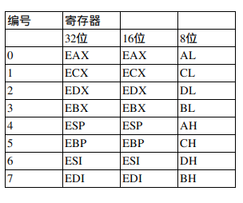

# 滴水逆向

## 32位通用寄存器

	


## **标志寄存器**

Carry Flag **最高位**进位时置1 **无符号运算**

Parity Flag 结果中1的奇偶性

Auxiliary Carry Flags w/2进位时置1

Zero Flag 结果为0时置1 xor 与mov 指令**获得0的主要区别是，mov指令不会置标志寄存器** 

Sign Flag 最高位为1时置1

Overflow Flag  溢出标志 **有符号**

```

```

