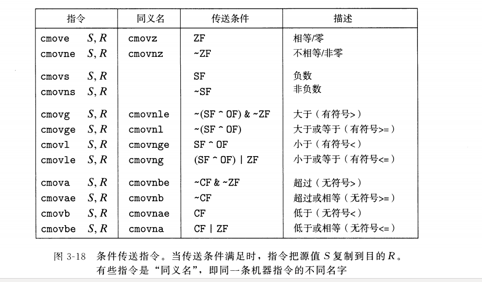
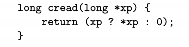
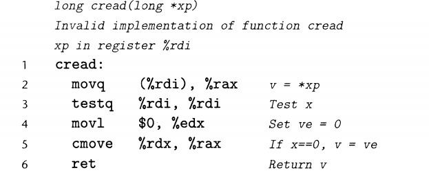
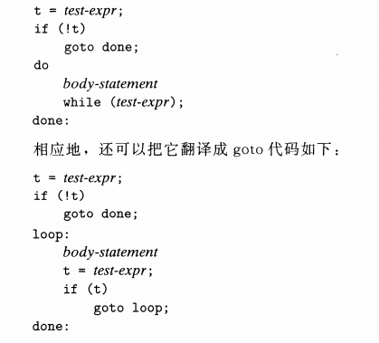
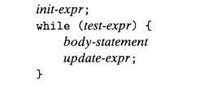
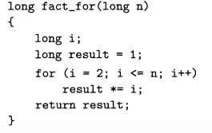
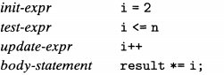
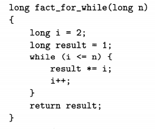
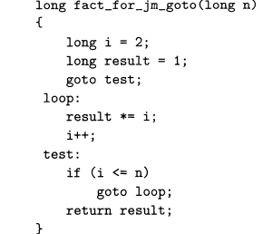

# 深入理解计算机系统

## 第三章 程序的机器级表示

### 3.2.2 代码实例 

### 3.2.2.1如何展示程序的字节表示

	

### 3.2.2.2查看机器代码文件内容的反汇编器

	


	


### 3.2.2.3 访问机器的低级特性

1.使用汇编代码写整个函数

2.利用GCC的支持，直接在c程序中嵌入汇编代码

#### 3.2.2.3.1 intel 汇编的生成

```
gcc -Og -S -masm=intel mstore.c
```

	

#### 3.2.2.3.2 C语言访问不到的低级特性

**虽然C编译器在把程序中表达的计算转换到机器代码方面表现出色**，但是仍然有一 些机器特性是C程序访问不到的。例如，每次x86-64处理器执行算术或逻辑运算时,如果得到的运算结果的**低8位中有偶数个l,**那么就会把一个名为PF的1位条件码 (conditioncode)标志设置为1,否则就设置为0。这里的PF表示“parity flag(奇偶标 志)″。在c语言中计算这个信息需要至少7次移位、掩码和异或运算(参见习题2.65)。即使作为每次算术或逻辑运算的一部分,硬件都完成了这项计算,而C程序却无法知道 PF条件码标志的值。在程序中插入几条汇编代码指令就能很容易地完成这项任务。

在C程序中插入汇编代码有两种方法。第一种是,我们可以编写完整的函数,放进 一个独立的汇编代码文件中,让汇编器和链接器把它和用C语言书写的代码合并起来。第二种方法是,我们可以使用GCC的内联汇编(inlineassembly)特性,用asm伪指令可 以在C程序中包舍简短的汇编代码。这种方法的好处是减少了与机器相关的代码量。

当然,在C程序中包含汇缩代码使得这些代码与某类特殊的机器相关(例如x86- 64),所以只应该在想要的特性只能以此种方式才能访问到时才使用它。

	

### 3.3 数据格式


如图所示,大多数GCC生成的汇编代码指令都有一个字符的后缀,表明操作数的大小。例如,数据传送指令有四个变种: moVb(传送字节)、 moVW(传送字)、 moVl(传送双 字)和movq(传送四字)。后缀‘l’用来表示双字,因为32位数被看成是“长字(long word)。)″。注意,**汇编代码也使用后缀‘l’来表示4字节整数和8字节双精度浮点数**。这不 会产生歧义,因为浮点数使用的是一组完全不同的指令和寄存器。


### 3.4 通用目的寄存器

一个x86-64的中央处理单元(CPU)包含一组16个存储64位值的通用目的寄存器。这些寄存器用来存储整数数据和指针。图3-2显示了这16个寄存器。它们的名字都以笔r 开头,不过后面还跟着一些不同的命名规则的名字,这是由于指令集历史演化造成的。最初的8086中有8个16位的寄存器,即图3-2中的%ax到%bp。每个寄存器都有特殊的用 途,它们的名字就反映了这些不同的用途。扩展到IA32架构时,这些寄存器也扩展成32 位寄存器,标号从%eax到%ebp。扩展到x86-64后,原来的8个寄存器扩展成64位,标 号从%rax到%rbpo除此之外,还增加了8个新的寄存器,它们的标号是按照新的命名规 则制定的,从宅r8到宅r15。

	

如图3-2中嵌套的方框标明的,指令可以对这16个寄存器的低位字节中存放的不同 大小的数据进行操作。字节级操作可以访问最低的字节, 16位操作可以访问最低的2个字 节, 32位操作可以访问最低的4个字节,而64位操作可以访问整个寄存器。

在后面的章节中,我们会展现很多**指令,复制和生成1字节、 2字节、 4字节和8字 节值**。当这些指令以寄存器作为目标时,对于生成小于8字节结果的指令,寄存器中剩下 的字节会怎么样,对此有两条规则:**生成1字节和2字节数字的指令会保持剩下的字节不 变**;生**成4字节数字的指令会把高位4个字节置为O。 后面这条规则是作为从IA32到 x86-64的扩展的一部分而采用的。**

就像图3-2右边的解释说明的那样,在常见的程序里不同的寄存器扮演不同的角色。其中最特别的是栈指针持sp,用来指明运行时栈的结束位置。有些程序会明确地读写这个寄存器。另外15个寄存器的用法更灵活。少量指令会使用某些特定的寄存器。更重要的是,有一组标准的编程规范控制着如何使用寄存器来**管理栈**、**传递函数参数**、从**函数的返 回值**,以及**存储局部和临时数据**。我们会在描述过程的实现时(特别是在3.7节中),讲述这些惯例。


#### 3.4.1操作数指示符


大多数指令有一个或多个操作数(operand),指示出执行一个操作中要使用的源数据 值,以及放置结果的目的位置。X86-64支持多种操作数格式(参见图3-3)。源数据值可以以常数形式给出,或是从寄存器或内存中读出。结果可以存放在寄存器或内存中。因此,各种不同的操作数的可能性被分为三种类型。第一种类型是**立即数**(immediate),用来表示常数值。在ATT格式的汇编代码中,立即数的书写方式是‘$’后面跟一个用标准C表示法表示的整数,比如, S-577或soxlFo 不同的指令允许的立即数值范围不同,汇编器会自动选择最紧凑的方式进行数值编码。

第二种类型是**寄存器**(register),它表示某个寄存器的内容, 16个寄存器的低位1字节、 2字节、 4字节或8字节中的一个作为操作数,这些字节数分别对应于8位、 16位、 32位或64位。在图3-3中,我们用符号ra来表示任意寄存器α,用引用R[ra]来表示它的值,这是将寄存器集合看成一个数组R,用寄存器标 识符作为索引。

第三类操作数是**内存引用**,它会根据计算出来的地址(通常称为有效地址)访问某个内 存位置。因为将内存看成一个很大的字节数组,我们用符号讥[Addr]表示对存储在内存 中从地址A拍r开始的6个字节值的引用。为了简便,我们通常省去下标b。

如图3-3所示,有多种不同的寻址模式,允许不同形式的内存引用。表中底部用语法 ′仍仍(ro, r., S)表示的是最常用的形式。这样的引用有四个组成部分:一个**立即数偏移Imm** 一个**基址寄存器**Rb,一个**变址寄存器**Ri和一个**比例因子s,**这里s必须是1、 2、 4或者8.基址和变址寄存器都必须是64位寄存器。有效地址被计算为Imm+R[rb]+R[ri].s。引 用数组元素时,会用到这种通用形式。其他形式都是这种通用形式的特殊情况,只是省略 了某些部分。正如我们将看到的,当引用数组和结构元素时,比较复杂的寻址模式是很有 用的。

#### 3.4.2 数据传送指令

最频繁使用的指令是将数据从一个位置复制到另一个位置的指令。操作数表示的通用 性使得一条简单的数据传送指令能够完成在许多机器中要好几条不同指令才能完成的功 能。我们会介绍多种不同的数据传送指令,它们或者源和目的类型不同,或者执行的转换 不同,或者具有的一些副作用不同。在我们的讲述中,把许多不同的指令划分成**指令类**, 每一类中的指令执行相同的操作,只不过操作数大小不同。

图3-4列出的是最简单形式的数据传送指令一MOv类。这些指令把数据从源位置 复制到目的位置,不做任何变化o MOV类由四条指令组成‥ moVb、 moVW、 moVl和 m°vqo这些指令都执行同样的操作;主要区别在于它们操作的数据大小不同:分别是1、 2、 4和8字节。


源操作数指定的值是一个立即数,存储在寄存器中或者内存中。目的操作数指定一个 位置,要么是一个寄存器或者,要么是一个内存地址o x**86-64加了一条限制,**传送指令的 **两个操作数不能都指向内存位置**。将一个值从一个内存位置复制到另一个内存位置需要两 条指令一**第一条指令将源值加载到寄存器**中,第二条将**该寄存器值写人目的位置**。参考 图3-2,这些指令的寄存器操作数可以是16个寄存器有标号部分中的任意一个,寄存器部分的大小必须与指令最后一个字符(‘b’, ‘w’, ‘l’或‘q’)指定的大小匹配。大多数情况 中, MOv指令只会更新目的操作数指定的那些寄存器字节或内存位置。造成这个例外的 原因是x86-64采用的惯例,**即任何为寄存器生成32位值的指令都会把该寄存器的高位部 分置成0。**

下面的MOv指令示例给出了源和目的类型的五种可能的组合。记住,第一个是源操 作数,第二个是目的操作数：


图3-4中记录的最后一条指令是处理64位立即数数据的。常规的m〇vq指令只能以袁 示为32位补码数字的立即数作为源操作数,然后把这个值符号扩展得到64位的值,放到 目的位置o **movabsq**指令能够以任意64位立即数值作为源操作数,并且只能以寄存器作 为目的。


图3-5和图3-6记录的是两类数据移动指令,在将较小的源值复制到较大的目的时使 用。所有这些指令都把数据从源(在寄存器或内存中)复制到目的寄存器。MOvZ类中的 指令把目的中剩余的字节填充为0,而MOvS类中的指令通过符号扩展来填充,把源操作 的最高位进行复制。可以观察到,每条指令名字的最后两个字符都是大小指示符:第一个 字符指定源的大小,而第二个指明目的的大小。正如看到的那样,这两个类中每个都有三 条指令,包括了所有的源大小为1个和2个字节、目的大小为2个和4个的情况,当然只 考虑目的大于源的情况。

##### 3.4.2.1理解数据传送如何改变目的寄存器

正如我们描述的那样,关于数据传送指令是否以及如何修改目的寄存器的高位字节 有两种不同的方法。下面这段代码序列会说明其差别: 


在接下来的讨论中,我们使用十六进制表示。在这个例子中,第1行的指令把寄存器宅 rax初始化为位模式00112233445566770 剩下的指令的源操作数值是立即数值一10 回想一 1的十六进制表示形如FF…F,这里F的数量是表述中字节数量的两倍。因此m°vb指令 (第2行)把扯ax的低位字节设置为FF,而mow指令(第3行)把低2位字节设置为FFFF, 剩下的字节保持不变. movl指令(第4行)将低4个字节设置为FFFFFFFF,同时把高位4 字节设置为000000000最后m°vq指令(第5行)把整个寄存器设置为FFFFFFFFFFFFFFFF.

注意图3-5中并没有一条明确的指令**把4字节源值零扩展到8字节目的**。这样的指令 逻辑上应该被命名为movzlq,但是并没有这样的指令.。不过,这样的数据传送可以用以 寄存器为目的的movl指令来实现.现。这一**投术利用的属性是******,生成4字节值并以寄存器作 为目的的指令会把高4字节置为0。***

对于64位的目标,**所有三种源类型都有对应的符号扩 展传送,而只有两种较小的源类型有零扩展传送**。

图3-6还给出cltq指令。这条指令没有操作数:它总是以寄存器?eax作为源,frax作 为符号扩展结果的目的。它的效果与指令m〇VSlq %eax,frax完全一致,不过编码更紧凑。

**x86-64中的内存引用总是用四字长寄存器给出**

##### 3.4.2.2 mov指令常见错误


#### 3.4.3 数据传送示例

```
   3 long exchange(long* xp, long y)
  4 {
  5     long x = *xp;
  6     *xp = y;
  7     return x;
  8 }
 
 9 exchange:
 10     movq    (%rdi), %rax
 11     movq    %rsi, (%rdi)
 12     ret
```

如图3-7b所示,函数exchange由三条指令实现:两个数据传送(movq),加上一条返回函数被调用点的指令(ret)。我们会在3.7节中讲述函数调用和返回的细节。在此之前,**知道参数通过寄存器传递给函数就足够**了。我们对汇编代码添加注释来加以说明。**函数通过把值存储在寄存器宅rax或该寄存器的某个低位部分中返回**。

当过程开始执行时,过程参数xp和y分别存储在寄存器%rdi和%rsi中。然后,指 令2从内存中读出x,把它存放到寄存器宅rax中,直接实现了C程序中的操作x=★xpo稍 后,用寄存器持ax从这个函数返回一个值,因而返回值就是xo指令3将y写人到寄存 器%rdi中的xp指向的内存位置,直接实现了操作★xp=yo这个例子说明了如**何用MOV 指令从内存中读值到寄存器(第2行),如何从寄存器写到内存(第3行)。**

关于这段汇编代码有两点值得注意。首先,我们看到C语言中**所谓的“指针”其实就 是地址**。**间接引用指针**就是将**该指针放在一个寄存器中,**然后在**内存引用中使用这个寄存 器**。其次,**像x这样的局部变量**通常是**保存在寄存器**中,而不是内存中。**访问寄存器比访 问内存要快得多**。

##### 3.4.3.1 汇编实现强制类型转换


#### 3.4.4 压入和弹出栈数据


最后两个数据传送操作可以将数据压人程序栈中,以及从程序栈中弹出数据,如图3-8 所示。正如我们将看到的,栈在处理过程调用中起到至关重要的作用。栈是一种数据结 构,可以添加或者删除值,不过要遵循“后进先出”的原则。通过push操作把数据压人 栈中,通过pop操作删除数据;它具有一个属性:弹出的值永远是最近被压人而且仍然在 栈中的值。栈可以实现为一个数组,总是从数组的一端插人和删除元素。这一端被称为栈 项。在x86-64中,程序栈存放在内存中某个区域。如图3-9所示,栈向下增长,这样一 来,栈顶元素的地址是所有栈中元素地址中最低的。 (根据惯例,我们的栈是倒过来画的, 栈“顶”在图的底部。)栈指针持sp保存着栈顶元素的地址。

pushq指令的功能是把数据压人到栈上,而popq指令是弹出数据。这些指令都只有 一个操作数一压人的数据源和弹出的数据目的。

将一个四字值压人栈中,首先要将栈指针减8,然后将值写到新的栈顶地址。因此, 指令pushq %rbp的行为等价于下面两条指令:


它们之间的区别是在机器代码中pushq指令编码为**1个字节**,而上面那两条指令一共需要 **8个字节**。


图3-9中前两栏给出的是,当%rsp为OxlO8,%rax为Ox123时,执行指令 pushq%rax的效果。首先%rsp会减8,得到Oxlo,然后会将Ox123存放到内存地址 Oxlo处。


弹出一个四字的操作包括从栈顶位置读出数据,然后将栈指针加80 因此,指令p〇pq 宅rax等价于下面两条指令:


图3-9的第三栏说明的是在执行完pushq后立即执行指令popq frdx的效果。先从内 存中读出值Ox123,再写到寄存器%rdx中,然后,寄存器%rsp的值将增加回到OxlO80 如图中所示,值Ox123仍然会保持在内存位置OxloO中,直到被覆盖(例如被另一条人栈 操作覆盖)。无论如何,%rsp指向的地址总是栈顶。 因为栈和程序代码以及其他形式的程序数据都是放在同一内存中,所以程序可以用标 准的内存寻址方法访问栈内的任意位置。例如,假设栈顶元素是四字,指令movq8(宅 rsp) ,笔rdx会将第二个四字从栈中复制到寄存器笔rdxo


### 3.5 算术和逻辑操作

**整数算术操作。加载有效地址(leaq)指令通常用来执行简单的算术操作。其余的指令 是更加标准的一元或二元操作。我们用>> A和>>.来分别表示算术右移和逻辑右移。 注意,这里的操作顺序与ATT格式的汇编代码中的相反**


图3-10列出了x86-64的一些整数和逻辑操.作。大多数操作都分成了指令类,这些指 令类有各种带不同大小操作数的变种(只有Ieaq没有其他大小的变种)。例如,指令类 ADD由四条加法指令组成‥ addb、 addw、 addl和addq,分别是字节加法、字加法、双 字加法和四字加法。事实上,给出的每个指令类都有对这四种不同大小数据的指令。这些操作被分为四组:加载有效地址、一元操作、二元操作和移位.二元操作有两个操作数, 而一元操作有一个操作数。这些操作数的描述方法与3.4节中所讲的一样。

#### 3.5.1加载有效地址 leap

加载有效地址(load effective address)指令Ieaq实际上是movq指令的变形.它的指 令形式是从内存读数据到寄存器,但实际上它根本就没有引用内存。它的第一个操作数看 上去是一个内存引用,但该指令并不是从指定的位置读人数据,而是将有效地址写人到目 的操作数。在图3-10中我们用C语言的地址操作符&s说明.这种计算这条指令可以**为后 面的内存引用产生指针**.另外,它还可以**简洁地描述普通的算术操作**。例如,如果寄存 器%rdx的值为x,那指令Ieaq 7(%rdx,%rdx,4),frax将设置寄存器%rax的值为5工+ 70编译器经常发现Ieaq的一些灵活用法,根本就与有效地址计算无关。目**的操作数必须 是一个寄存器**。

为了说明Ieaq在编译出的代码中的使用,看看下面这个C程序:

```
  1 
  2 long scale(long x, long y, long z)
  3 {
  4     long t = x + 4 * y + 12 * z;
  5     return t;
  6 }

```

```
  2 x in rdi, y in rsi z in rdx
  3 
  4 scale:
  5     leaq    (%rdi,%rsi,4), %rax 
  6     
  7     //x + 4y
  8     
  9     leaq    (%rdx,%rdx,2), %rcx
 10     
 11     z + 2z = 3z
 12     
 13     leaq    0(,%rcx,4), %rdx
 14     
 15     3z * 4 = 12z
 16     
 17     addq    %rdx, %rax
 18     
 19     x + 4y + 12z
 20     ret

```

leaq指令能执行加法和有限形式的乘法,在编译如上简单的算术表达式时,是很有用处的。

##### 3.5.1.1 xor

```
xorq %rdx,%rdx
1.这个指令将%rdx置为0,运用了对任意x，x^x=0 这一属性。它对应于c语句x=0。
2.将寄存器%rdx设置为0的更直接的方法是用指令 movq $0, %rdx
3.xorq 实现需要三个字节;movq 实现需要7个字节。
```

**其它将%rdx设置为0的方法都依赖于这样一个属性，即任何更新低位4字节的指令都会把高位字节设置为0.因此我们可以使用xorl %edx，%edx（2字节）或movl $0, %edx(5字节)**


#### 3.5.2 一元和二元操作

第二组中的操作是一元操作,只有一个操作数,既是源又是目的。这个操作数可以是 一个寄存器,也可以是一个内存位置。比如说,指令incq(%rsp)会使栈顶的8字节元素 加10 这种语法让人想起C语言中的加1运算符(++)和减1运算符(一一)。

第三组是二元操作,其中,第二个操作数既是源又是目的。这种语法让人想起C语言 中的赋值运算符,例如x一=yo不过,要注意,源操作数是第一个,目的操作数是第二个, 对于不可交换操作来说,这看上去很奇特。例如,指令subq frax,frdx使寄存器frdx的 值减去%rax中的值。 (**将指令解读成“从%rdx中减去?rax**”会有所帮助。)第一个操作数 可以是立即数、寄存器或是内存位置。第二个操作数可以是寄存器或是内存位置。注意, **当第二个操作数为内存地址时,处理器必须从内存读出值,执行操作,再把结果写回 内存**。


#### 3.5.3 移位操作

最后一组是移位操作,先给出移位量,然后第二项给出的是要移位的数。可以进行算 术和逻辑右移。移位量可以是一个立即数,或者放在单字节寄存器宅cl中。 (这些指令很 特别,因为只允许以这个特定的寄存器作为操作数。)原则上来说, 1个字节的移位量使得 移位量的编码范围可以达到28-1==2550.x86-64中,移位操作对砂位长的数据值进行操 作,移位量是由宅cl寄存器的低仍位决定的,这里2加…砂。高位会被忽略。**所以,例如当 寄存器%cl的十六进制值为OxFF时,指令salb会移7位, Salw会移15位, Sall会移 31位,而salq会移63位。**


#### 3.5.5 特殊的算术操作

正如我们在2.3节中看到的,两个64位有符号或无符号整数相乘得到的乘积需要128 位来表示。x86-64指令集对128位(16字节)数的操作提供有限的支持。延续字(2字节)、 双字(4字节)和四字(8字节)的命名惯例, Intel把16字节的数称为八字(oct word)。图3-12 描述的是支持产生两个64位数字的全128位乘积以及整数除法的指令。


imulq指令有两种不同的形式。其中一种,如图3-10所示,是IMUL指令类中的一 种。这种形式的imulq指令是一个“双操作数”乘洼指令。它从两个64位操作数产生一 个64位乘积。

此外, x86-64指令集还提供了两条不同的“单操作数”乘法指令以计算两个64位 值的全128位乘积积一一个是无符号数乘法(mulq),而另一个是补码乘法(imulq)。这两 条指令都要求一**个参数必须在寄存器%rax中**,而另一个作为指令的源操作数给出。然后 乘**积存放在寄存器%rdx(高64位)和%rax(低64位)中**。虽然imulq这个名字可以用于两 个不同的乘洼操作,但是汇编器能够通过计算操作数的数目,分辨出想用哪条指令。

下面这段C代码是一个示例,说明了如何从两个无符号64位数字x和y生成128位 的乘积:

```
  1 #include <inttypes.h>
  2 
  3 //dest in %rdi, x in %rsi, y in %rdx
  4 
  5 /*
  6   1     movq    %rsi, %rax
  7   2     mulq    %rdx
  8   3     movq    %rax, (%rdi)
  9   4     movq    %rdx, 8(%rdi)
 10   5     ret
 11 */
 12 
 13 typedef unsigned __int128 uint128_t;
 14 
 15 void store_uprod(uint128_t* dest, uint64_t x, uint64_t y )
 16 {
 17     *dest = x * (uint128_t) y;
 18 }
 19
```

可以观察到,存储乘积需要两个movq指令:一个存储低8个字节(第4行),一个存 储高8个字节(第5行)。由于生成这段代码针对的是**小端法机器**,所以高位字节存储在大 地址,正如地址8(%rdi)表明的那样。

前面的算术运算表(图3-10)没有列出除法或取模操作。这些操作是由单操作数除法指 令来提供的,类似于单操作数乘法指令。有符号除法指令idivl将寄存器%rdx(高64位) 和持ax(低64位)中的128位数作为被除数，而除数作为指令的操作数给出。指令将商存 储在寄存器持ax中,将余数存储在寄存器笔rdx中。

对于大多数64位除法应用来说,除数也常常是一个64位的值。这个值应该存放在宅 rax中,frdx的位应该设置为全0(无符号运算)或者%rax的符号位(有符号运算)。后面这 个操作可以用指令cqto来完成。**这条指令不需要操作数一它隐含读出扯%rax的符号位, 并将它复制到%rdx的所有位。**

```
  1 void remdiv(long x, long y, long* qp, long* rp)
  2 {
  3     long q = x / y;
  4     long r = x % y;
  5     *qp = q;
  6     *rp = r;
  7 }
  8     
  9 /*  
 10 
 11     //x in %rdi, y in %rsi, qp in %rdx, rp in %rcx
 12   8     movq    %rdi, %rax
 13   9     movq    %rdx, %rdi
 14 //在上述代码中,必须首先把参数qp保存到另一个寄存器中(第2行),因为除法操作
 15 //要使用参数寄存器扯%rdx
 16  10     cqto
 17 //它隐含读出扯%rax的符号位,
 18 //并将它复制到笔%rdx的所有位。
 19  11     idivq   %rsi
 20 //有符号除法指令idivl将寄存器%rdx(高64位)
 21 //和持%rax(低64位)中的128位数作为被除数,而除数作为指令的操作数给出
 22  12     movq    %rax, (%rdi)
 23 //指令将商存储在寄存器持%rax中
 24  13     movq    %rdx, (%rcx)
 25 //将余数存储在寄存器笔%rdx中。
 26  14     ret
 27 */ 
```

**无符号除法使用divq指令。通常,寄存器%rdx会事先设置为0.**


### 3.6 控制

到目前为止,我们只考虑了直线代码的行为,也就是指令一条接着一条顺序地执行.C语言中的某些结构,比如条件语旬、循环语旬和分支语句,要求有条件的执行,根据数 据测试的结果来决定操作执行的顺序。机器代码提供**两种基本的低级机制**来实现**有条件的 行为**:**测试数据值**,然后根据测试的结果来改变**控制流或者数据流**。

与**数据相关的控制流**是实现有条件行为的更一般和更常见的方法,所以我们先来介绍 它。通常, C语言中的语句和机器代码中的指令都是按照它们在程序中出现的次序,顺序 执行的。用jump指令可以改变一组机器代码指令的执行顺序, jump指令指定控制应该被 传递到程序的某个其他部分,可能是依赖于某个测试的结果.编**译器必须产生构建在这种 低级机制基础之上的指令序列,来实现C语言的控制结构**。

本文会先涉及**实现条件操作**的两种方式,然后描述**表达循环**和**switch**语句的方法.

#### 3.6.1条件码

除了整数寄存器, CPU还维护着一组单个位的条件码(condition code)寄存器，器,它们 描述了最近的**算术或逻辑操作**的**属性**。可以检测这些寄存器来执行条件分支指令。最常用 的条件码有:

**CF:进位标志。**最近的操作使最高位产生了进位。可用来检查无符号操作的溢出。

**ZF:零标志**。最近的操作得出的结果为0。

**SF:符号标志**。最近的操作得到的结果为负数o

**OF:溢出标志。**最近的操作导致一个补码溢出一正溢出或负溢出。


比如说,假设我们用一条ADD指令完成等价于C表达式t=a+ b的功能,这里变量 a、 b和t都是整型的。然后,根据下面的C表达式来设置条件码:

	

I**eaq指令不改变任何条件码**,因为它是用来进行地址计算的。除此之外,图3-10中 列出的所有指令都会设置条件码。对于**逻辑操作,**例如xor,进位标志和溢出标志会设 置成0.对于**移位操作**,进位标志将设置为最后一个被移出的位,而溢出标志设置为0.**INC和DEC**指令会**设置溢出和零标志,**但是不会改变进位标志,**至于原因,我们就不在 这里深人探讨了**。


	


除了图3-10中的指令会设置条件 码,还有**两类指令**(有8、 16、 32和64 位形式),它们只**设置条件码**而不改变任 何其他寄存器;如图3-13所示o CMP指 令根据两个操作数之差来设置条件码。除了只设置条件码而不更新目的寄存器 之外, **CMP指令**与**SUB指令**的行为是 一样的。在ATT格式中,列出操作数的 顺序是相反的,这使代码有点难读。如 果两个操作数相等,这些指令会将零标 志设置为1,而其他的标志可以用来确定 两个操作数之间的大小关系.**TEST**指 令的行为与AND指令一样,除了它们只 设置条件码而不改变目的寄存器的值。典型的用法是,**两个操作数是一样的(例如, TESTq %rax,%rax用来检查%rax是负数、 零,还是正数**),或**其中的一个操作数是一个掩码,用来指示哪些位应该被测试**。

#### 3.6.2 访问条件码	

	

条件码通常不会直接读取,常用的使用方法有三种: 1)可以根据条件码的某种组合, 将一个字节设置为0或者1, 2)可以条件跳转到程序的某个其他的部分, 3)可以有条件地 传送数据。对于第一种情况,图3-14中描述的指令根据条件码的某种组合,将一个字节 设置为0或者1。我们将这一整类指令称为SET指令;它们之间的区别就在于它们考虑的 条件码的组合是什么,，这些指令名字的不同后缀指明了它们所考虑的条件码的组合。这些 指令的后缀表**示不同的条件**而不是操作数大小,了解这一点很重要。例如,指令setl和 setb表示“小于时设置(set less)”和“低于时设置(set below)”,而不是“设置长字(set long word)”和“设置字节(set byte)”。

**一条SET指令的目的操作数**是**低位单字节寄存器元素(图3-2)之一**,或是**一个字节的 内存位置**,指令会将这个字节设置成0或者1。为了得到一个32位或64位结果,我们必 须对高位清零。一个计算C语言表达式**a< b**的典型指令序列如下所示,这里a和b都是 long类型:

	

注意cmpq指令的比较顺序(第2行)。虽然参数列出的顺序先是%rsi(b)再是%rdi(a), 实际上比较的是a和b，还要记得,正如在3.4.2节中讨论过的那样, moVZbl指令不仅会 把%eax的高3个字节清零,还会把整个寄存器%rax的高4个字节都清零。

某些底层的机器指令可能有多个名字,我们称之为“同义名(synonym)″。比如说, setg(表示“设置大于”)和setnle(表示“设置不小于等于”)指的就是同一条机器指令。 编译器和反汇编器会随意决定使用哪个名字。

虽然所有的算术和逻辑操作都会设置条件码,但是各个SET命令的描述都适用 的情况是:执行比较指令,根据计算t=a-b设置条件码。更具体地说,假设α、 6和‘ 分别是变量a、 b和t的补码形式表示的整数,因此仁==α一∴6,这里砂取决于α和6 的大小。

来看sete的情况,即“当相等时设置(setwhenequal)”指令。当当cz…Z,时,会得到r=O, 因此零标志置位就表示相等。类似地，考虑用setl,即“当小于时设置(set whenless)”指令,测试一个有符号比较。当没有发生溢出时(OF设置为0就表明无溢出),我们有当α一b<0 时a<b,,将SF设置为1即指明这一点,而当a-b>=0时a>b,由sF设置为0指明.另一 方面,当发生溢出时,我们有当α一b>0(负溢出)时a<b,而当a-b<0(正溢出)时α>b.当a=b时,不会有溢出。

注意到机器代码如何区分有符号和无符号值是很重要的。**同C语言不同,机器代码不 会将每个程序值都和一个数据类型联系起来。**相反,大多数情况下,机器代码对于有符号 和无符号两种情况都使用一样的指令,这是因为许多算术运算对无符号和补码算术都有一 样的位级行为。有些情况需要用不同的指令来处理有符号和无符号操作,例如,使用不同 版本的右移、除法和乘法指令,以及不同的条件码组合。

#### 3.6.3 跳转指令

正常执行的情况下,指令接照它们出现的顺序一条一条地执行。跳转(jump)指令会导 致执行切换到程序中一个全新的位置。在汇编代码中,这些跳转的目的地通常用一个标号 (label))指明。考虑下面的汇编代码序列(完全是人为编造的):

	

指令jmp.Ll会导致程序跳过movq指令,而从popq指令开始继续执行在产生目标 代码文件时,**汇编器**会确定**所有带标号指令的地址**,并将**跳转目标**(目的指令的地址)编码 为**跳转指令**的一部分。

	

图3-15列举了不同的跳转指令。jmp指令是无条件跳转。它可以是**直接跳转**,即**跳转 目标**是**作为指令的一部分**编码的;也可以是间接跳转,即跳转目标是从寄存器或内存位置 中读出的。汇编语言中,直接跳转是给出一个标号作为跳转目标的,例如上面所示代码中 的标号“.Ll″。间接跳转的写法是‘★ ’后面跟一个操作数指示符,使用图3-3中描述的内 存操作数格式中的一种。举个例子,指令

```
jmp *%rax
```

用寄存器%rax中的值作为跳转目标,而指令

```
jmp*(%rax)
```

以%rax中的值作为读地址,从内存中读出跳转目标。

表中所示的其他跳转指令都是有条件的,它们根据**条件码的某种组合**,或者**跳转**, 或者**继续执行代码序列中下一条指令**。这些指令的名字和跳转条件与sET指令的名字和 设置条件是相匹配的(参见图3-14）。)同SET指令一样,一些底层的机器指令有多个名字。 **条件跳转只能是直接跳转**。


#### 3.6.4 跳转指令的编码

虽然我们不关心机器代码格式的细节,但是理解跳转指令的目标如何编码,这对第**7章研究链接**非常重要。此外,它也能帮助理**解反汇编器**的输出。在汇编代码中,跳转目标 用符号标号书写。汇编器,以及后来的链接器,会产生跳转目标的适当编码。跳转指令有 几种不同的编码,但是最常用都是PC相对的(PC-relative)。也就是,它们会将**目标指令 的地址与紧跟在跳转指令**后面那条指令的地址之间的差作为编码。这些地址偏移量可以编 码为l、 2或4个字节。第二种编码方洼是给出“绝对”地址,用4个字节直接指定目标。汇编器和链接器会选择适当的跳转目的编码。

下面是一个PC相对寻址的例子,这个函数的汇编代码由编译文件branch.c产生。下面是一个PC相对寻址的例子,这个函数的汇编代码由编译文件branch.c产生。它 包含两个跳转:第2行的jmp指令前向跳转到更高的地址,而第7行的jg指令后向跳转 到较低的地址。

	

右边反汇编器产生的注释中,第2行中跳转指令的跳转目标指明为0x8,第5行中跳 转指令的跳转目标是0x5。不过,观察指令的 字节编码,会看到第一条跳转指令的目标编码(在第二个字节中)为0x03。把它加上Ox5, 也就是下一条指令的地址,就得到跳转目标地址Ox8,也就是第4行指令的地址。

类似,第二个跳转指令的目标用单字节、补码表示编码为Oxf8(十进制一8)。将这个数 加上Oxd(十进制13),即第6行指令的地址,我们得到Ox5,即第3行指令的地址。**这些例子说明,当执行PC相对寻址时,程序计数器的值是跳转指令后面的那条指令 的地址,而不是跳转指令本身的地址。**这种惯例可以追溯到早期的实现,当时的处理器会 将**更新程序计数器作为执行一条指令的第一步**。

下面是链接后的程序反汇编版本:

	

这些指令被重定位到不同的地址,但是第2行和第5行中跳转目标的编码并没有变。通过使用与PC相对的**跳转目标编码,**指令编码很简洁(只需要2个字节),而且目标代码 **可以不做改变就移到内存中不同的位置**。

##### 3.6.4.1 指令rep和量repz有什么用

本节开始的汇编代码的第8行包舍指令组合rep; ret.它们在反汇编代码中(第6 行)对应于repz retq.可以推测出repz是rep的同义名,而retq是ret的同义名。查阅Intel和AMD有关rep的文档,我们发现它通常用来实现重复的字符串操作[3, 51]。在这里用它似乎很不合适。这个问题的答案可以在AMD给编译器编写者的指导 意见书[1]中找到.他们建议用**rep后面跟ret的组合来避兔使ret指令成为条件跳转 指令的目标**。如果没有rep指令,当分支不跳转时, jg指令(汇编代码的第7行)会继 续到ret指令.根据AMD的说法,当ret指令通过跳转指令到达时,处理器不能正确 预测ret指令的目的。这里的rep指令就是作为一种空操作,困此作为跳转目的插入 它,赊了能使代码在AMD上运行得更快之外,不会改变代码的其他行为。在本书后面 其他代码中再遇到rep或repz时,我们可以很放心地无视它们。

**跳转指令提供了一种实现条件执行(if)和几种不同循环结构的方式.**


#### 3.6.5 用条件控制来实现条件分支

		

	

将条件表达式和语句从C语言翻译成机器代码,最常用的方式是结合有条件和无条件 跳转。 (另一种方式在3.6.6节中会看到,有些条件可以用数据的条件转移实现,而不是 用控制的条件转移来实现。)例如,图3-16a给出了一个计算两数之差绝对值的函数的C代 码.这个函数有一个副作用,会增加两个计数器,编码为全局变量lt_cnt和ge_cnt之 一. GCC产生的汇编代码如图3-16c所指示。示。把这个机器代码再转换成C语言,我们称之为 函数gotodiff_Se(图3-图3-16c所示。把这个机器代码再转换成C语言,我们称之为 函数gotodiff_Se(图3-16b)。它使用了C语言中的goto语旬,这个语句类似于汇编代 码中的无条件跳转。使用goto语句通常认为是一种不好的编程风格,因为它会使代码非常难以阅读和调试。本文中使用goto语旬,是为了构造描述汇编代码程序控制流的C程 序。我们称这样的编程风格为“goto代码”。

在goto代码中(图3-16b),第5行中的gotox_ge_y语句会导致跳转到第9行中的标 号x_ge_y处(当z>y时会进行跳转)。从这一点继续执行,完成函数absdiff_Se的 else部分并返回。另一方面,如果测试x>=y失败,程序会计算absdiff_Se的if部分 指定的步骤并返回。

汇编代码的实现(图3-16c)首先比较了两个操作数(第2行),设置条件码.如果比较 的结果表明工大于或者等于y,那么它就会跳转到第8行,增加全局变量ge_cnt,计算x -y作为返回值并返回。由此我们可以看到a**bsdiff_Se对应汇编代码的控制流**非常**类似于 gotodiff_Se的goto代码**。

C语言中的if-else语句的通用形式模板如下:

	

这里‘“十℃工卸一是一个整数表达式,它的取值为O(解释为“假”)或者为非0(解释为“真”)。两个分支语句中(砌锄飞比比加e加或e打扩J比比仍绷‘)只会执行一个。

对于这种通用形式,汇编实现通常会使用下面这种形式,这里,我们用C语法来描述 控制流,

	

也就是,汇编器为‘加″飞比比加助‘和〆sg一扔‘彻6加产生备自的代码块。它会插人条件 和无条件分支,以保证能执行正确的代码块。


#### 3.6.6 用条件传送来实现条件分支

实现条件操作的传统方法是通过使用控制的条件转移。当条件满足时,程序沿着一条 执行路径执行,而当条件不满足时,就走另一条路径。这种机制简单而通用,但是在现代 处理器上,它可能会非常低效。

**一种替代的策略是使用数据的条件转移。**这种方法计算一个条件操作的两种结果,然 后再根据条件是否满足从中选取一个。只有在一些受限制的情况中,这种策略才可行,但 是如果可行,就可以用一条简单的条件传送指令来实现它,条件传送指令更符合现代处理 器的性能特性。我们将介绍这一策略,以及它在x86-64上的实现。

	

图3-17a给出了一个可以用条件传送编译的示例代码码。这个函数计算参数x和y差的 绝对值,和前面的例子一样(图3-16))。不过前面的例子中,分支里有副作用,会修玫It cnt或ge_Cnt的值,而这个版本只是简单地计算函数要返回的值.

##### 3.6.6.1 cmovge

GCC为该函数产生的汇编代码如图3-17c所示,它与图3-17b中所示的C函数 cmovdiff有相似的形式。研究这个C版本,我们可以看到它既计算了y-X,也计算了x-y, 分别命名为rval和evall.然后它再测试x是否大于等于y,如果是,就在函数返回rval 前,将eval复制到rval中。图3-17c中的汇编代码有相同的逻辑。关键就在于汇编代码的那 条**cmovge**指令(第7行)实现了cmovdiff的**条件赋值**(第8行)。只有当第6行的cmpq指令表明 一个值大于等于另一个值(正如后缀ge表明的那样)时,才会把数据源寄存器传送到目的。

##### **3.6.6.2 现代处理器运行-流水线**

为了理解为什么**基于条件数据传送的代码会比基于条件控制转移的代码(如图3-16中 那样)性能要好**,我们必须了解一些美于现代处理器如何运行的知识。正如我们将在第4 章和第5章中看到的,处理器通过使用**流水线(pipelining)**来获得**高性能**,在流水线中, 一条指令的处理要经过一系列的阶段,每个阶段执行所需操作的一小部分(例如,从内存取 指令、确定指令类型、从内存读数据、执行算术运算、向内存写数据,以及更新程序计数 器)。这种方法通过重叠连续指令的步骤来获得高性能,例如,在取一条指令的同时,执 行它前面一条指令的算术运算。要做到这一点,要求能够事先确定要执行的指令序列,这 样才能保持流水线中充满了待执行的指令。当机器遇到条件跳转(也称为“分支″)时,只 有当分支条件求值完成之后,才能决定分支往哪边走。处理器采用非常精密的分支预测逻 辑来猜测每条跳转指令是否会执行。只要它的猜测还比较可靠(现代微处理器设计试图达 到90%以上的成功率),指令流水线中就会充满着指令。另一方面,错误预测一个跳转, 要求处理器丢掉它为该跳转指令后所有指令已做的工作,然后再开始用从正确位置处起始 的指令去填充流水线。正如我们会看到的,这样一个错误预测会招致很严重的惩罚,浪费 大约15-30个时钟周期,导致程序性能严重下降。

作为一个示例,我们在Intel Haswe11处理器上运行absdiff函数,用两种方法来实 现条件操作。在一个典型的应用中, x< y的结果非常地不可预测,因此即使是最精密的 分支预测硬件也只能有大约50%的概率猜对。此外,两个代码序列中的计算执行都只需要 一个时钟周期。因此,分支预测错误处罚主导着这个函数的性能。对于包含条件跳转的 x86-64代码,我们发现当分支行为模式很容易预测时,每次调用函数需要大约8个时钟周 期;而分支行为模式是随机的时候,每次调用需要大约17.50个时钟周期。由此我们可以 推断出分支预测错误的处罚是大约19个时钟周期。这就意味着函数需要的时间范围大约 在8到27个周期之间,这依赖于分支预测是否正确。




图3一⊥8列举了x86-64上一些可用的条件传送指指令。每条指令都有两个操作数:源寄 存器或者内存地址S,和目的寄存器R.与不同的SET(3.6.2节)和跳转指令(3.6.3节) 一样,这些指令的结果取决于条件码的值。源值可以从内存或者源寄存器中读取,但是只 有在指定的条件满足时,才会被复制到目的寄存器中。

**源和目的的值可以是16位、 32位或64位**长。不支持单字节的条件传送.无条件指令的操 作数的长度显式地编码在指令名中(例如m〇w和movl).,**汇编器可以从目标寄存器的名字推断出条件传送指令的操作数长度,所以对所有的操作数长度,都可以使用同一个的指令名字**。

同条件跳转不同,**处理器无需预测测试的结果就可以执行条件传送**。处理器只是读源 值(可能是从内存中),检查条件码,然后要么更新目的寄存器,要么保持不变。**我们会在 第4章中探讨条件传送的实现**。

为了**理解如何通过条件数据传输来实现条件操作**,考虑下面的条件表达式和赋值的通 用形式:

**v = test-expr ? then-expr :else -expr;**

用条件控制转移的标准方法来编译这个表达式会得到如下形式:

```
if(!test-expr)

​	goto false;

v = then-expr;

​	foto done;

false:

​	v = else-expr;

done:
```

这段代码包含两个代码序列:一个是对else-expr求值,另一个对then-expr求值。条件 跳转和无条件跳转结合起来使用是为了保证只有一个序列执行。

**基于条件传送的代码,会对两个序列都求值**,最终值的选择基于对test-expr的求值。可以用下面的抽象代码描述:

v = then-expr;

ve = else-expr;

t = test-expr;

if(!t)

v = ve;

**不是所有的条件表达式都可以用条件传送来编译。**最重要的是,无论测试结果如何,我们给出的抽象代码会对两个序列都求值。如**果这两个表达式中的任意一个 可能产生错误条件或者副作用,就会导致非法的行为**。前面的一个例子(图3-16)就是这种 情况。

实际上,我们在该例中引人副作用就是为了**强制GCC用条件转移来实现这个函数**。

作为说明,考虑下面这个C函数



乍一看,这段代码似乎很适合被编译成使用条件传送,当指针为空时将结果设置为0, 如下面的汇编代码所示:



不过,这个实现是非法的,因为即使当测试为假时, m〇vq指令(第2行)对xp的间接引用 还是发生了,**导致一个间接引用空指针的错误。**所以,必须**用分支代码来编译这段代码**

使用条件传送也不总是会提高代码的效率。例如如,如果两个序列值需要大量的计算,那么当相对应的条件不满足时,这些工作就白费了。编译器必须考虑 浪费的计算和由于分支预测错误所造成的性能处罚之间的相对性能。说实话,编译器并不 具有足够的信息来做出可靠的决定;例如,它们不知道分支会多好地遵循可预测的模式。我们对GCC的实验表明,只有当两个表达式都很容易计算时,例如表达式分别都只是一 条加法指令,它才会使用条件传送。根据我们的经验,即使许多分支预测错误的开销会超 过更复杂的计算, **GCC还是会使用条件控制转移**。

所以,总的来说,条件数据传送提供了一种用条件控制转移来实现条件操作的替代策 略。它们只能用于非常受限制的情况,但是这些情况还是相当常见的,而且与现代处理器 的运行方式更契合。


#### 3.6.7 循环

C语言提供了多种循环结构,即do-While、 While和for。汇编中没有相应的指令 存在,可以用条件测试和跳转组合起来实现循环的效果。GCC和其他汇编器产生的循环 代码主要基于两种基本的循环模式。我们会循序渐进地研究循环的翻译,从d〇一While开 始,然后再研究具有更复杂实现的循环,并覆盖这两种模式。

##### 1.do-while

```
do

	body-statement

	while(test-expr)
```

这个循环的效果就是重复执行60dy蛔比仍钟砧,对‘“十“卸一求值,如果求值的结果为非零,就继续循环。可以看到,body至少会执行一次

这种通用形式可以被翻译成如下所示的条件和g〇t〇语句:

```
loop:
	body-statement
	t = test-expr
	if(t)
		goto loop;
```

也就是说,每次循环,程序会执行循环体里的语旬,然后执行测试表达式。如果测试为 真,就回去再执行一次循环。

看一个示例,图3-19a给出了一个函数的实现,用d〇-While循环来计算函数参数的 阶乘,写作n!。这个函数只计算″>0时″的阶乘的值。


##### 逆向工程循环

理解产生的汇编代码与原始源代码之间的关系,关键是找到程序值和寄存器之间的 映射关系。对于图3-19的循环来说,这个任务非常简单,但是对于更复杂的程序来说, 就可能是更具挑战性的任务o C语言编译器常常会重组计算,因此有些C代码中的变量 在机器代码中没有对应的值;而有时,机器代码中又会引入源代码中不存在的新值。此 外,编译器还常常试图将多个程序值映射到一个寄存器上,来最小化寄存器的使用率。我们描述fact_do的过程对于逆向工程循环来说,是一个通用的策略看看在循 环之前如何初始化寄存器,在循环中如何更新和测试寄存器,以及在循环之后又如何使 用寄存器。这些步骤中的每一步都提供了一个线索,组合起来就可以解开谜团。做好准备,你会看到令人惊奇的变换,其中有些情况很明显是编译器能够优化代码,而有些情 况很难解释编译器为什么要选用那些奇怪的策略。**根据我们的经验, GCC常常做的一 些变换,非但不能带来性能好处,反而甚至可能降低代码性能.**

##### 2.while循环

与d〇一While的不同之处在于,在第一次执行body-statement之前,它会对test-eXpr求 值,循环有可能就中止了。有很多种方法将while循环翻译成机器代码, GCC在代码生 成中使用其中的两种方法。这这两种方法使用同样的循环结构,**与d〇一While一样,**不过它 们实现初始测试的方法不同。

**第一种翻译方法,**我们称之为跳转到中间(jumptomiddle),它执行一个无条件跳转 跳到循环结尾处的测试,以此来执行初始的测试。可以用以下模板来表达这种方法,这个 模板把通用的while循环格式翻译到g〇tO代码:

```
	goto test:
loop:
	body-statement
test:
	t = test-expr
	if(t)
		goto loop;
```

第二种翻译方法,我们称之为guarded-do,首先用条件分支,如果初始条件不成立就 跳过循环,把代码变换为do-While循环。当使用较高优化等级编译时,例如使用命令行 选项一01, GCC会采用这种策略略。可以用如下模板来表达这种方法,把通用的while循环格式翻译成do-While循环:

	

利用这种实现策略,编译器常常可**以优化初始的测试**,例如认为测试条件总是满足。


##### 3.for循环

C语言标准说明(有一个例外,练习题3.29中有特别说明),这样一个循环的行为与下面 这段使用while循环的代码的行为一样:

	

程序首先对初始表达式加十g工卸一求值,然后进人循环;;在循环中它先对测试条件‘“‘ 飞工〆求值,,如果测试结果为“假”就会退出,否则执行循环体切dy飞‘仇〃″名″年 最后对 更新表达式昨加灰广“夕r求值o

GCC为f〇r循环产生的代码是while循环的两种翻译之一,这取决于优化的等级。 也就是,跳转到中间策略会得到如下g〇tO代码‥

作为一个示例,考虑用f〇r循环写的阶乘函数:

	

如上述代码所示,用for循环编写阶乘函数最自然的方式就是将从2一直到″的因子 乘起来,因此,这个函数与我们使用while或者do-While循环的代码很不一样。	

这段代码中的for循环的不同组成部分如下‥

	

用这些部分替换前面给出的模板中相应的位置,就把for循环转换成了while循环, 得到下面的代码‥

	

对while循环进行跳转到中间变换,得到如下goto代码:

	

确实,仔细查看使用命令行选项」Og的GCC产生的汇编代码,会发现它非常接近于以下模板‥

综上所述, C语言中三种形式的所有的循环一d〇一While、 While和f〇r一都可以 用一种简单的策略来翻译,产生包含一个或多个条件分支的代码。控制的条件转移提供了 将循环翻译成机器代码的基本机制。


#### 3.6.8 switch语句