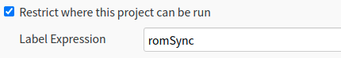
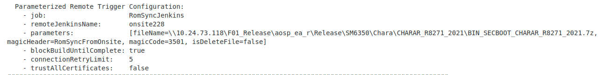
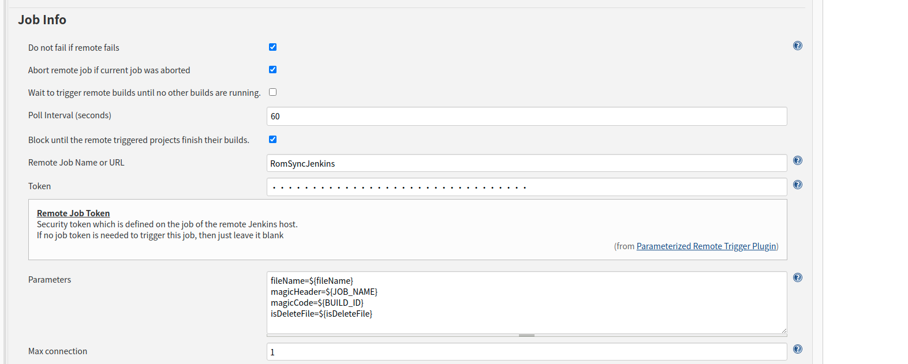
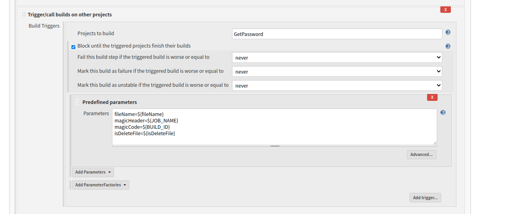

# 1.200服务器发起任务

**Item**	：**RomSyncFromOnsite**

**Job**	   ：	

```
fileName=\\10.24.73.118\F01_Release\aosp_ea_r\Release\SM6350\Chara\CHARAR_R8271_2021\BIN_SECBOOT_CHARAR_R8271_2021.7z
```

限定在200服务器上执行：

	

## 1.发起远程任务



```
Triggering parameterized remote job 'http://10.24.252.228:8080/job/RomSyncJenkins'
```



**RomSyncJenkins：**

删除并新建：/home/onsite-215/RomSyncJenkins/3438/currentWork

1.检查工作目录是否创建成功，失败将报错重定向到文件。用于200与228的通信。

2.检查文件/home/onsite-215/PasswordFolder/Password$currentDate.txt是否存在，错误信息重定向到文件

	

3.检查文件名是否合法，错误信息重定向到文件

检查是否有空格

```
if [[ "${fileName}" == *" " ]] || [[ "${fileName}" == " "* ]] || [[ "${fileName}" == *" "* ]]; then
  echo "ERROR: path include SPACE, current jenkins not support SPACE detect, if possible could you help remove the SPACE from path on server?"
  echo "ERROR" > /tmp/Result.$magicHeader$magicCode.sh
  echo "ERROR: path include SPACE, current jenkins not support SPACE detect, if possible could you help remove the SPACE from path on server?" >> /tmp/Result.$magicHeader$magicCode.sh
  exit 1
fi
```

检查是文件名格式

log:

```
/tmp/Result.RomSyncFromOnsite3501.sh
```

```
ret1=`echo ${fileName} | grep -o '\\\\' | wc -l` #windows 目录格式
ret2=`echo ${fileName} | grep -o '/' | wc -l` #linux目录格式
```

获取指定路径

```
\\10.24.73.118\F01_Release\aosp_ea_r\Release\SM6350\Chara\CHARAR_R8271_2021\BIN_SECBOOT_CHARAR_R8271_2021.7z
aosp_ea_r\Release\SM6350\Chara\CHARAR_R8271_2021\BIN_SECBOOT_CHARAR_R8271_2021.7z
tmpString=`echo ${fileName} | cut -d '\' -f 5-100` //显示第五列
```

将反斜杠转换成linux反斜杠

```
fileNameString="$( echo "${tmpString}" | sed 's#\\#/#g' )"
aosp_ea_r/Release/SM6350/Chara/CHARAR_R8271_2021/BIN_SECBOOT_CHARAR_R8271_2021.7z
```

```
fileRootString=`echo ${fileName} | cut -d '\' -f 4`
F01_Release
```

**调用GetPassword**




读取PW文件

```
/home/onsite-215/PasswordFolder/Password$currentDate.txt
```

判断rom是否已经被请求

修改Password$currentDate.txt


**GetPassword**

log

```
/tmp/Password.RomSyncJenkins3438.sh
```

解析log，此处log不知道从何而来

从log里获取密码 压缩文件名

```
GetPassword
```

```
cp home/onsite-215/F01_Release/aosp_ea_r/Release/SM6350/Chara/CHARAR_R8271_2021/BIN_SECBOOT_CHARAR_R8271_2021.7z /home/onsite-215/workspace/GetPassword
```

加密

```
7z a -p"$zipPassword" -mhe $zipFileName.7z BIN_SECBOOT_CHARAR_R8271_2021.7z
```

解密

```
7z x -p"$zipPassword" -o"/home/gota/CloudRomSync/$fileRootString/$fileDirString" ${zipFile[0]}
```

