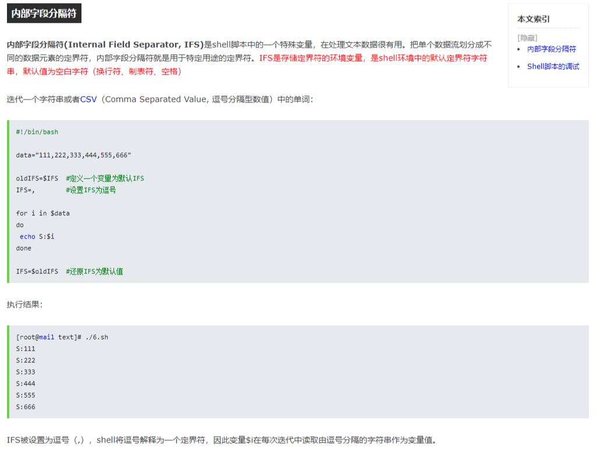
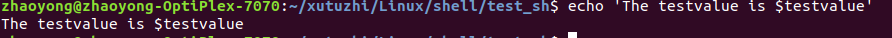
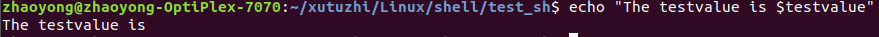

```
#!/bin/bash

if [[ $fileName == "" ]]; then
  echo -e "`date`\t`date +%s`\t`du --max-depth=1 /home/scm/ownCloud/SC-TS-Space/Manual/`"
  echo -e "`date`\t`date +%s`\t`du --max-depth=1 /home/scm/ownCloud/SC-TS-Space/Manual/`" >> /home/scm/syncDataCount.txt
fi

currentDate=`date -u +%Y%m`
currentDay=`date -u +%Y%m%d`
intoDir=`pwd`
workspace=$intoDir/currentWork

echo $intoDir
echo $workspace

rm -rf $workspace
mkdir -p $workspace
if [ ! -d $workspace ]; then
  echo "ERROR: failed create workspace."
  exit 1
fi

ssh yanxi@10.74.185.200 "scp onsite-215@10.24.252.228:~/PasswordFolder/Password$currentDate.txt /tmp/Password$currentDate.txt";
if [ $? -ne 0 ]; then //如果上一条命令的返回值不等于0
  echo "[!!WARNING!!]: not found Password file on onsite."
  #exit 1 # Comment out due to onsite some time offline
fi
  
scp yanxi@10.74.185.200:/tmp/Password$currentDate.txt /tmp/Password$currentDate.txt;
if [ $? -ne 0 ]; then
  echo "[!!WARNING!!]: failed copy Password file."
  #exit 1 # Comment out due to onsite some time offline
fi

if [ ! -f /tmp/Password$currentDate.txt ]; then
  echo "ERROR: password file miss."
  exit 1
fi

skipFirstLine=0
detectFlag=0

while read -r line
do
  if [[ $skipFirstLine == "0" ]]; then
    skipFirstLine=1
  else
    OldIFS=$IFS
    IFS=" "
    splitString=($line)
    if [[ ${#splitString[@]} != "4" ]]; then
	  continue
	fi

    zipPassword=${splitString[0]}
    zipFileName=${splitString[1]}
    syncDate=${splitString[2]}
    savedFileName=${splitString[3]}

    skipDate=`date -d "$currentDay -2 day" +%Y%m%d`
    secSkipDate=`date -d "$skipDate" +%s`
    secSyncDate=`date -d "$syncDate" +%s`

    if [[ $secSyncDate -ge $secSkipDate ]] || [[ $fileName != "" ]]; then
      ret1=0;ret1=`echo ${savedFileName} | grep -o '\\\\' | wc -l`
      ret2=0;ret2=`echo ${savedFileName} | grep -o '/' | wc -l`
      if [[ $ret1 != "0" ]] && [[ $ret2 == "0" ]]; then
        tmpString=`echo ${savedFileName} | cut -d '\' -f 5-100`
        fileNameString="$( echo "${tmpString}" | sed 's#\\#/#g' )"
        fileRootString=`echo ${savedFileName} | cut -d '\' -f 4`
      elif [[ $ret1 == "0" ]] && [[ $ret2 != "0" ]]; then
        tmpString=`echo ${savedFileName} | cut -d '/' -f 5-100`
        fileNameString=$tmpString
        fileRootString=`echo ${savedFileName} | cut -d '/' -f 4`
      else
        echo "ERROR: program error that file name not right"
        exit 1
      fi

      if [[ ${fileRootString,,} == "f01_release" ]]; then
        fileRootString="F01_Release"
      elif [[ ${fileRootString,,} == "g03_group" ]]; then
        fileRootString="G03_Group"
      else
        echo "ERROR: program error that file path is not F01_release or g03_group"
        exit 1
      fi

      if [[ $fileName != "" ]]; then
        partSavedFileName="$( echo "${savedFileName}" | sed 's#\\#/#g' )"
        halfSavedFileName="$( echo "${partSavedFileName}" | sed 's# ##g' )"
        finalSavedFileName="$( echo "${halfSavedFileName}" | sed 's#smb:##g' )"
        partFileName="$( echo "${fileName}" | sed 's#\\#/#g' )"
        halfFileName="$( echo "${partFileName}" | sed 's# ##g' )"
        finalFileName="$( echo "${halfFileName}" | sed 's#smb:##g' )"
        if [[ "${finalFileName,,}" == "${finalSavedFileName,,}" ]]; then
          detectFlag=1
        else
          continue
        fi
      fi

      echo "--- once start ---"
	  #echo "zipPassword: $zipPassword"
	  echo "zipFileName: $zipFileName"
	  echo "savedFileName: $savedFileName"

	  if [ ! -f /home/gota/CloudRomSync/$fileRootString/$fileNameString ]; then
	    zipFile=`find /home/scm/ownCloud/SC-TS-Space/ -name "$zipFileName.7z"`
	    zipFileNum=`find /home/scm/ownCloud/SC-TS-Space/ -name "$zipFileName.7z" | wc -l`
	    if [[ ${zipFileNum} == 1 ]]; then
	      fileDirString=`dirname $fileNameString`
		  mkdir -p /home/gota/CloudRomSync/$fileRootString/$fileDirString
	      echo "INFO: download finished, extract ${zipFile[0]} to /home/gota/CloudRomSync/$fileRootString/$fileDirString"
	      7z x -p"$zipPassword" -o"/home/gota/CloudRomSync/$fileRootString/$fileDirString" ${zipFile[0]}
          touch -c /home/gota/CloudRomSync/$fileRootString/$fileNameString
          #curl
	    else
          zipFile=`find /home/scm/ownCloud/SC-TS-Space/ -name ".$zipFileName.7z.*"`
          zipFileNum=`find /home/scm/ownCloud/SC-TS-Space/ -name ".$zipFileName.7z.*" | wc -l`
	      if [[ ${zipFileNum} != 0 ]]; then
            if [[ ${zipFileNum} == 1 ]]; then
              zipFileSize=`du -h ${zipFile[0]} | awk '{print $1}'`
              if [[ $fileName != "" ]]; then
                echo ""
                echo ""
                echo "######################################################################################################"
                echo "####  INFO: ongoing download the file, had download $zipFileSize, please wait a while."
                echo "######################################################################################################"
                echo ""
                echo ""
              else
                echo "INFO: ongoing download the file, had download $zipFileSize, please wait a while."
              fi
            else
              if [[ $fileName != "" ]]; then
                echo ""
                echo ""
                echo "######################################################################################################"
                echo "####  INFO: ongoing download the file, please wait a while."
                echo "######################################################################################################"
                echo ""
                echo ""
              else
                echo "INFO: ongoing download the file, please wait a while."
              fi
            fi
          else
            if [[ $fileName != "" ]]; then
              echo ""
              echo ""
              echo "######################################################################################################"
              echo "####  INFO: download prepare start, please wait a while."
              echo "######################################################################################################"
              echo ""
              echo ""
            else
              echo "INFO: download prepare start, please wait a while."
            fi
          fi
        fi
      else
        if [[ $fileName != "" ]]; then
          echo ""
          echo ""
          echo "######################################################################################################"
	      echo "####  INFO: already exist, please check ftp://10.74.185.226/CloudRomSync/$fileRootString/$fileNameString"
          echo "######################################################################################################"
          echo ""
          echo ""
        else
	      echo "INFO: already exist, please check ftp://10.74.185.226/CloudRomSync/$fileRootString/$fileNameString"
        fi
	  fi
    #else
    #  echo "!!!skip $syncDate $zipFileName"
    fi
	IFS=$OldIFS
  fi
done  < /tmp/Password$currentDate.txt

if [[ $fileName != "" ]] && [[ $detectFlag == "0" ]]; then
  echo ""
  echo ""
  echo "######################################################################################################"
  echo "####  INFO: Upload is in the queue, or not request sync this file, you should better check it first."
  echo "######################################################################################################"
  echo ""
  echo ""
fi
```


# shell

## 1.默认全局变量IFS




```
mkdir -p workspace/FIH${BUILD_ID} && cd workspace/FIH${BUILD_ID} -> mkdir -p workspace/FIH7 && cd workspace/FIH7
```


## 2.for 循环

```
  5 #for a in $@
  6 #do
  7 #echo $a
  8 #done
```


## 3.符号

### 3.1 反引号

反引号位 (`) 位于键盘的Tab键的上方、1键的左方。注意与单引号(')位于Enter键的左方的区别。

在[Linux](http://lib.csdn.net/base/linux)中起着命令替换的作用。命令替换是指shell能够将一个命令的标准输出插在一个命令行中任何位置。

如下，shell会执行反引号中的date命令，把结果插入到echo命令显示的内容中。

```
echo The date is `date`
```


单引号、双引号用于用户把带有空格的字符串赋值给变量事的分界符。单引号、双引号用于用户把带有空格的字符串赋值给变量事的分界符。

### 3.2 单引号

单引号告诉shell忽略所有特殊字符

	

### 3.3 双引号

而双引号忽略大多数，但不包括$、\、`。

	


## 4.函数

### 4.1 函数定义

```
exit_with_email()
{
  rm sendmail.txt
  echo "Dear "$BUILD_USER"," >> sendmail.txt
  echo "" >> sendmail.txt
  if [[ $1 == "1" ]]; then #引用参数
    echo "Your build had failed with below error:" >> sendmail.txt
    echo $2  >> sendmail.txt#引用参数
  else
    echo "Your build had successful!" >> sendmail.txt
  fi
  echo "" >> sendmail.txt
  echo "Please open below link to check result:" >> sendmail.txt
  echo $BUILD_URL >> sendmail.txt
  echo "" >> sendmail.txt
  echo "Thanks" >> sendmail.txt

  if [[ $1 == "1" ]]; then #引用参数
    cat sendmail.txt | heirloom-mailx -s "[Jenkins] $JOB_NAME Task #$BUILD_ID failed" $BUILD_USER_EMAIL
    echo "error is $2"#引用参数
  else
    cat sendmail.txt | heirloom-mailx -s "[Jenkins] $JOB_NAME Task #$BUILD_ID successful" $BUILD_USER_EMAIL
  fi
  rm sendmail.txt

  exit $1 #返回值
}
```

### 4.2 函数调用

```
 exit_with_email 1 "ERROR: Please input right manifest!!!"
```


## 5.数组

```
Shell数组元素个数${#array[@]}数组的所有元素${array[*]} 字符串长度${#str}

1、获取数组元素的个数:

array=(bill chen bai hu);

num=${#array[@]} //获取数组元素的个数。

遍历数组就变成非常简单的事情:

for((i=0;i<num;i++))

{

echo $array[i];

}

获取数组某一个单元的长度就变成了:

${#array[i]}

2、获取数组的所有元素:

${array[*]}

遍历数组就编程了非常简单的事情:

for var in ${array[*]}grep -r "include"

do

echo $var;

done

获取长度就变成了:

${#var}

3、获取字符串的长度:

str="hello"

len=${#str}

```

