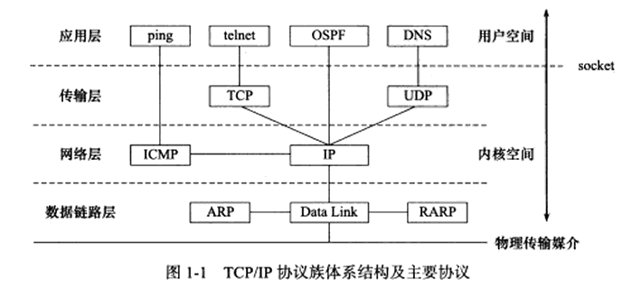
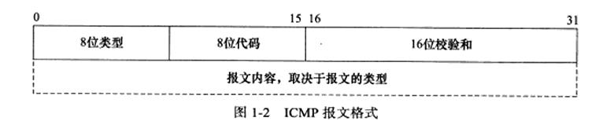

# Linux高性能服务器编程

## 前言

### 大师级别的书

​	整本书只关注于一个问题，而且对每个技术细节的描述都精雕细琢。最关键的是，我们在阅读这些经典书籍时，似乎实在用心与一位编程高手交流。这绝对是一种享受。


## 第一章 TCP/IP协议族

### 1.1 TCP/IP协议族体系结构以及主要协议

​	**TCP/IP协议族是一个四层协议系统**。上层协议使用下层协议提供的服务。

	


#### 1.1.1 数据链路层

​	**数据链路层**实现了**网卡接口**的**网络驱动程序**，以处理数据在物理媒介（以太网、令牌环）上的传输。不同的物理网络有不同的电气特性，网卡驱动程序隐藏了这些细节，为上层协议提供一个统一的接口。

​	数据链路层常用的协议是ARP协议（Address reslove Protocol，地址解析协议 ）和RARP协议（Rerverse Address reslove Protocol，逆地址解析协议 ）。**它们实现了IP地址与机器物理地址（MAC地址）的相互转换。**

​	网络层通过IP地址寻找一台机器，而数据链路层通过mac地址寻找一台机器，因此网络层必须先将IP地址转为物理地址，才能使用数据链路层提供的服务，这就**是ARP协议的用途**。RARP协议仅用于网络上的某些无盘工作站。以内缺乏存储设备，无盘工作站无法记住自己的IP地址，但是它们可以利用网卡上的物理地址来向网络管理者（服务器或网络管理软件）查询自身的IP地址。运行RARP的网络管理者通常存有该网络上所有机器的物理地址到IP地址的映射，


#### 1.1.2 网络层

​	**网络层实现数据包的选路和转发。**WAN（Wide Area Network， 广域网）通常使用众多分级的路由器来连接分散的主机或LAN（Local Area Network， 局域网）因此通信的两台主机一般不是直接相连的，而是通过多个中间节点（路由器）连接的。**网络层的任务就是选择这些中间节点，以确定两台机器之间的通信路径**。**同时网络层对上层协议隐藏了网络拓扑连接的细节，使得传输层和上层应用程序来看，两台机器是直接向连的**，

​	网络层最核心的协议是**IP协议**（Internet Protocol，因特网协议）。IP协议根据数据包的目的IP地址来决定如何投递它。如果数据包不能直接发给目标主机，那么IP协议就为它寻找一个合适的下一跳（next hop）路由器，并将数据交付给该路由器来转发。多次重复这一过程，数据最终达到目标主机，或者由于发送失败而被丢弃。可见，**IP协议通过逐跳的（hop by hop）方式来来确定通信路径**。

​	网络层的另一个重要的协议是**ICMP协议**（Internet Control message Protocol，因特网控制报文协议）。它是IP协议的重要补充，主要用于检测网络连接。ICMP使用的报文格式如图：



上图，**八位类型字段**用于区分报文类型。它将ICMP报文分为两大类：一类是差错报文，这类报文主要是用来回应网络错误，比如目标不可到达（类型值为3），和重定向（类型值为5）;另一类是查询报文，这类报文用来查询网络信息，比如ping程序就是使用ICMP报文查看目标是否可到达的（类型值为8）。有的ICMP还使用**八位代码字段**来进一步细分不同的条件。比如重定向报文使用代码值0表示对网络重定向，代码值为1代表对主机重定向。ICMP报文使用16为校验和字段对整个报文（包括头部和内容部分）进行循环冗余校验（Cyclik Redundancy Check，CRC），以检验报文在传输过程中是否损坏。不同的ICMP报文类型具有不同的正文内容。

需要指出的是，ICMP协议并不属于严格意义上的网络层协议，因为它使用处于同一层的IP协议提供的服务（一般来说上层协议使用下层协议提供的服务）。


#### 1.1.3 传输层

	

传输层为两台主机提供端到端(end to end)的通信。与网络层使用的逐跳通信方式不同，传输层只关心通信的起始端和目的端，而不在乎数据包的中转过程。图1-3展示了传输层和网络层的这种区别。

##### 1.1.3.1 各层的封装

可见，数据链路层(驱动程序)封装了物理网络的电气细节；网络层封装了网络连接的细节；传输层则为应用程序封装了一条端到端的逻辑通信链路，它负责数据的收发、链路的超时重连等。

传输层主要协议有三个：**TCP协议**、**UDP**协议和**SCTP**协议。

TCP协议为应用层提供**可靠的**、**面向连接**的、**基于流**的服务。TCP协议使用**超时重传**、**数据确认**等方式来**确保数据包被正确地发送到目的端**，因此TCP服务是可靠的。使用TCP协议通信的双方必须建立TCP连接，并在内核中为该连接维持一些必要的数据结构，比如**连接的状态**、**读写缓冲区**，以及**诸多定时器**等。当通信结束时，双方必须关闭连接以释放这些内核数据。

##### 1.1.3.2 基于流的特点

**TCP服务**是基于流的。**基于流的数据没有边界限制**，它源源不断地从**通信的一端流入流入另一端**。发送端可以逐个字节地向数据流中写入数据，接收端可以逐个字节地将它们读出。

**UDP协议**则与TCP协议完全相反，它为应用层提供不可靠、无连接、基于数据报的服务。“不可靠”意味着UDP协议无法保证数据从发送端正确地传输到目的端。如果数据在中途丢失，或者目的端通过数据校验发现数据错误而将其丢弃，则**UDP协议只是简单地通知应用程序发送失败**。因此，使用UDP协议的应用程序通常需要自己处理数据确认、超时重传等逻辑。UDP协议是无连接的，即通信双方不保持一个长久的联系，因此应用程序每次发送数据都要明确指定接收端的地址（IP地址等信息）。基于数据报的服务，是相当于流的服务而言的。**每个UDP数据报都有一个长度，接收端必须以该长度为最小单位将其所有内容一次性读出，否则，数据将被截断。**

SCTP协议（流控制传输协议）是一种相对较新的传输协议，它是为了在因特网上传输电话信号而设计的。


#### 1.1.4 应用层

应用层负责处理应用程序的逻辑。数据链路层、网络层、传输层负责处理网络通信细节，这部分必须既稳定又高效，因此它们都在内核中实现，如图1-1所示。而应用层则在用户空间实现，因为它负责处理众多逻辑，比如文件传输、名称查询、和网络管理等。如果应用层也在内核当中实现，则会使内核变得非常庞大。当然，也有少数服务器程序是在内核当中实现的，这样代码无须在用户空间和内核空间来回切换（主要是数据的复制），极大地提高了工作效率。不过这种代码实现起来比较复杂，不够灵活，不便于移植。

ping是应用程序，使用icmp协议检测网络连接，是调试i网络环境的必备工具。

telnet协议是一种远程登录协议，它使我们能在本地完成远程任务。

OSPF（open shortest patch first 开发最短路径优先）协议是一种动态路由更新协议，用于路由器之间的通信，以告知对方各自的路由信息。

DNS协议提供机器域名到IP地址的转换。


### 1.2 封装

Encapsulation

	

应用程序数据在发送到物理网络之前，将沿着协议栈从上往下依次传递。每层协议都将在上层数据的基础上加上自己的头部信息（有时还包括尾部信息），以实现该层的功能，这个过程就称为封装。

	

TCP message segment

	


当发送端应用程序使用send函数向一个TCP连接写入数据时，内核中的TCP模块首先把这些数据复制到与该连接对应的TCP内核发送缓冲区中，然后TCP模块调用IP模块提供的服务，传递的参数包括TCP头部信息和TCP发送缓冲区中的数据，即TCP报文段。

经过udp封装后的数据称为UDP数据报。UDP对应用程序数据的封装与TCP类似。不同的是，UDP无须为应用程序数据保存副本，因为它提供的服务是不可靠的。当一个UDP数据被成功发送之后，UDP内核缓冲区中的该数据报就被丢弃了。如果应用程序检测到该数据报未能被接收端正确接收，并打算重发这个数据报，则应用程序需要重新从用户空间将该数据拷贝到UDP内核发送缓冲区当中。	

经过IP封装后的数据称为数据报。IP数据报也包括头部信息和数据部分，其中数据部分就是一个TCP、UDP或者ICMP。

经过数据链路层封装的数据称为帧。传输媒介不同	，帧的类型也不同。帧的最大传输单元（Max transmit Unit, MTU）是1500字节。正因为如此,过长的IP数据报可能需要被分片传输。


**帧才是最终在物理网络上传送的字节序列。**


### 1.3 分用

	

因为IP协议、ARP协议和RARP协议都使用帧传输数据，所以帧的头部需要提供某个字段来区分它们。以太网帧为例，它使用两字节的类型字段来标识上层协议。如果主机接收到的以太网帧类型字段的值为0x800 ，则帧的数据部分为IP数据报，以太网驱动程序就将帧交付给ARP模块。

TCP报文段和UDP数据报则通过其头部中的16位端口号字段来区分上层应用程序。

帧通过上述分用步骤后，最终将封装前的原始数据送至目标服务。这样，在顶层目标服务来看，封装和分用似乎没发生过。


### 1.4 测试网络

实测:


### 1.5 ARP协议工作原理

ARP协议能实现任意网络层地址到任意物理层地址的转换，不过本书紧讨论从IP地址到以太网地址（MAC）地址的转换。其工作原理是：主机向自己所在的网广播一个ARP请求，该请求包含目标机器的网络地址。此网络上的其他机器都将收到这个请求，但只有被请求的目标机器会回应一个ARP应答，其中包含自己的物理地址。


#### 1.5.1 以太网ARP请求/应答报文详解

	

1. 硬件类型值为1表示**MAC地址**
2. 协议类型的值为0x800时表示要映射IP地址
3. mac地址长度6字节，IP地址长度4字节
4. 操作字段：1为ARP请求 2为ARP应答 3为RARP请求 4为RARP应答

​	长度为28字节。再加上以太网头部和尾部的18字节总长为46字节。有的实现要求以太网帧数据部分至少为46字节，这种情况下一个ARP请求至少为64字节


#### 1.5.2 ARP高速缓存的查看和修改

通常，ARP维护一个高速缓存，其中包含经常访问或最近访问的机器的IP到物理地址的映射。这样就避免了重复的ARP请求，提高了发送数据包的速度。

linux下使用arp命令来**查看和修改ARP高速缓存**。

	

**删除arp缓存**

	

**添加arp缓存**

	


#### 1.5.3 使用tcpdump观察ARP通信过程

```
sudo arp -d 10.74.185.196 //删除缓存
sudo tcpdump -i eno1 -ent '(dst 10.74.185.129 and src 10.74.185.196) or (dst 10.74.185.196 and src 10.74.185.129)'//-e 显示以太网头部信息
```


打开另一个终端

```
telnet 10.74.185.196 echo
```

	

获取到对话：


	

**路由器也将收到以太网帧1，因为该帧是一个广播帧。**


### 1.6 DNS工作原理

域名查询服务将域名转换为IP地址，域名查询服务有多种实现方式，NIS、DNS和本地静态文件等。

#### 1.6.1 DNS查询和应答报文详解

DNS是一套分布式的域名服务系统。每个dns服务器都存放着大量的机器名和IP地址的映射，并且是动态更新的。众多网络客户端程序都是用dns协议来向dns服务器查询目标主机的IP地址。DNS查询和应答报文的格式如图所示。

	

16位标识字段用来标记一对dns查询和应答，以此区分这个是dns应答是哪个dns查询的回应。

16位标志字段用于协商具体的通信方式和反馈通信状态。具体如下图所示


	

...


#### 1.6.2 linux下访问DNS服务

Linux使用/etc/resolv.conf文件来存放DNS服务的IP地址

Linux下常用的DNS服务器访问客户端程序是host

```
host -t A www.baidu.com //向首选服务器查询百度的ip
```

	

host使用DNS协议与DNS服务器通信。-t A 指明查询类型是A可诶性


#### 1.6.3 使用tcpdump观察dns通信过程

...


### 1.7 Socket与TCP/IP 协议族的关系

数据链路层、IP层和传输层都在内核当中实现，因此操作系统需要提供一组系统调用，使得应用程序能够访问这些协议提供的服务。下图显示了socket与tcp/ip协议族的关系。

	

socket定义的这一组api有两种功能：一是将应用程序数据从用户缓冲区复制到TCP/UDP内核发送缓冲区，以交付内核来发送数据。或是将数据从TCP/UDP数据接收缓冲区复制到用户缓冲区，以读取数据；二是应用程序可通过它们来修改内核中各层协议的某些头部信息或数据结构，从而精细地控制底层通信的行为。比如可以通过**setsockopt**函数来设置IP数据报在网上的存活时间。

socket是一套通用网络编程接口，它还可以访问其他的网络协议栈。


## 第二章 IP协议详解

IP协议是TCP/IP协议族的核心协议，本章将从两个方面来介绍IP协议。

1.IP头部信息。IP头部信息出现在每个IP数据报中，用于指定IP通信的源端IP地址、目的端IP地址，指导IP分片和重组，以及指定部分通信行为。

2.IP数据报的路由和转发。发生在除目标机器外的所有主机和路由器上。它们决定数据是否该转发以及如何转发。


### 2.1 IP服务的特点

IP协议是TCP/IP协议族的动力，它为上层协议提供**无状态、无连接、不可靠**的服务。

**无状态**是指IP通信的双方不同步传输数据的状态信息，因此所有ip数据报的发送、传输和接收都是独立的、没有上下文关系的。面向连接的协议，比如TCP协议，则能自己处理乱序的、重复的报文段。

虽然IP数据报头部提供了一个标识字段用以标识一个唯一的IP数据报，但它是用来处理IP分片、和重组的，而不是用来指示接收顺序的。

无状态服务的优点也很明显：简单、高效。UDP协议和HTTP协议都是无状态协议。以HTTP协议为例，一个浏览器的连续两次网页请求之间没有任何的关联，将会被web服务器单独地处理。

**无连接**是指通信双方之间不长久地维持任何信息，这样上层协议发送数据的时候都必须指定对方的IP地址。

不可靠是指IP数协议不能保证IP数据报准确地到达接收端，它值是承诺尽力。很多情况都能导致IP数据报发送失败。使用IP服务的上层协议必须自己实现数据确认、超时重传等机制以达到可靠传输的目的。


### 2.2 IPV4头部结构

#### 2.2.1 ipv4头部结构

IPV4头部结构如图2-1所示，通常为20字节。

	

4位版本号指定IP协议的版本。4标识IPV4

4位头部长度标识该IP头部有多少个32bit。4位最大表示15，所以IP头部最大位60字节。

8位服务类型包含一个三位的优先权字段（已经被废弃）和四位的TOS字段（type of service）分别标识：最小延时、最大吞吐量，最高可靠性和最小费用。其中最多能有一个设置位1。应用程序应根据实际需求来设置它。比如ssh和telnet这样的登陆程序需要的是最小延时服务，而文件传输程序ftp则需要最大吞吐量服务。

16位字节为IP数据报的总长度，以字节为单位，因此IP数据报的长度最长为65535字节。但是由于MTU的限制，超过MTU都将被分片传输。

接下来的三个字段描述了如何分片：

16位标识唯一地标识主机发送的每一个数据报。初始值由系统随即生成；每发送一个数据报，其值就加一。该值在数据报分片时被复制到每一个分片中

。因此同一个数据报的所有分片都有同样的标识值。

3位标志字段的第一位保留，第二位DF（don，t Fragment）标识禁止分片。如果设置这个位为1，IP模块将不会对数据报分片。在这种情况下，如果IP数据报长度超过MTU，IP模块将会丢弃这个数据报并返回一个ICMP差错报文。
