# 1. 典型代码

	


# 2. ELF头定义

## 2.1 ELF文件定义类型大小

```
Elf64_Half   =  2
Elf64_Word  = 4
Elf64_Addr  = 8
Elf64_Off = 8
Elf64_Xword = 8
Elf64_Section=2
```


	


## 2.2 可重定位文件头信息

	

## 2.3 可重定位文件头解析


# 3.段数据映射

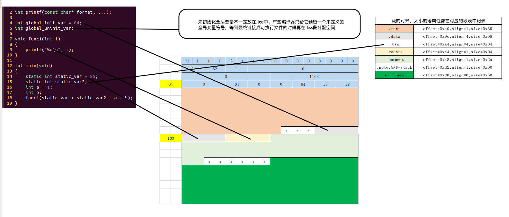


# 4. 段表定义

	

## 4.1 可重定位文件段表信息

	

## 4.2 可重定位文件 段表解析

	

# 5.重定位表


	


SHT_RELA = 4,重定位表。

sh_info = 1,表示对.text重定位

## 5.1 可重定位表的定义

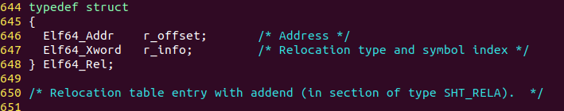	


# 6.字符串表

文件头记录了**段表的偏移**和**段表字符串表描述信息在段表中的下标**，可以获取到**段表字符串表描述信息**。

**段表字符串表描述信息**记录了**段表字符串表**在文件中的**偏移**，因此可以通过遍历段表字符串，**获取到所有的段名及段的数量**（文件头直接记录了数量）。

**因此通过文件头的信息我们可以解析整个ELF文件。**


# 7.符号表定义

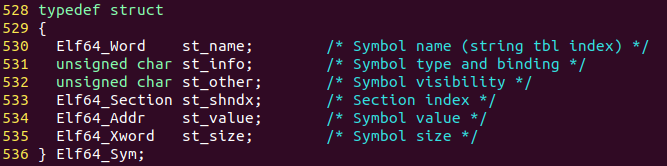	

sizeof=21

## 7.1 第1项 文件名

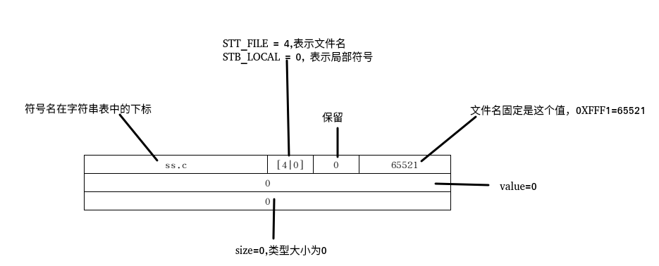	

## 7.2 第2项

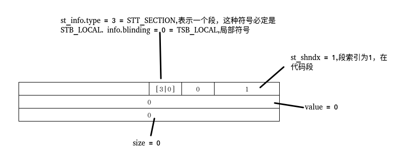	

## 7.3 第7项 局部变量 static int static_var

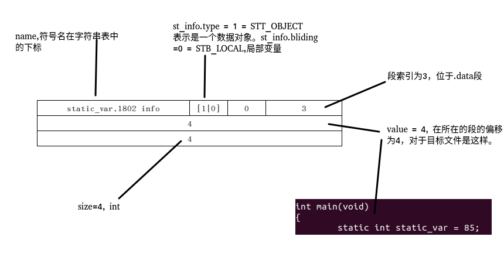	

## 7.4 第8项 局部未初始化变量 static int static_var2

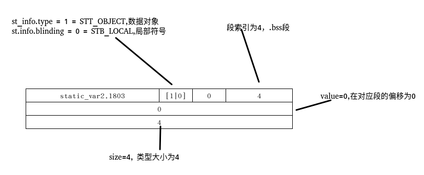	

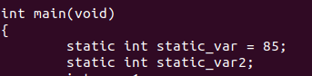	


## 7.5 第12项 已初始化局部变量 global_init_var

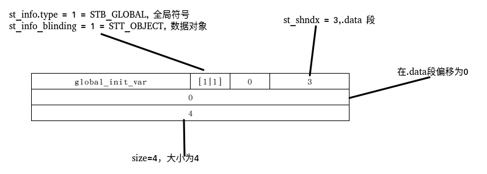	

	

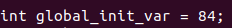	


## 7.6 第13项 未初始化的全局变量 global_uninit_var

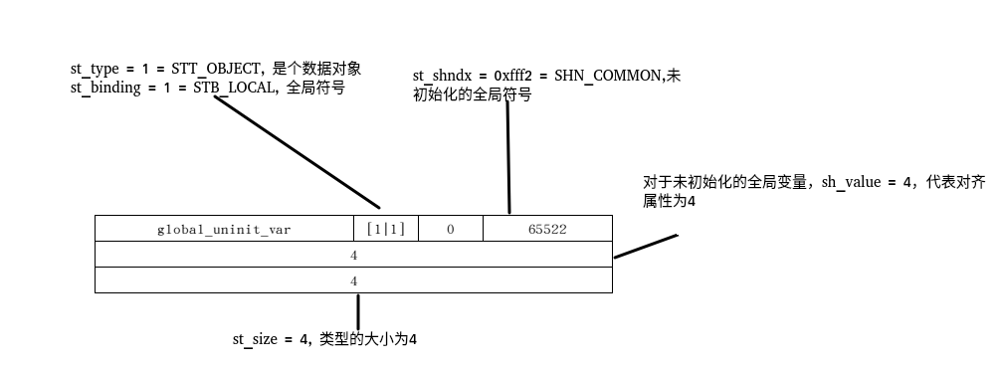	

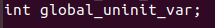	


## 7.7 第14项 函数名 func1

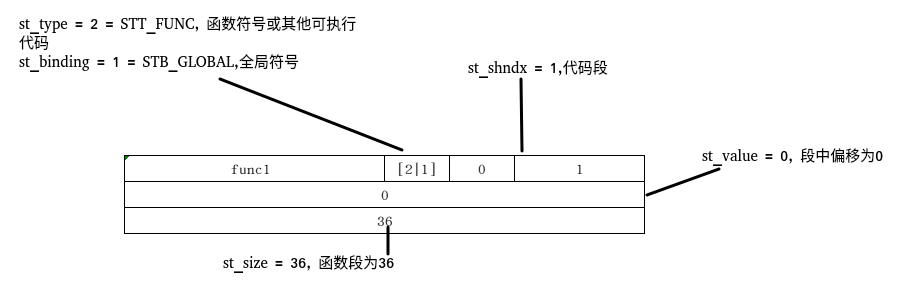	

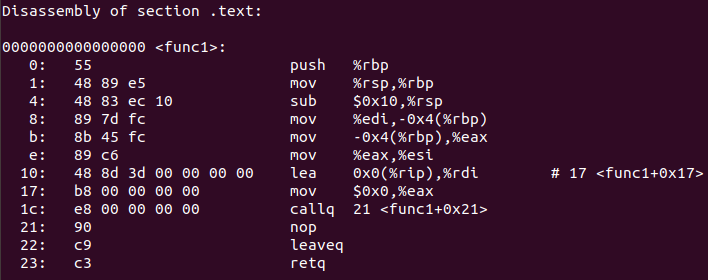	


## 7.8 第15项 _GLOBAL_OFFSET_TABLE_

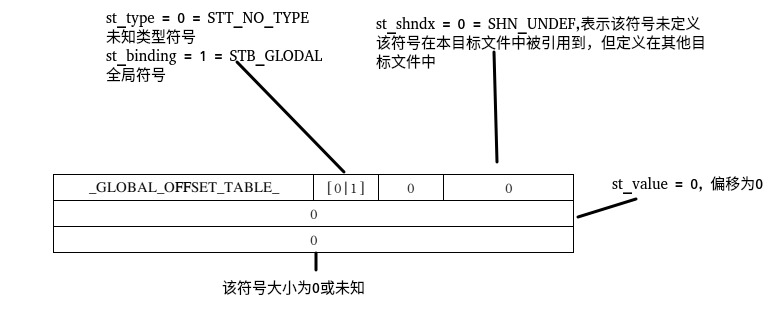	

## 7.9 第16项 printf

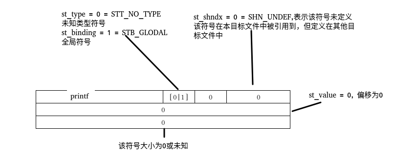	

## 7.10 第17项 main

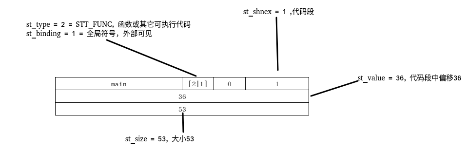


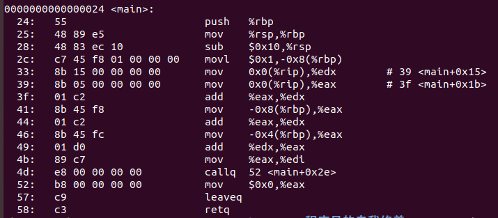	


# 完整elf图解

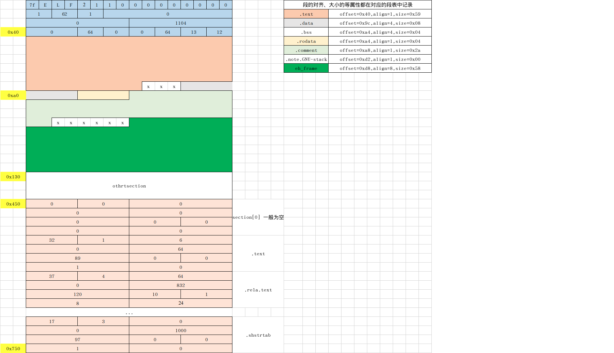

​	

# 8.a.o 的全解析

```
  1 extern int shared;
  2 
  3 int main()
  4 {
  5     int a = 100;
  6     swap(&a, &shared);
  7 }

```

## 第一步 获取头部信息

## 第二步 定位到段表描述符表位置

头信息记录了该表在文件中的偏移和描述符数量

## 第三步 定位到段表字符串描述符

头文件记录了该表在段表中的索引

## 第四步 定位段表字符串表所在的位置

段表字符串描述符记录了该表在文件中的偏移

## 第五步 遍历输出各段的名字

头文件记录描述符数量，描述符记录段名在字符串表的偏移

## 第六步 定位字符串表的位值

通过字符串表的固定名字获取其在段表中的索引，其它段信息的获取都是一样的方式.

```
xutuzhi/Linux/程序员的自我修养/test/linker$ vim parse_obj.c
```

