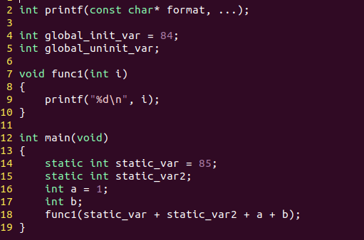
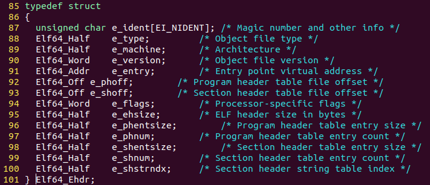
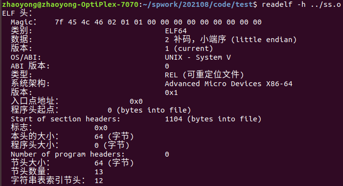
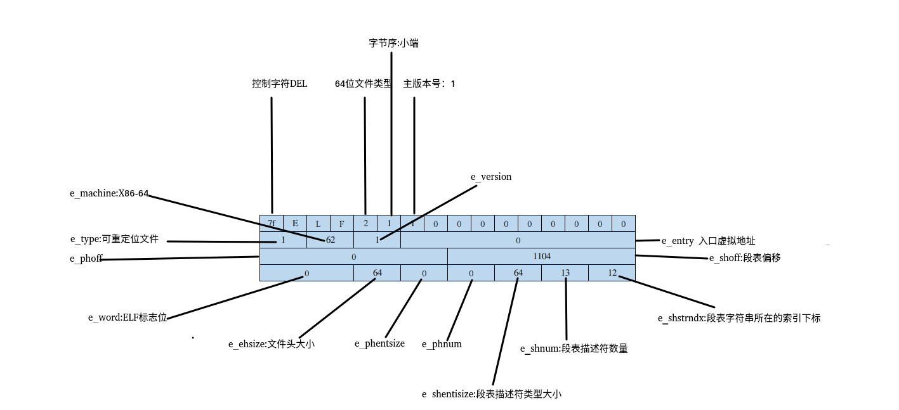
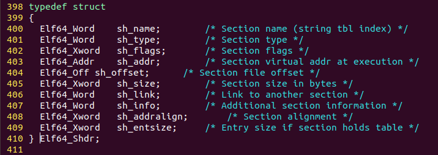
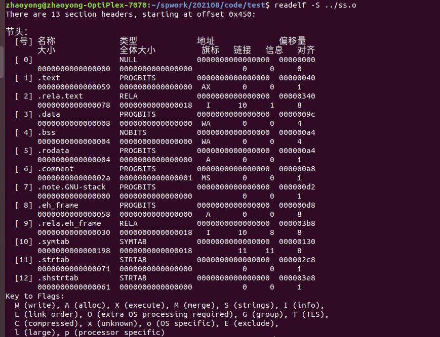
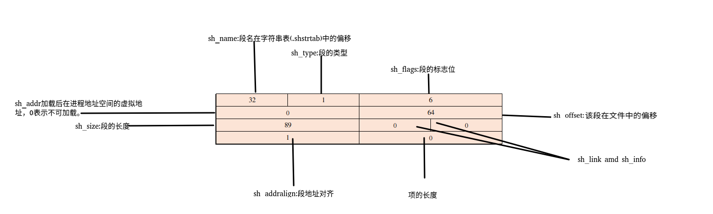
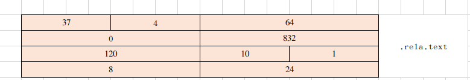
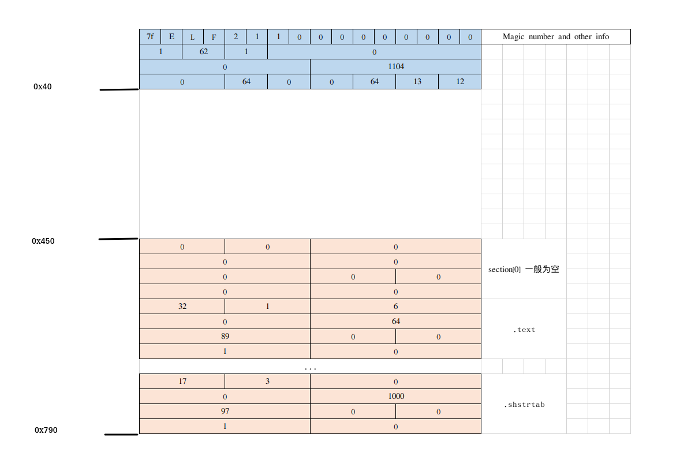

# 1. 典型代码

	


# 2. ELF头定义

## 2.1 ELF文件定义类型大小

```
Elf64_Half   =  2
Elf64_Word  = 4
Elf64_Addr  = 8
Elf64_Off = 8
Elf64_Xword = 8
```


	


## 2.2 可重定位文件头信息

	

## 2.3 可重定位文件头解析



# 3. 段表定义

	

## 3.1 可重定位文件段表信息

	

## 3.2 可重定位文件段表解析

	

# 4.重定位表


	


SHT_RELA = 4,重定位表。

sh_info = 1,表示对.text重定位


# 完整elf图解



