## 第三章 目标文件里有什么

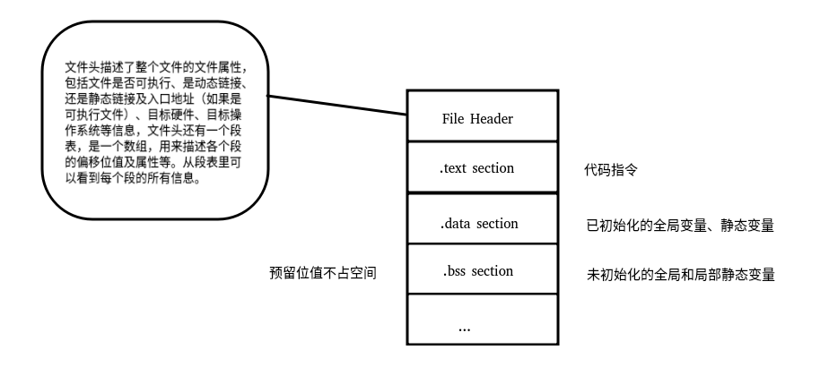	

### 3.3 测试程序代码

	

1.objdump -h 打印各个段的基本信息

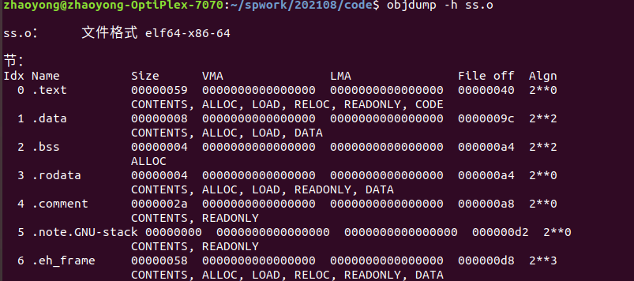	


CONTENTS表示该段在文件中存在


2.size查看

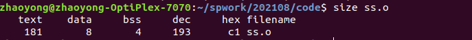	


#### 3.3.1 代码段

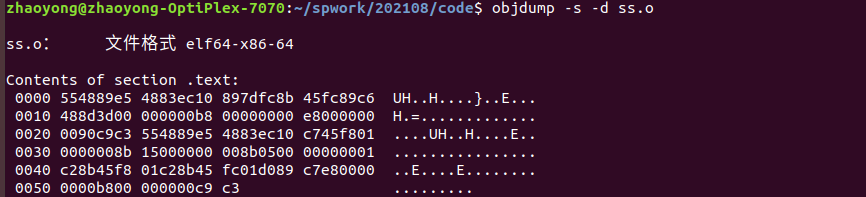	

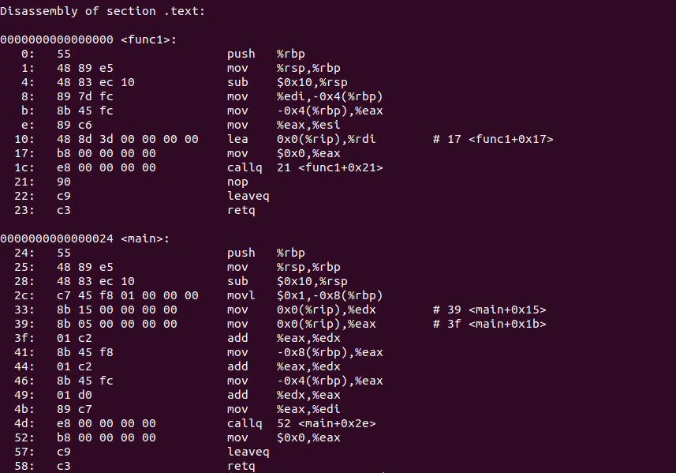	


#### 3.3.2 数据段和只读数据段

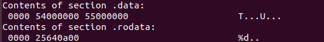	

​	

```
0x54 = 84;
0x55 = 85
```

```
只读数据：
% =0x25
d  =0x64
\n =0x0A
\0 =0x00
```

“.rodta“段存放的时只读数据，一般是程序里面的**只读变量**（如**const**修饰的变量）和 **字符串常量**。

单独设.r**odata段有很多好处**，不光是在语义上支持了C++的const关键字，而且操作系统在加载的时后可以将“.rodata“段的属性映射成只读，这样对于这个段的任何修改操作都会作为非法操作处理，保证了程序的安全性。另外在某些嵌入式平台下，有些存储区域是采只读存储器的，如ROM，这样将“.rotada”段放在该存储区域中，就可以保证访问存储器的正确性。

另外值得一提的是，有**时候编译器会把字符串常量放到“.data”段中.将.c改为.cpp可验证**


#### 3.3.3 BSS段

.bss存放的是**未初始化**的**局部静态变量和全局变量**

有些编译器会将全局的为未始化变量存放在目标文件.bss段，有些则不存放，只是预留一个为定义的全局变量符号，等到最终链接成可执行文件的时候再在.bss段分配空间。

**注意下边全局的已初始化的变量的存放位值**

```
static int x1 = 0; .bss
static int x2 = 1; .data
```


#### 3.3.4 其他段

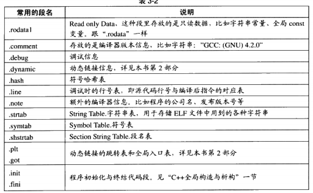	

1.我们可以自己插入一个段比如music，但是不能以.开头

2.一个ELF文件可以有几个相同段名的段，比如.text

3.一些保留的段是历史遗留问题造成的


#### 3.3.5 自定义段

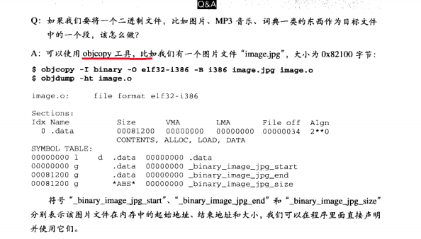		


#### 3.3.6 代码指定段

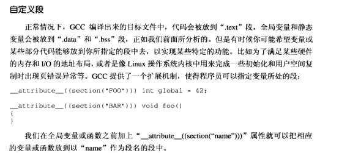	


### 3.4 ELF文件结构描述

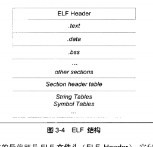	

ELF文件头描述了整个文件的基本属性,紧接着是ELF文件的各个段。其中ELF为文件中与段有关的最重要的结构是段表，该表描述了与ELF文件包含的所有段的信息。

#### 3.4.1 文件头

	


ELF文件头结构及相关常数被定义在“/usr/include/elf.h”里。32位、64位的头部结构分别为Elf32_Ehdr、Elf64_Ehdr.


Elf32_Ehdr:

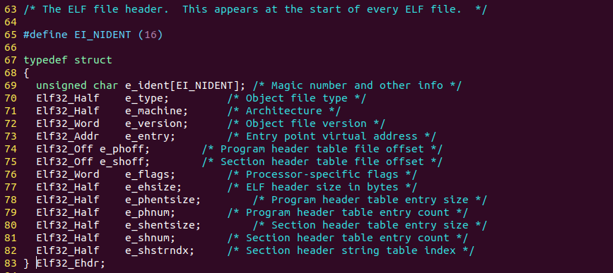	


##### 1)ELF魔数

用来标识ELF文件的平台属性

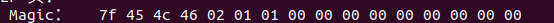	

前四个字节是标识码

```
0x7f= DEL
0x45= 'E'
0x4c= 'L'
0x46= 'F'
```

操作系统在加载可执行文件的时候会确认魔数是否会正确，如果不正确会拒绝加载

接下来一个字节标识类型

```
0x01 表示32位
0x02 表示64位
```

第6个字节表示字节序

```
0x01 小端
```

第7个字节表示主版本号

```
0x01
```

后边的9个字节未定义，为0

##### 2)e_type

表示ELF文件类型

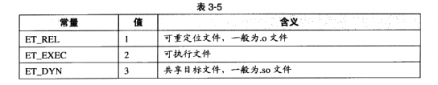	

##### 3)机器类型

e_machine 表示该ELF文件的平台属性，

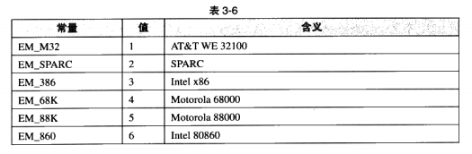	


#### 3.4.2 段表

段表（Section Header Table）保存段的基本属性的结构，它描述了ELF的各个段的信息。比如每个段的**段名**、段的**长度**、在文件中的**偏移**、**读写权限**及段的其他属性。段表在ELF中的位置由ELF文件头的**e_shoff**成员决定。、

真正的**段表结构**

	

##### **段描述符**

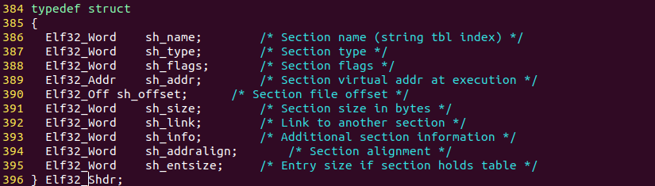	


##### 段的类型

段的名字只在链接和编译过程中有意义，但它不能真正地表示段的类型。我们可以将一个数据段命名为“。text”，对于编译器和链接器来说，主要决定段的属性的是段的类型（sh_type）和段的标志位（sh_flags）。**段的类型**相关的常量以SHT开头：

	

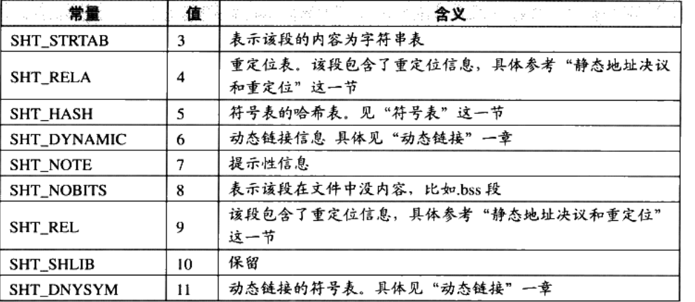	


##### 段的标志位

段的标志位表示该段在进程虚拟地址空间的属性，比如**是否可写**，是**否可执行**等。相关常量以SHF开头。

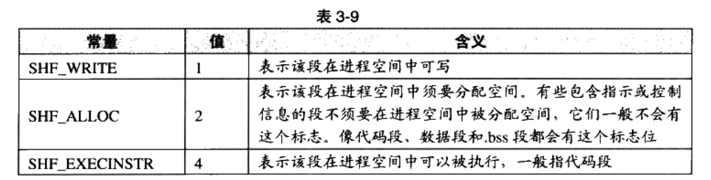	

系统保留段的属性

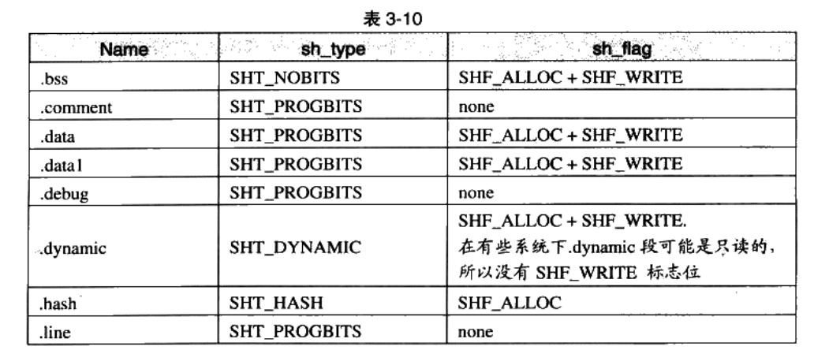	

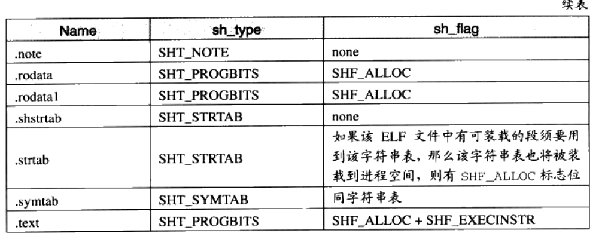	

##### 段的链接信息

如果段的链接与符号相关的，比如重定位表、符号表等，那么sh_link和sh_info这两个成员所包含的意义如表3-11所示。对于其它类型的段，这两个成员没有意义。

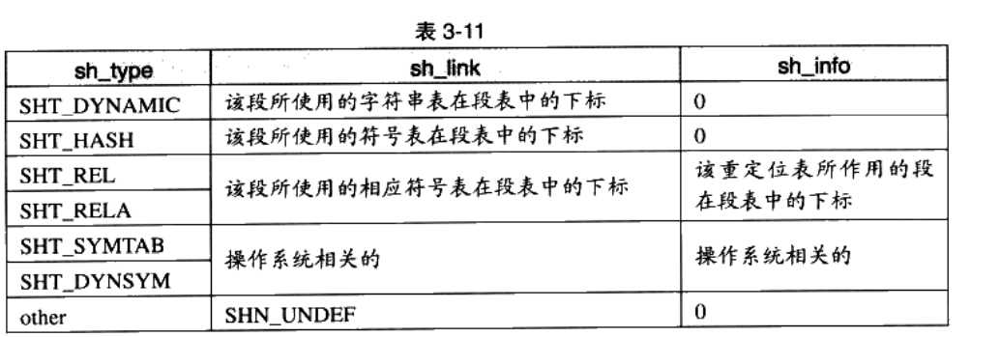	


#### 3.4.3 重定位表

​	.rel.text段，它的类型为SHT_REL,也就是说它是一个重定位表（Relocation Table)。正如我们最开始所说的，链接器在处理目标文件时，需要对目标文件中某些部位进行重定位，即代码段和数据段中那些对绝对地址的引用位值。这些重定位的信息都记录在ELF文件的重定位表里面，对于每个须要重定位的代码段和数据段，都会有一个相应的重定位表。比如“。rel.text”就是针对.text段的重定位表，因为“.text”段中至少有一个绝对地址的引用，那就是对printf函数的调用；而.data段则没有绝对地址的引用，它至包含了几个常量。

​	一个重定位表同时也是ELF的一个段，那么这个段的类型（sh_type）就是“SHL_REL类型的，它的sh_link表示符号表的下标，它的“sh_info”表示它作用于哪个段。比如“.rel.text”作用于“.text”段。


#### 3.4.4 字符串表

ELF文件中用到了很多字符串，比如段名、变量名等。因为字符串的长度往往都是不确定的，所以用固定的结构表示它很困难。一种常见的做法时把字符串集中起来做一个表，然后使用字符串在表中的偏移来引用字符串。

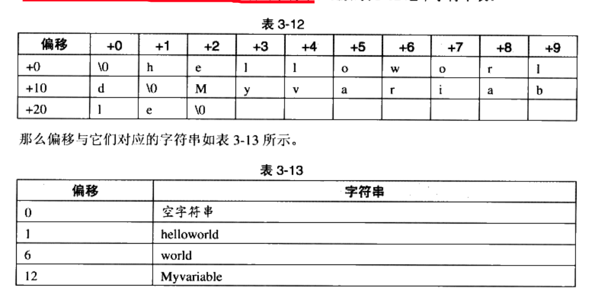	

通过这种方法，在ELF文件中引用字符串只需要给出一个字符串下标即可，不用考虑字符串长度问题。一般字符串表在ELF文件中以段的形式保存，常见的段名为“.strlab”或".shstrtab"。这两个字符串表为**字符串表**和**段字符传表**。顾名思义，字符串表用来保存普通的字符串，比如符号的名字；段字符串表用来保存段表中用到的字符串，最常见的就是段名（sh_name）。


**e_shstrbndx**. 段表字符串表本身也是ELF文件中的一个普通的段，知道它的名字往往叫做“,shstrtab”.e_shstrbndx表示shstrtab在段表中的下标

**因此通过文件头我们可以获取字符串表的信息**


### 3.5 链接的接口--符号

**链接过程的本质**就是**把多个不同的目标文件之间相互“粘”到一起**，或者像玩具积木一样，可以拼接成一个整体。为了使不同目标文件之间能够相互粘合，这些目标文件之间必须有固定的规则才行，就像积木模块必须有凹凸部分才能够拼合。在链接中，**目标文件相互拼合**实际上是**目标文件对地址的引用**，即对**函数和变量**的地址的引用。比如目标文件B要用到了目标文件A中的函数“foo”,那么我们就称目标文件A**定义**了函数“foo”，称目标文件B**引用**了目标文件A中的函数“foo”。这两个概念同样适用于**变量**。每个函数和变量都有自己独特的名字，才能避免链接过程中不同变量和函数之间的混淆。在链接中，我们将函数和变量中统称为**符号**，函数名和变量名就是**符号名**。

我们可以将符号看作是链接中的粘合剂整个链接过程正是基于符号才能够正确完成。**链接过程中很关键的一部分就是符号的管理**，每一个目标文件都会有一个相应的**符号表**，这个表里记录了目标文件所用到的所有符号。每个定义的符号都有一个对应的值，叫做**符号值**，对于**变量和函数**来说，**符号值就是**它们的**地址**。除了函数和变量之外，还存在几种不常用到的符号。我们将符号表中的符号进行分类，它们有可能是下面类型的一种：

1.定义在目标文件的全局符号，可以被其他目标文件引用。

2.在本目标文件引用的全局符号，却没有定义在本目标文件中，这一般叫作外部符号，也就是符号引用。

3.段名，这种符号往往由编译器产生，它的值就是该段的起始地址。

4.局部符号，这类符号只在编译单元内部可见。调试器可以通过这些符号分析程序的核心转储文件。这些局部符号对于链接过程没有作用，链接器往往也忽略它们。

5.行号信息，即目标文件中指令与源代码中代码行的对应关系，它们是可选的。

对于我们来说，最值的关注的就是全局符号，因为链接过程只关注全局符号的相互“粘合”，局部符号、段名、行号都是次要的，它们对于其他目标文件来说是“不可见”的，在链接过程中是无关紧要的。

查看符号表：

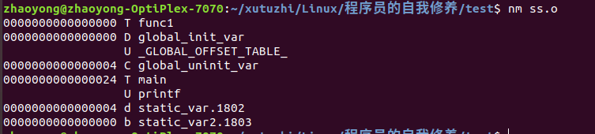	


#### 3.5.1 ELF符号表结构

ELF文件中的符号表往往是文件中的一个段，段名一般叫“.symtab”。符号表的结构很简单，它是一个Elf64_Sym结构的数组，每个Elf64_Sym结构对应一个符号。这个数组的第一个元素，也就是下标0的元素为无效的“未定义符号”。Elf64_Sym的结构定义如下：


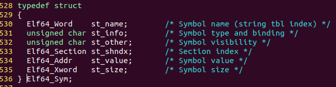	

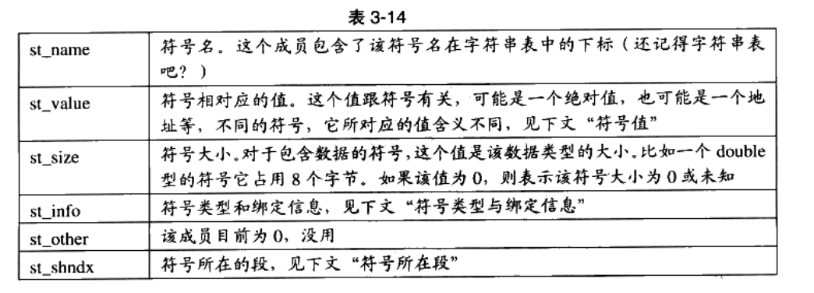	

**符号类型和绑定信息**：该成员低4位表示符号的类型，高28位表示符号绑定信息

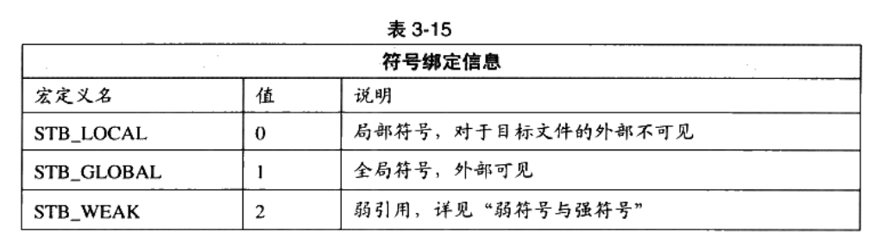	

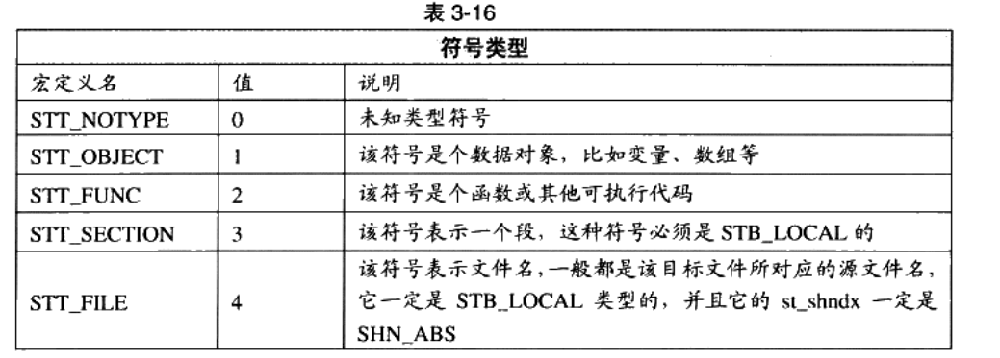	

**符号所在段：**如果符号定义在本目标文件中，那么这个成员表示符号所在的段在段表中的下标；但是如果不是定义在本目标文件中，或者对于有些特殊符号，sh_shndx的值有些特殊：

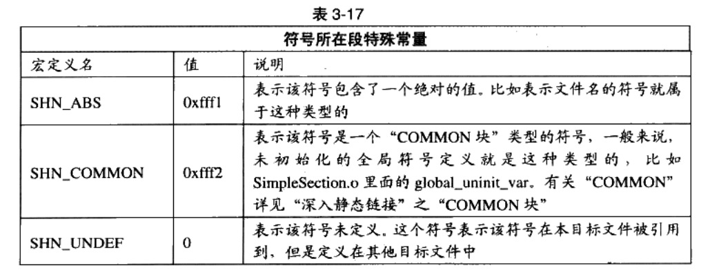	


符**号值 **我们前面已经介绍过，每个符号都有一个对应的值，如果这个符号是函数或变量的定义，那么符号的值就是这个函数或变量的地址，更准确地讲应该按照下面几种情况区别对待

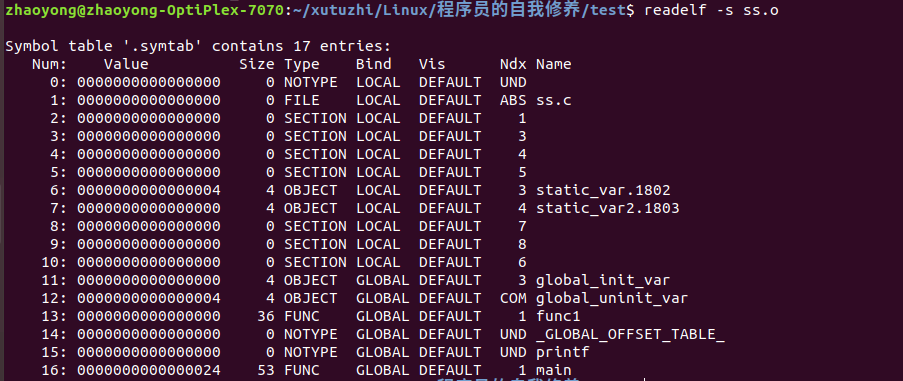	


#### 3.5.2 特殊符号

链接器定义的符号

```
1.__excutable_start,该符号为程序起始地址，注意不是入口地址，是程序最开始的地址
2.__etext或_etext或exext, 该符号为代码段结束地址，即代码段最末尾的地址
3._edata或edata，该符号为数据段结束的地址，即数据段最末尾的地址
4._end或end，该符号为程序结束地址
```

以上地址都是程序被装载时的虚拟地址，我们在装载这一章时再来回顾关于程序被装载后的虚拟地址。

```
#include <stdio.h>

extern char __executable_start[];
extern char etext[], _etext[], __etext[];
extern char edata[], _edata[];
extern char end[], _end[];

int main()
{
	printf("程序起始地址:%X\n", __executable_start);
	printf("代码末尾地址:%X\n", etext);
	printf("数据段结束地址:%X\n", edata);
	printf("程序结束地址:%X\n", end);

	return 0;
}

```


#### 3.5.3  符号修饰与函数签名

##### C++符号修饰

```
  1 int func(int);
  2 float func(float);
  3 
  4 class C
  5 {
  6     int func(int);
  7     class C2
  8     {
  9         int func(int);
 10     };
 11 };
 12 
 13 
 14 namespace N
 15 {
 16     int func(int);
 17 
 18     class C
 19     {
 20         int func(int);
 21     };
 22 };    
```

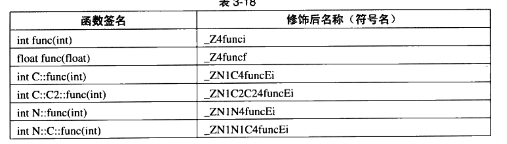

###### **GCC的基本C++名称修饰方法**

所有的符号都以“_Z”开头

对于嵌套的名字后面紧跟N

然后是各个名称空间和类的名字，每个名字前是名字的长度

再以E结尾

int类型参数后面紧跟i

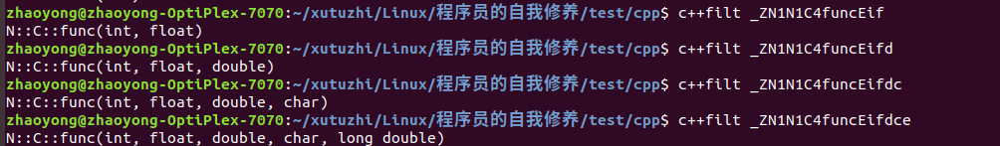	

签名和名称修饰机制不光被用到函数上，C++的全局变量和静态变量也有同样的机制。对于全局变量来说，它跟函数一样都是一个全局可见的名称，它也遵循上面的名称修饰机制，比如一个名称空间foo中的全局变量bar，它修饰后的名字为：**_ZN3foo3barE**

	

**值得注意的是，变量的类型并没有被加入到修饰后名称中，所以不论这个变量类型是什么，它的名字都是一样的**

**名称修饰机制也被用来防止静态变量的名字冲突**。比如main函数中有一个静态变量叫foo，而func函数中也有一个静态变量叫foo。为了区分这两个变量，GCC将它们的符号名修饰为两个不同的名字_ZZ4mainE3foo和 _ZZ4funcE3foo

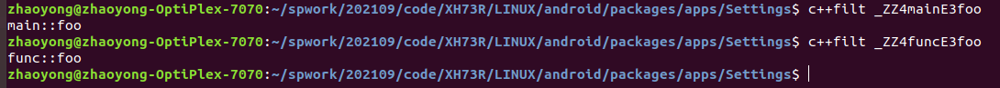	


###### **visual c++ 修饰规则**

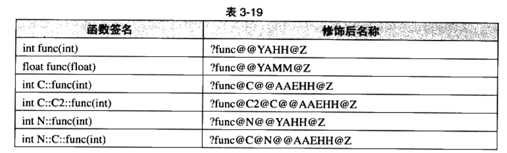	

```
int N::C::func(int) 
```

1.以？开头, @结尾 的函数名func

2.后面跟着以@结尾的类名C

3.以@结尾的N

4.再一个@表示函数的名称空间结束

5.第一个A表示函数**调用类型**为**__cdecl**

6.接着是函数的参数类型及返回值，由@结束

7.最后由Z结尾

Micorosoft提供了一个UnDecorateSymbolName()的API来解析函数名

```
#include <windows.h>
#include <Dbghelp.h>
#include <stdio.h>
int main()
{
	char buf[256];

	UnDecorateSymbolName("?func@C@N@@AAEHH@Z", buf, 256, 0);

	puts(buf);

	system("pause");
	return 0;
}
```


#### 3.5.4 extern "C"

C++为了与C兼容，在符号的管理上，C++有一个用来声明或定义一个C的符号的**extern C**关键字用法

```
extern "C"
{
		int func(int);
		int var;
}
```

括号内的代码将会按照C语言代码来处理。所以上边的C++的名称修饰机制将不会起作用。它声明了一个C的函数func，定义了一个整型全局变量var.从上文我们得知，vc++会修饰为_func, _var;但是linux版本的GCC编译器下却没有这种修饰，都是修饰后的符号。也可以用如下形式：

```
extern "C" int func( int )
extern "C" int var;	
```

quiz

```
  1 #include <stdio.h>
  2 
  3 namespace myname
  4 {
  5     int var = 42;
  6 }
  7 
  8 extern "C" double _ZN6myname3varE;//var被修饰后的名字
  9 
 10 
 11 int main()
 12 {
 13     printf("%d\n", _ZN6myname3varE);
 14     return 0;
 15 }
```

很多时候我们会碰到有些头文件声明了一些C语言的函数和全局变量函数，但是这个头文件可能会被C语言代码段或C++代码包含。比如常见的，我们c语言库函数中的string.h中声明了memset这个函数

```
void *memset (void*, int, size_t); 
```

如果不加任何处理,当我们C语言程序包含string.h的时候，并且用到了memset函数，编译器会将memset符号引用正常处理；但是在C++语言中，编译器会认为这个memset函数是一个C++函数，将memset的符号修饰成_Z6memsetPvii

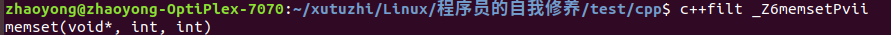	

这样链接器就无法与C语言库中的memset符号进行链接。所以对于C++来说，必须使用extern “C”来声明memset这个函数。但是c语言又不支持extern “C”的语法，如果为了兼容C语言和C++语言定义两套头文件，未免过于麻烦。幸好我们有一种很好的方法可以解决上述问题，就是使用C++的宏“__cplusplus”**,C++编译器会在编译c++的程序时**默认定义这个宏，我们可以使用条件宏来判断当前编译单元是不是C++代码。具体代码如下：

```
#ifdef __cplusplus
extern "C" {
#endif

void *memset (void*, int, size_t);

#ifdef __cplusplus
}
#endif
```

​	如果当前编译单元时C++代码，那么memset会在extern “C” 里面被声明；如果是C代码，就直接声明。上面这段代码中的技巧几乎在所有的系统头文件里面都被用到。


#### 3.5.5 弱符号与强符号

我们经常在编程中碰到一种情况叫**符号重复定义**。多个目标文件中含**有相同名字全局符号定义**，那么这些目标文件链接的时候会出现**符号重复定义**的错误。比如我们在目标文件a和b中都定义了全局整形变量global，并将它们都初始化，那么链接器将A和B进行链接的时候会报错：

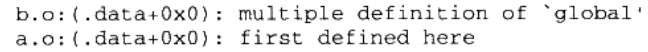

这种**符号的定义**可以被称为**强符号**。有些符号的定义可以被称为**弱符号**。对于C/C++语言来说，编译器默认函数和初始化了的全局变量为强符号，未初始化的全局变量为弱符号。我们可以通过GCC的“____atrribute ____((weak))”来定义任何一个强符号为弱符号。注意，强符号和弱符号都是针对于定义来说的，不是针对于符号的引用。比如，我们有下面的这段程序：

```
extern int ext

int weak;
int strong = 1;
__attribute__((weak)) weak2 = 2;
int main()
{
	
	return 0;
}00000000000020 R_X86_64_PC32     .tex
```

weak,weak2 是弱符号

strong and main is strong symbol

ext 既不是强符号也不是弱符号

**针对强弱符号的概念，链接器就会按如下规则去处理与选择被多次定义的符号**：

1.规则1： 不允许强符号被重复定义

2.规则2：如果一个目标文件中是强符号，在其它文件都是弱符号，那么选择强符号

3.规则3：如果一个符号在所有文件中都是弱符号，那么选择其中占用空间最大的一个。


**弱引用和强引用**

目前我们所看到的对外部目标文件的符号引用，在目标文件最终被链接成可执行文件时，它们须要被正确决议，如果没有找到该符号的定义，链接器就会报符号未定义错误，这种被称为**强引用**。与之对应，还有一种弱引用，在处理弱引用是，如果符号有定义，则链接器将该符号的引用决议；如果该符号未定义，则链接器对该引用不报错。链接器处理强引用和弱引用的过程几乎一样，只是对于未定义的弱引用，链接器不认为它是一个错误。一般对于未定义的弱引用，链接器默认其为0，或者是一个特殊的值，以便于程序代码能够识别。弱引用和符号引用主要用于库的链接过程，我么将在库这一章详细讨论。弱符号和链接器的COMMON块概念联系很紧密，我们在后面“深入静态链接”这一章中的“COMMON块”一节，还会回顾弱符号的概念。


在GCC中，我们可以通过使用“__attribute__((weakref))”这个扩展关键字来声明对于一个外部符号的引用为弱引用，比如下边这段代码

```
__attribute__ ((weakref)) void foo();

int main()
{
		foo();
}
```

我们可以将它编译为一个可执行文件，编译器不会报任何错误。但我们运行这个可执行文件时，将会运行错误。因为main函数试图调foo函数时，foo函数的地址为0，于是发生了非法地址访问的错误。一个改进的例子是：

```
__attribute__ ((weakref)) void foo();

int main()
{
		if(foo)
			foo();
}
```

这种**弱符号与弱引用**对于**库**来说十分有用，比如库中定义的**弱符号可以被用户定义的强符号**所覆盖，从而使得程序可以使用自定义版本的库函数；或者程序可以对某些扩展功能模块的引用定义为弱引用，当我们将扩展模块与程序链接在一起时，功能模块就能正常使用；如果我们去掉了某些功能模块，那么程序也可以正常链接，值时缺少了相应的功能，这使得**程序的功能更加容易裁减和组合**。


在Linux程序设计中，如果一个程序可以被设置成可以支持单线程和多线程模式，就可以通过弱引用的方法来判断当前的程序时链接到了单线程的glibc库还是多线程的glibc库（是否在编译时有-lpthread选项），从而执行单线程版本的程序或多线程的版本程序。我们可以在程序中定义一个pthread_create函数的弱引用，然后程序在运行时判断是否链接到pthread库从而决定执行多线程版本还是单线程版本。

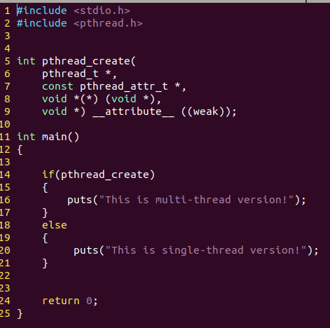	

### 3.6 调试信息

在目标文件中还有可能保存的是调试信息。几乎所有的现代编译器都支持源代码级别的调试，比如我们可以在函数里设置断点，可以监视变量变化，可以单步执行等，前提是编译器必须提前将源代码与目标代码之间的关系，比如目标代码中的地址对应源代码中的那一行、函数和变量的类型、结构体的定义、字符串保存在目标文件里面。甚至有高级的编译器和调试器支持查看STL容器的内容，即程序员在调试过程中可以直接观察STL容器中成员的值。

如果我们在gcc编译时加上-g参数,编译器就会在产生的目标文件里加上调试信息，我们可以通过readelf等工具查看到，目标文件中多了很多debug相关的段

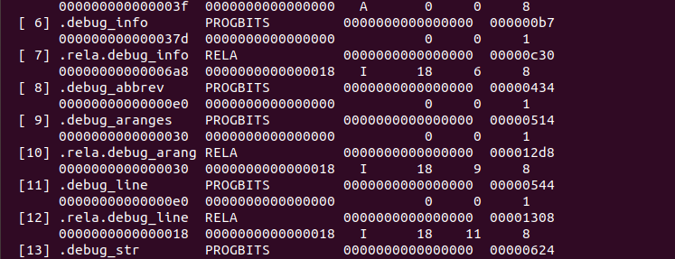	

这些段中保存的都是调试信息。现在的ELF文件采用一个叫DWARF的标准的调试信息格式。调试信息内容很大，在linux下我们可以使用strip命令来去掉调试信息。

```
strip test2.o
```


## 第四章 静态链接

a.c

```
  1 extern int shared;
  2 
  3 int main()
  4 {
  5     int a = 100;
  6     swap(&a, &shared);
  7 }

```

b.c

```
  1 int shared = 1;
  2 
  3 void swap(int* a, int* b)
  4 {
  5     *a ^= *b ^= *a ^= *b;
  6 }

```

### 4.1 空间与地址分配

对于链接器来说，整个链接过程中，它就是将几个输入目标文件加工后合并成一个输出文件。那么在这个例子里，我们的输入就是目标文件“a.o”和“b.o”，输出就是可执行文件“ab”。

第一个问题：输出文件的空间分配如何分配给输入文件？


#### 4.1.1 按序叠加

这种做法非常浪费空间，因为每一个段都须要有一定的地址和空间对齐要求，比如对于X86硬件来说，段的装载地址和空间的对齐单位是页，也就是4096字节。那么就是说如果一个段的长度只有一个字节，它也要在内存中占用4096字节。这样会造成内存空间大量的内存碎片，所以这并不是一个很好的方案。


#### 4.1.2 相似段合并

**两步链接**：

第一步 空间与地址分配

第二步 符号解析与重定位

**链接a.o与b.o**

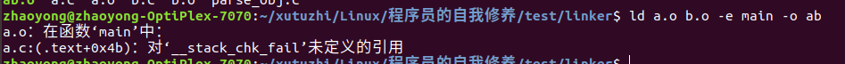	

VMA, 表示虚拟地址 LMA表示加载地址

正常情况下两个值是一样的，但是有些嵌入式系统中，特别是那些程序放在ROM的系统，LMA和VMA是不相同的。


为什么不是从虚拟地址空间0开始分配？

操作系统的进程虚拟地址空间的分配规则：32位操作系统默认从0x08048000开始分配


#### 4.1.3 符号地址的确定

.text 段 + 偏移

以a.o和b.o为例子，分析链接器的工作过程。在第一步的扫描和空间分配阶段，**各个段在链接后的虚拟地址**已经确定了。比如.data,.text段。

当前面一步完成后，链接器开始计算各个符号的虚拟地址。因为各个符号在段内的相对位置是固定的，所以这时候“main”、“shared”和“swap”地址已经确定了，

只不过链接器需要为每个符号添加一个偏移量，使它们能够调整到一个正确的虚拟地址。


### 4.2 符号解析与重定位

在完成空间和地址的分配步骤后，链接器就进入了符号解析与重定位的步骤，这也是静态链接的核心内容。在分析符号解析和重定位之前，首先让我们看看a.o里面是怎么使用这两个外部符号的。

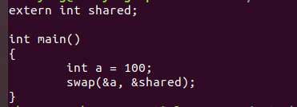	

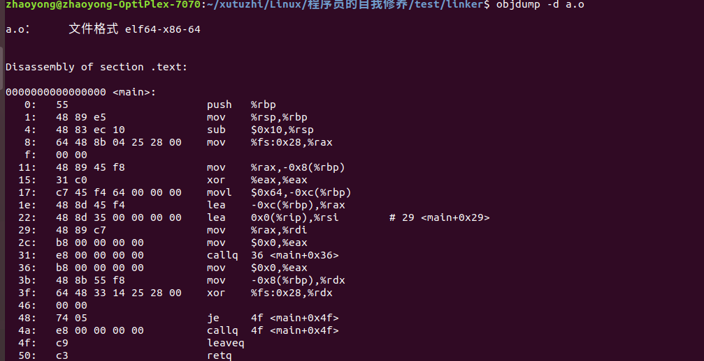	

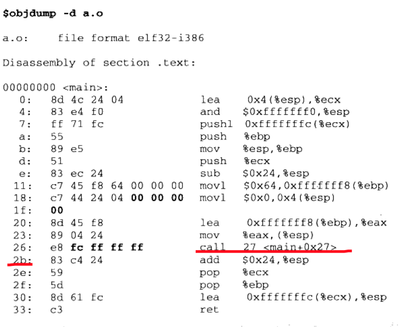	

当源代码“a.c”在被编译成目标文件之时，编译器并不知道“shared”和“swap”的地址，因为它们定义在其它目标文件中。所以编译器暂时把地址0看作是“shared”的地址，我们可以看到这条“mov”指令中，关于“shared”的地址部分为“0x00000000”.

另外一个是调用指令，它是对swap函数的调用.这是一条近址相对位移调用指令。后边四个字节是**被调用函数**的相对于**调用指令的下一条指令**的**偏移量**。在没有被重定位之前，相对偏移被置为-4

```
1111 1100  = FC
0x2b + -4 = 0x27
```

0x27地址为

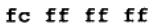	

这是一个假地址，编译器并不知道swap的地址。把真正的地址计算留给了链接器。


**指令地位修正**：

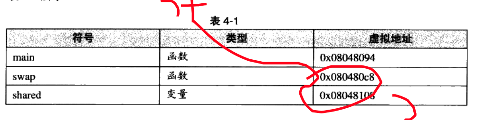

**80480bf + 09 = 08180c8**

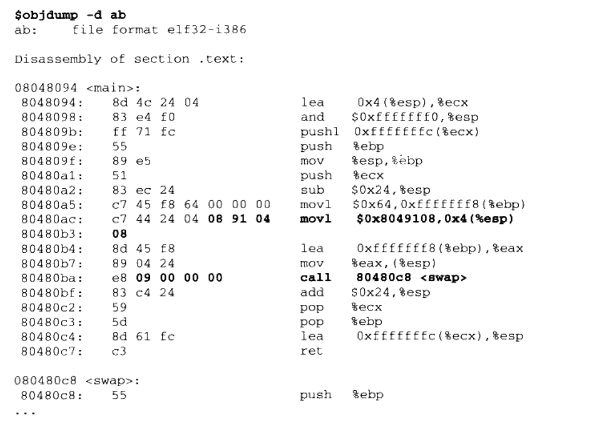


#### 	4.2.2 重定位表

链接器是怎么知道哪些指令是要被调整的呢？这些指令的哪些部分要被调整？怎么调整？比如上面例子中“mov”指令和“call”指令的调整方式就有所不同。事实上在ELF文件中，有一个重定位表的结构专门用来保存这些与重定位相关的信息。

对于可重定位的ELF文件来说，它必须包含有**重定位表**，**用来描述如何修改相应段里的内容**

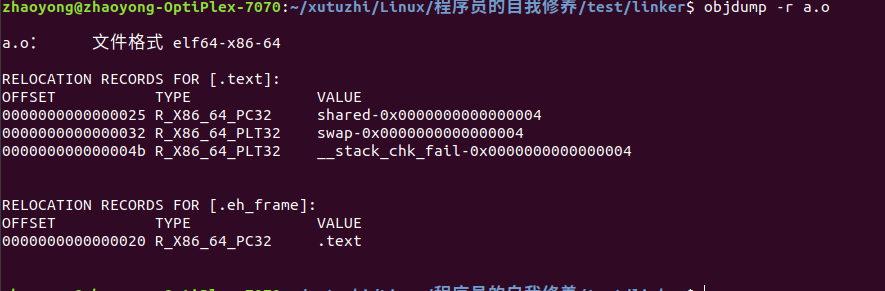	

每个要被重定位的地方，叫作一个重定位入口。重定位入口的偏移表示该入口在要被重定位的段中的位置。OFFSET表示在对应段的偏移

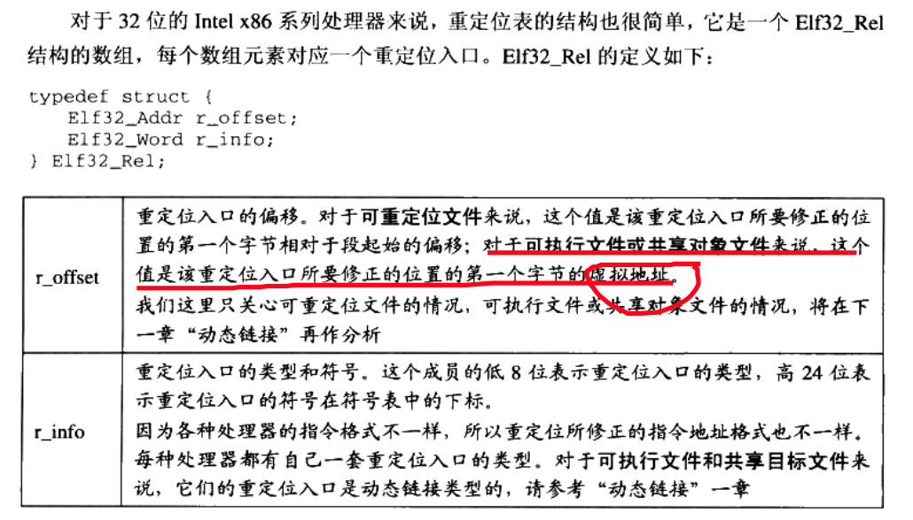	


#### 4.2.3 符号解析

重定位过程也伴随着符号解析过程，没个目标文件都可能定义一些符号，也可能引用到定义在其它目标文件的符号。重定位的过程中，每个重定位的入口都是一个对符号的引用，那么当链接器须要对某个符号的引用进行重定位时，它就要确定这个符号的目标地址。这时候链接器就会找全局符号表，找到相应的符号后进行重定位。

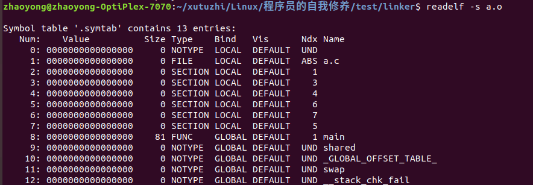	

#### 4.2.4 指令修正方式

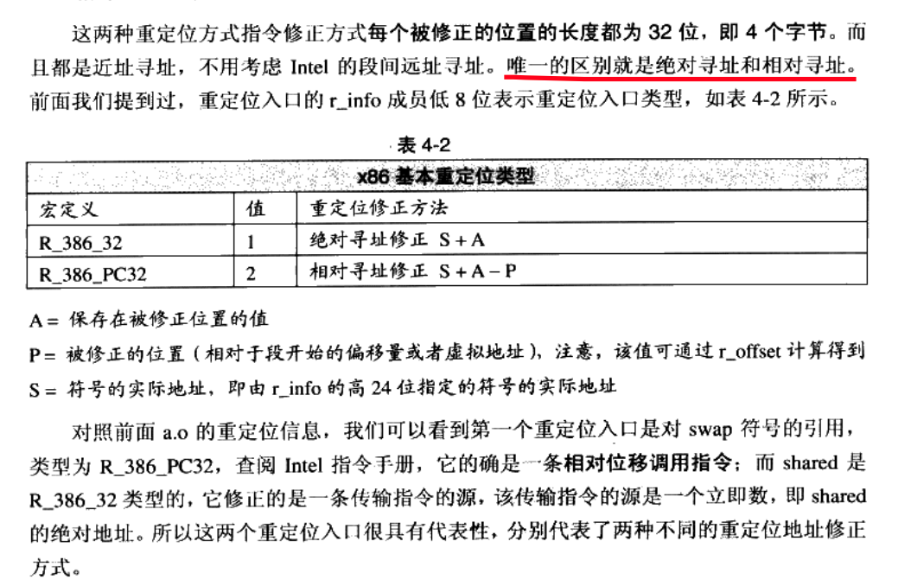	

### 4.3 COMMON块

目前编译器并不知道符号的类型，即变量类型对于链接器时透明的，它值知道一个符号的名字，并不知道类型是否一致。那我们定义多个符号类型不一致时，链接器该如何处理呢

1.两个或两个以上强符号类型不一致

多个强符号会直接报错

2.有一个强符号，其它都是弱符号，出现类型不一致

3.两个或两个以上弱符号类型不一致

现代的链接机制在处理弱符号的时候，采用的就是与COMMON块一样的机制。前面我们在SimpleSection.c这个例子中已经看到，编译器将未初始化的全局变量定义作为弱符号处理。比如符号global_uninit_var,它在符号表中的各个值为（readelf -s）

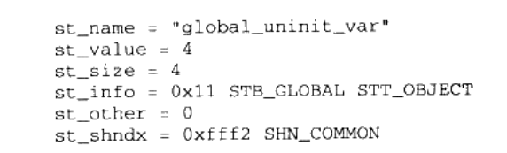	

可以看到它是一个全局的数据对象，它的类型为SHN_COMMON类型，这是一个典型的**弱符号**。那么我们在另一个文件里也定义了global_uninit_var变量，且未初始化，他的类型为double，占8个字节，情况会怎么样呢？按照COMMON类型的链接规则，原则上讲最终链接后输出文件中，global_uninit_var的大小以输入文件最大的哪个为准。即这两个文件链接后输出文件中，global_uninit_var 以输入文件最大的那个为准。即最终占8个字节。

如果链接过程中弱符号大于强符号，那么ld链接器会报如下警告:

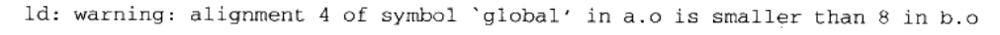

直接导致COMMON块机制的原因是编译器和链接器允许不同类型的弱符号存在，但本质的原因还是链接器不支持符号类型，即链接器无法判断各个符号的类型是否一致。

当编译器将一个编译单元编译成目标文件的时候，如果编译单元包含了弱符号（**未初始化的全局变量就是典型的弱符号**），那么该弱符号所占的空间大小此时是未知的，因为有可能其它编译单元中该符号所占的空间笔本编译单元该符号所占的空间大。所以编译单元无法为该弱符号在BSS段空间分配大小，但是在链接过程中可以知道它的大小，所以它可以在最终	输出文件的BSS段为其分配空间。所以总体看来，未初始化全局变量最终还是放在BSS段的。

GCC的“-fno-common”也允许我们把未初始化的全局变量不以COMMON块来处理

```
int global  __attribute__ ((nocommon));
```


### 4.4 C++相关问题

C++的一些语言特性使之必须由编译器和链接器共同支持才能完成工作。最主要的是两个方面，一个是C++的重复代码消除，还有一个就是全局构造与析构。两外由于c++语言的各种特性，比如虚函数	、函数重载、继承、异常等，使得它背后的数据结构异常复杂，这些数据结构往往在不同的编译器和链接器之间相互不能通用，使得c++二进制兼容性成了一个很大的问题，我们在这一节还将讨论c++二进制的兼容性问题。

#### 4.4.1 重复代码消除

模板、外部内联函数、虚函数表都有可能在不同的编译单元里生成相同的代码。模板本质上相当于宏，当模板在一个编译单元里被实例化时，它并不知道自己在别的编译单元是否也被实例化了。所以当一个模板在不同的编译单元被实例化后一定会产生重复的代码。当然最简单的方法就是不管这些，都保留下来。这样做主要有一下几个方面的问题：

1.空间浪费。

2.地址易出错。

3.指令运行效率较低。

一个比较有效的做法是将每个模板的实例代码都单独存放在一个段里，每个段只包含一个模板实例。比如模板函数add<T>(),某个编译单元以int或float类型实例化了该模板函数，那么目标文件中就包含了两个该模板实例的段，我们假设这两个段的名字叫.temp.add<int>,.temp.add<float>.这样，当别的编译单元也以int或float类型实例化该模板函数后，也会生成同样的名字，这样链接器在最终链接的时候可以区分这些相同的段，然后把它们合并入最后的代码段。

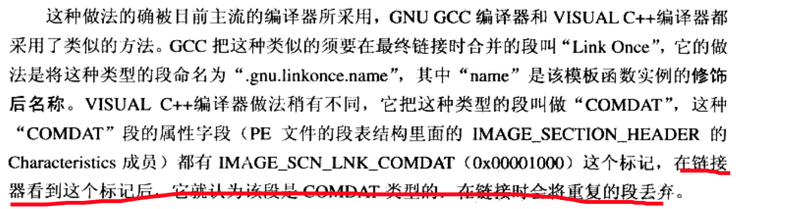	

这种重复代码消除对于模板来说是这样的，对于外部内联函数和虚函数表的做法也类似。比如对于一个有虚函数的类来说，有一个与之相对应的虚函数表，编译器会在用到该类的多个编译单元内生成虚函数表，造成代码重复；外部内联函数、默认构造函数、默认拷贝构造函数和赋值操作符也有类似的问题。解决方法类似。

函数级别链接

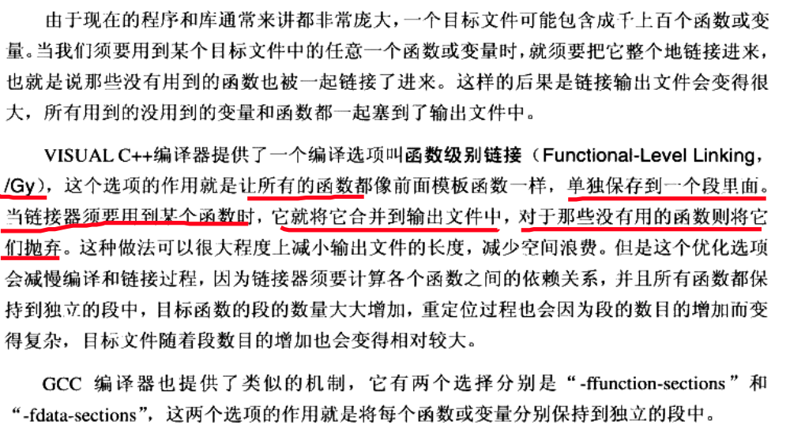

#### 4.4.2 全局构造与析构

我们知道一般的c/c++程序都是从main开始执行的，随着main函数的结束而结束。**然而，其实在main函数被调用之前，为了程序能够顺利执行，要先初始化进程执行环境，比如堆分配初始化和进程子系统等。**C++的全局对象构造函数也是在这时候开始执行的，C++的全局构造在main之前，全局析构在main之后。

linux系统下一般程序的入口是_start,这个函数是linux系统库的一部分。当我们的程序与glibc链接成可执行程序之后，会调用main函数执行程序的主体。在main函数执行完成以后，返回到初始化部分，它进行一些清理工作，然后结束进程。**对于有些场合，程序的一些特定的操作必须在main函数之前被执行，还有一些操作必须main函数之后被执行，最具代表性的就是C++的全局对象的构造与析构。**

**因此ELF文件里还保存了两种特殊的段：**

**.init** 

该段里保存的是可执行指令，它构成了进程的初始化代码。因此当一个程序开始运行时，在main函数调用之前，glibc的初始化部分安排执行这个段的代码

**.fini**

该段保存着进程终止代码指令。因此当一个程序正常退出后，glibc会安排执行这个段中的代码。

**这两个段的存在有特别的目的**，如果一个函数方到.init段,在main函数执行前系统就会执行它。同理，假如一个函数放到.fini段，在main函数之后它就会被执行。C++的全局与析构就由此实现。

#### 4.4.3 C++与ABI

两个编译器编译出来的目标文件能够相互链接必须满足下边的条件：

采用同样的目标文件格式

拥有同样的符号修饰标准

变量的内存分布方式相同

函数的调用方式相同

我们把上述内容与可执行文件二进制兼容性相关的内容称为ABI


C++一直为人诟病的原因是它的二进制兼容不太好。很多时候**库厂商**往往不希望**库用户**看到**库的源代码**


### **4.5 静态库链接**

### 
