# Linux设备驱动开发


## 前言

### 优秀程序员该具备的品质

1. 能够心平气和地学习与思考问题，透析代码背后的架构、原理和设计思想。
2. 学习能力也是优秀程序员的又一个重要品质。没有人生下来便是天才，良好的学习能力也是通过后天的不断学习培养的。可以说，学得越多的人，学新东西的速度一定越快，学习能力也变得越强。因为，知识的共通性实在太多。

### 思想之于代码

没有思想的代码是垃圾代码，没有思想的程序员，只是在完成低水平重复建设的体力活。


### 多数程序员的现状

很多程序员不过问自己写的代码最后在机器上是怎么跑的，很多事情莫名其妙地发生了，很多bug莫名其妙地消失了...他们永远都在**得过且过**。


### 技术的变化

技术工作从来都不能一劳永逸。世界变化得太快，当前技术革新的速度数倍于我们的父辈、祖辈、祖祖辈经历过的任何时代。这个时代是伪程序员的地狱，真程序员的天堂。

从浩如烟海的知识体系、不断更新的软件版本中终生学习，不断攻克一个个挑战，获取新养分，寻找新灵感，这实在是黑暗的码农生涯中不断闪现的璀璨光芒。


### 坚定选择

时代的滚滚车轮推动着linux内核的版本不断向前，也推动着我们的人生。

红尘滚滚，

我不去想是否能够成功，

既然选择了远方，

便只顾风雨兼程。


## 第１章 Linux 设备驱动概述及开发环境构建


### 1.1　设备驱动的作用

任何一个计算机系统的运转都是系统中软硬件共同努力的结果，没有硬件的软件是空中 楼阁，而没有软件的硬件则只是一堆废铁。硬件是底层基础，是所有软件得以运行的平台， 代码最终会落实为硬件上的**组合逻辑与时序逻辑**；软件则实现了具体应用，它按照各种不同 的业务需求而设计，并完成用户的最终诉求。硬件较固定，软件则很灵活，可以适应各种复 杂多变的应用。因此，计算机系统的软硬件相互成就了对方。

但是，软硬件之间同样存在着悖论，那就是软件和硬件不应该互相渗透入对方的领地。为尽可能快速地完成设计，应用软件工程师不想也不必关心硬件，而硬件工程师也难有足够 的闲暇和能力来顾及软件。譬如，应用软件工程师在调用套接字发送和接收数据包的时候， 不必关心网卡上的中断、寄存器、存储空间、I/O 端口、片选以及其他任何硬件词汇；在使 用 printf() 函数输出信息的时候，他不用知道底层究竟是怎样把相应的信息输出到屏幕或者 串口。

也就是说，应用软件工程师需要看到一个没有硬件的纯粹的软件世界，硬件必须透明地 呈现给他。**谁来实现硬件对应用软件工程师的隐形？**这个光荣而艰巨的任务就落在了驱动工 程师的头上。

对设备驱动最通俗的解释就是“驱使硬件设备行动”。驱动与底层硬件直接打交道，按 照硬件设备的具体工作方式，读写设备的寄存器，完成设备的轮询、中断处理、DMA 通信， 进行物理内存向虚拟内存的映射等，最终让通信设备能收发数据，让显示设备能显示文字和 画面，让存储设备能记录文件和数据。

由此可见，**设备驱动充当了硬件和应用软件之间的纽带**，应用软件时只需要调用系统软 件的应用编程接口（API）就可让硬件去完成要求的工作。在系统没有操作系统的情况下，工 程师可以根据硬件设备的特点自行定义接口，如对串口定义 SerialSend()、SerialRecv()，对 LED 定义 LightOn()、LightOff()，对 Flash 定义 FlashWr()、FlashRd() 等。而在有操作系统的 情况下，**驱动的架构**则由相应的**操作系统定义**，**驱动工程师必须按照相应的架构设计驱动**， 这样，**驱动**才能良好地**整合入操作系统的内核**中。

**驱动程序负责硬件和应用软件之间的沟通**，**而驱动工程师则负责硬件工程师和应用软件 工程师之间的沟通**。目前，随着通信、电子行业的迅速发展，全世界每天都会生产大量新芯 片，设计大量新电路板，也因此，会有大量设备驱动需要开发。这些驱动或运行在简单的单 任务环境中，或运行在 VxWorks、Linux、Windows 等多任务操作系统环境中，它们发挥着 不可替代的作用。


### 1.2　无操作系统时的设备驱动

并**不是任何一个计算机系统都一定要有操作系统**，在许多情况下，操作系统都不必存 在。对于功能比较单一、控制并不复杂的系统，譬如 ASIC 内部、公交车的刷卡机、电冰箱、 微波炉、简单的手机和小灵通等，并不需要多任务调度、文件系统、内存管理等复杂功能， 用单任务架构完全可以良好地支持它们的工作。一个无限循环中夹杂着对设备中断的检测或 者对设备的轮询是这种系统中软件的典型架构

在这样的系统中，虽然不存在操作系统，但是设备驱动则无论如何都必须存在。一般情 况下，每一种设备驱动都会定义为一个软件模块，包含 .h 文件和 .c 文件，前者定义该设备 驱动的数据结构并声明外部函数，后者进行驱动的具体实现。

其他模块想要使用这个设备的时候，只需要包含设备驱动的头文件 serial.h，然后调用其 中的外部接口函数。如要从串口上发送“Hello World”字符串，使用语句 SerialSend（“Hello World”，11）即可。

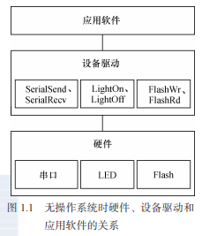	

由此可见，在没有操作系统的情况下，设备驱动 的接口被直接提交给应用软件工程师，应用软件没有 跨越任何层次就直接访问设备驱动的接口。驱动包含 的接口函数也与硬件的功能直接吻合，没有任何附加 功能。图 1.1 所示为无操作系统情况下硬件、设备驱动 与应用软件的关系。

### 1.3　有操作系统时的设备驱动

首先，无操作系统时设备驱动的硬件操作工作仍然是必不可少的，没有这一部分，驱动 不可能与硬件打交道。

其次，我们还需要将驱动融入内核。为了实现这种融合，必须在所有设备的驱动中设计 **面向操作系统**内核的接口，这样的**接口由操作系统规定**，**对一类设备而言结构一致，独立于 具体的设备**。

	

**由此可见，当系统中存在操作系统的时候，驱动变成了连接硬件和内核的桥梁**。如 图 1.4 所示，**操作系统的存在势必要求设备驱动附 加更多的代码和功能**，**把单一的“驱使硬件设备行 动**”**变成了操作系统内**与硬件交互的模块，**它对外 呈现为操作系统的 API**，不**再给应用软件工程师直 接提供接口**。

那么我们要问，有了操作系统之后，驱动反而 变得复杂，那要操作系统干什么？

首先，一个复杂的**软件系统需要处理多个并发** 的任务，没有操作系统，想完成多任务并发是很困 难的。

其次，**操作系统给我们提供内存管理机制**。一 个典型的例子是，对于多数含 MMU 的 32 位处理 器而言，Windows、Linux 等操作系统可以让每个进 程都可以独立地访问 4GB 的内存空间。

上述优点似乎并没有体现在设备驱动身上，**操作系统的存在给设备驱动**究竟带来了什么 **实质性的好处**？

简而言之，**操作系统通过给驱动制造麻烦来达到给上层应用提供便利的目的**。当驱动都 按照操作系统给出的独立于设备的接口而设计时，那么，应用程序将可使用统一的系统调用 接口来访问各种设备。对于类 UNIX 的 VxWorks、Linux 等操作系统而言，**当应用程序通过 write()、read() 等函数读写文件就可访问各种字符设备和块设备，而不论设备的具体类型和工 作方式**，那将是多么**便利**。


### 1.4 Linux 设备驱动

#### 1.4.1　设备的分类及特点

计算机系统的硬件主要由 CPU、存储器和外设组成。随着 IC 制作工艺的发展，目前， 芯片的集成度越来越高，往往在 **CPU 内部就集成了存储器和外设适配器**。譬如，相当多的 ARM、PowerPC、MIPS 等处理器都集成了 UART、I 2 C 控制器、SPI 控制器、USB 控制器、 SDRAM 控制器等，有的处理器还集成了 GPU（图形处理器）、视频编解码器等。

**驱动针对的对象是存储器和外设**（包括 CPU 内部集成的存储器和外设），而**不是针对 CPU 内核**。Linux 将存储器和外设分为 3 个基础大类。

● 字符设备。

● 块设备。

● 网络设备。

字符设备指那些必须以串行顺序依次进行访问的设备，如触摸屏、磁带驱动器、鼠标 等。块设备可以按任意顺序进行访问，以块为单位进行操作，如硬盘、eMMC 等。**字符设备 和块设备的驱动设计有出很大的差异**，但是对于用户而言，它们都要使用文件系统的操作接 口 open()、close()、read()、write() 等进行访问。

在 Linux 系统中，**网络设备面向数据包的接收和发送而设计**，它并不倾向于对应于文件 系统的节点。内核与网络设备的通信与内核和字符设备、网络设备的通信方式完全不同，前 者主要还是使用**套接字接口**。

#### 1.4.2 Linux 设备驱动与整个软硬件系统的关系

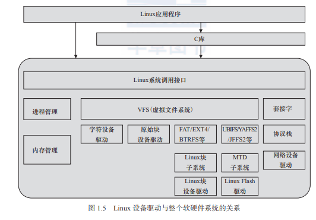	

如图 1.5 所示，除网络设备外，字符设备与块设备都被映射到 Linux 文件系统的文件和 目录，通过文件系统的系统调用接口 open()、write()、read()、close() 等即可访问字符设备 和块设备。所有字符设备和块设备都统一呈现给用户。Linux 的块设备有两种访问方法：**一 种是类似 dd 命令对应的原始块设备**，如“ /dev/sdb1”等；**另外一种方法是在块设备上建立 FAT、EXT4、BTRFS 等文件系统**，然后以文件路径如“ /home/barry/hello.txt”的形式进行 访问。在 Linux 中，针对 NOR、NAND 等提供了独立的内存技术设备（Memory Technology Device，MTD）子系统，其上运行 YAFFS2、JFFS2、UBIFS 等具备擦除和负载均衡能力的文 件系统。针对磁盘或者 Flash 设备的 FAT、EXT4、YAFFS2、JFFS2、UBIFS 等文件系统定义 了文件和目录在存储介质上的组织。而 Linux 的虚拟文件系统则统一对它们进行了抽象。


应用程序可以使用 Linux 的系统调用接口编程，但也可使用 C 库函数，**出于代码可 移植性的目的**，后者更值得推荐。C 库函数本身也通过系统调用接口而实现，如 C 库函 数 fopen()、fwrite()、fread()、fclose() 分别会调用操作系统的 API open()、write()、read()、 close()。


#### 1.4.3 Linux 设备驱动的重点、难点

Linux 设备驱动的学习是一项浩繁的工程，包含如下重点、难点。

● 编写 Linux 设备驱动要求工程师有**非常好的硬件基础**，懂得 SRAM、Flash、SDRAM、 磁盘的读写方式，UART、I 2 C、USB 等设备的接口以及轮询、中断、DMA 的原理， PCI 总线的工作方式以及 CPU 的内存管理单元（MMU）等。

● 编写 Linux 设备驱动要求工程师有**非常好的 C 语言基础**，能灵活地运用 C 语言的结 构体、指针、函数指针及内存动态申请和释放等。

● 编写 Linux 设备驱动要求工程师有一定的 L**inux 内核基础**，虽然并不要求工程师对 内核各个部分有深入的研究，但至少要明白驱动与内核的接口。尤其是对于块设 备、网络设备、Flash 设备、串口设备等复杂设备，内核定义的驱动体系结构本身就 非常复杂。

● 编写 Linux 设备驱动要求工程师有非**常好的多任务并发控制和同步**的基础，因为在驱 动中会大量使用**自旋锁、互斥、信号量、等待队列**等并发与同步机制。

上述经验值的获取并非朝夕之事，因此要求我们有足够的学习恒心和毅力。对这些重 点、难点，本书都会在相应章节进行讲解。

动手实践永远是学习任何软件开发的最好方法，学习 Linux 设备驱动也不例外。因此， 本书使用的是通过 QEMU 模拟的 ARM vexpress 电路板，本书中的所有实例均可在该“电路 板”上直接执行。

阅读经典书籍和参与 Linux 社区的讨论也是非常好的学习方法。Linux 内核源代码中包 含了一个 Documentation 目录，其中包含了一批内核设计文档，全部是文本文件。很遗憾， 这些文档的组织不太好，内容也不够细致。

学习 Linux 设备驱动的一个注意事项是要**避免管中窥豹、只见树木不见森林**，因为 各类 Linux 设备驱动都从属于一个 Linux 设备驱动的架构，单纯而片面地学习几个函数、 几个数据结构是不可能理清驱动中各组成部分之间的关系的。因此，Linux 驱动的分析方 法是**点面结合**，将对**函数和数据结构的理解**放在**整体架构的背景**之中。这是本书各章节 讲解驱动的方法。


## 第２章 驱动设计的硬件基础

### 2.1　处理器

#### 2.1.1　通用处理器

目前主流的通用处理器（GPP）多采用 SoC（片上系统）的芯片设计方法，集成了各种功 能模块，每一种功能都是由硬件描述语言设计程序，然后在 SoC 内由电路实现的。在 SoC 中，每一个模块不是一个已经设计成熟的 ASIC 器件，而是利用芯片的一部分资源去实现某 种传统的功能，将各种组件采用类似搭积木的方法组合在一起。

```
ASIC即专用集成电路，是指应特定用户要求和特定电子系统的需要而设计、制造的集成电路
```

ARM 内核的设计技术被授权给数百家半导体厂商，做成不同的 SoC 芯片。ARM 的功耗 很低，在当今最活跃的无线局域网、3G、手机终端、手持设备、有线网络通信设备等中应用 非常广泛。至本书编写时，市面上绝大多数智能手机、平板电脑都使用 ARM SoC 作为主控芯片。很多 ARM 主控芯片的集成度非常高，除了集成多核 ARM 以外，还可能集成图形处 理器、视频编解码器、浮点协处理器、GPS、WiFi、蓝牙、基带、Camera 等一系列功能。比 如，高通的 Snapdragon 810 就集成了如图 2.1 所示的各种模块。

主流的 ARM 移 动处理芯片供 应 商 包 括 高 通（Qualcomm）、三星 （Samsung）、 英 伟 达（Nvidia）、 美 满（Marvell）、联发科（MTK）、海思 （HiSilicon）、 展 讯（Spreadtrum） 等。 德州仪器（TI）、博通（Broadcom）则 已淡出手机芯片业务。

中央处理器的体系结构可以分为 两类，一类为冯·诺依曼结构，另一 类为哈佛结构。Intel 公司的中央处理 器、ARM 的 ARM7、MIPS 公司的 MIPS 处理器采用了冯·诺 依 曼 结 构； 而 AVR、ARM9、ARM10、ARM11 以 及 Cortex A 系列等则采用了哈佛结构。

冯·诺依曼结构也称普林斯顿结 构，是一种将程序指令存储器和数据 存储器合并在一起的存储器结构。程序指令存储地址和数据存储地址指向同一个存储器的不 同物理位置，因此程序指令和数据的宽度相同。而哈佛结构将程序指令和数据分开存储，指 令和数据可以有不同的数据宽度。此外，哈佛结构还采用了独立的程序总线和数据总线，分 别作为 CPU 与每个存储器之间的专用通信路径，具有较高的执行效率。图 2.2 描述了冯·诺 依曼结构和哈佛结构的区别。

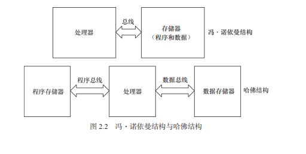


许多芯片采用的是如图 2.3 所示的改进的哈佛架构，它具有独立的地址总线和数据总线， 两条总线由程序存储器和数据存储器分时共用。因此，改进的哈佛结构针对程序和数据，其 实没有独立的总线，而是使用公用数据总线来完成程序存储模块或数据存储模块与 CPU 之 间的数据传输，公用的地址总线来寻址 程序和数据。

从指令集的角度来讲，中央处理器 也可以分为两类，即 RISC（精简指令集 计算机）和 CISC（复杂指令集计算机）。 CSIC 强调增强指令的能力、减少目标代 码的数量，但是指令复杂，指令周期长； 而 RISC 强调尽量减少指令集、指令单周 期执行，但是目标代码会更大。ARM、 MIPS、PowerPC 等 CPU 内核都采用了 RISC 指令集。目前，RISC 和 CSIC 两者 的融合非常明显。


#### 2.1.2　数字信号处理器

数字信号处理器（DSP）针对通信、图像、语音和视频处理等领域的算法而设计。它包含 独立的硬件乘法器。DSP 的乘法指令一般在单周期内完成，且优化了卷积、数字滤波、FFT（快 速傅里叶变换）、相关矩阵运算等算法中的大量重复乘法。

DSP 分为两类，一类是定点 DSP，另一类是浮点 DSP。浮点 DSP 的浮点运算用硬件来 实现，可以在单周期内完成，因而其浮点运算处理速度高于定点 DSP。而定点 DSP 只能用 定点运算模拟浮点运算。

德州仪器（TI）、美国模拟器件公司（ADI）是全球 DSP 的两大主要厂商。

TI 的 TMS320 ™ DSP 平台包含了功能不同的多个系列，如 2000 系列、3000 系列、4000 系列、5000 系列、6000 系列，工程师也习惯称其为 2x、3x、4x、5x、6x。2010 年 5 月，TI 已经宣布为其 C64x 系列数字信号处理器与多核片上系统提供 Linux 内核支持，以充分满足 通信与关键任务基础设施、医疗诊断以及高性能测量测试等应用需求。TI 也推出了软件可编 程多核 ARM + DSP SoC，即 KeyStone 多核 ARM+DSP 处理器，以满足医疗成像应用、任务 关键应用、测试和自动化应用的需求。

ADI 主要有 16 位定点的 21xx 系列、32 位浮点的 SHARC 系列、从 SHARC 系列发展 而来的 TigerSHARC 系列，以及高性能 16 位 DSP 信号处理能力与通用微控制器方便性相结 合 的 blackfin 系列等。ADI 的 blackfin 不 含 MMU，完整支持 Linux，是没有 MMU 情况下 Linux 的典型案例，其官方网站为 http://blackfin.uclinux.org，目前 blackfin 的 Linux 开发保持 了与 Linux mainline 的同步。

通用处理器和数字信号处理器也有相互融合以取长补短的趋势，如数字信号控制器 （DSC）即为 MCU+DSP，ADI 的 blackfin 系列就属于 DSC。目前，芯片厂商也推出了许多 ARM+DSP 的双核以及多核处理器，如 TI 公司的 OMAP 4 平台就包括 4 个主要处理引擎： ARM Cortex-A9 MPCore、PowerVR SGX 540 GPU（Graphic Processing Unit）、C64x DSP 和 ISP（Image Signal Processor）。

除了上面讲述的通用微控制器和数字信号处理器外，还有一些针对特定领域而设计的 专用处理器（ASP），它们都是针对一些特定应用而设计的，如用于 HDTV、ADSL、Cable Modem 等的专用处理器。

网络处理器是一种可编程器件，它应用于电信领域的各种任务，如包处理、协议分析、 路由查找、声音 / 数据的汇聚、防火墙、QoS 等。网络处理器器件内部通常由若干个微码处 理器和若干硬件协处理器组成，多个微码处理器在网络处理器内部并行处理，通过预先编制 的微码来控制处理流程。而对于一些复杂的标准操作（如内存操作、路由表查找算法、QoS 的拥塞控制算法、流量调度算法等），则采用硬件协处理器来进一步提高处理性能，从而实现 了业务灵活性和高性能的有机结合。

对于某些应用场合，使用 ASIC（专用集成电路）往往是低成本且高性能的方案。ASIC 专门针对特定应用而设计，不具备也不需要灵活的编程能力。使用 ASIC 完成同样的功能往 往比直接使用 CPU 资源或 CPLD（复杂可编程逻辑器件）/FPGA（现场可编程门阵列）来得 更廉价且高效。

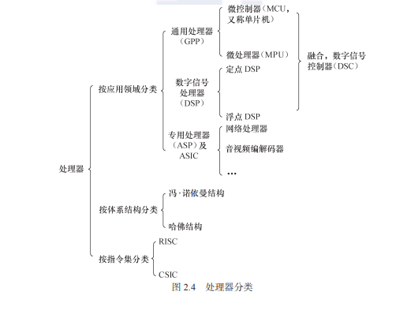	

在实际项目的硬件方案中，往往会根据应用的需求选择通用处理器、数字信号处理器、 特定领域处理器、CPLD/FPGA 或 ASIC 之一的解决方案，在复杂的系统中，这些芯片可能会 同时存在，协同合作，各自发挥自己的长处。如在一款智能手机中，可使用 MCU 处理图形 用户界面和用户的按键输入并运行多任务操作系统，使用 DSP 进行音视频编解码，而在射频 方面则采用 ASIC。


### 2.2　存储器

存储器主要可分类为只读储存器（ROM）、闪存（Flash）、随机存取存储器（RAM）、光 / 磁介质储存器。

ROM 还可再细分为不可编程 ROM、可编程 ROM（PROM）、 可 擦 除 可 编 程 ROM （EPROM）和电可擦除可编程 ROM（E2 PROM），E2 PROM 完全可以用软件来擦写，已经非常 方便了。

NOR（或非）和 NAND（与非）是市场上两种主要的 Flash 闪存技术。Intel 于 1988 年首 先开发出 NOR Flash 技术，彻底改变了原先由 EPROM 和 EEPROM 一统天下的局面。紧接 着，1989 年，东芝公司发表了 NAND Flash 结构，每位的成本被大大降低。

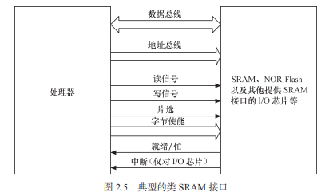	

NOR Flash 和 CPU 的接口属于典型的类 SRAM 接口（如图 2.5 所示），不需要增加额外 的控制电路。NOR Flash 的特点是可芯片内执行（eXecute In Place，XIP），程序可以直接在 NOR 内运行。而 NAND Flash 和 CPU 的接口必须由相应的控制电路进行转换，当然也可以 通过地址线或 GPIO 产生 NAND Flash 接口的信号。NAND Flash 以块方式进行访问，不支持 芯片内执行。

公共闪存接口（Common Flash Interface， CFI）是一个从 NOR Flash 器件中读取数据的公 开、标准接口。它可以使系统软件查询已安装的 Flash 器件的各种参数，包括器件阵列结构 参数、电气和时间参数以及器件支持的功能等。如果芯片不支持 CFI，就需使用 JEDEC（Joint Electron Device Engineering Council，电子电器设备联合会）了。JEDEC 规范的 NOR 则无法 直接通过命令来读出容量等信息，需要读出制造商 ID 和设备 ID，以确定 Flash 的大小。

与 NOR Flash 的类 SRAM 接口不同，一个 NAND Flash 的接口主要包含如下信号。

● I/O 总线：地址、指令和数据通过这组总线传输，一般为 8 位或 16 位。

● 芯片启动（Chip Enable，CE#）：如果没有检测到 CE 信号，NAND 器件就保持待机 模式，不对任何控制信号做出响应。 

● 写使能（Write Enable，WE#）：WE# 负责将数据、地址或指令写入 NAND 之中。

● 读使能（Read Enable，RE#）：RE# 允许数据输出。 

● 指令锁存使能（Command Latch Enable，CLE）：当 CLE 为高电平时，在 WE# 信号的 上升沿，指令将被锁存到 NAND 指令寄存器中。 

● 地址锁存使能（Address Latch Enable，ALE）：当 ALE 为高电平时，在 WE# 信号的上 升沿，地址将被锁存到 NAND 地址寄存器中。

● 就绪 / 忙（Ready/Busy，R/B#）：如果 NAND 器件忙，R/B# 信号将变为低电平。该信 号是漏极开路，需要采用上拉电阻。

NAND Flash 较 NOR Flash 容量大，价格低；NAND Flash 中每个块的最大擦写次数是 100 万次，而 NOR 的擦写次数是 10 万次；NAND Flash 的擦除、编程速度远超过 NOR Flash。

由于 Flash 固有的电器特性，在读写数据过程中，偶然会产生 1 位或几位数据错误，即 位反转，NAND Flash 发生位反转的概率要远大于 NOR Flash。位反转无法避免，因此，使用 NAND Flash 的同时，应采用错误探测 / 错误更正（EDC/ECC）算法。

Flash 的编程原理都是只能将 1 写为 0，而不能将 0 写为 1。因此在 Flash 编程之前，必 须将对应的块擦除，而擦除的过程就是把所有位都写为 1 的过程，块内的所有字节变为 0xFF。另外，Flash 还存在一个负载均衡的问题，不能老是在同一块位置进行擦除和写的动 作，这样容易导致坏块。

值得一提的是，目前 NOR Flash 可以使用 SPI 接口进行访问以节省引脚。相对于传统的 并行 NOR Flash 而言，SPI NOR Flash 只需要 6 个引脚就能够实现单 I/O、双 I/O 和 4 个 I/O 口的接口通信，有的 SPI NOR Flash 还支持 DDR 模式，能进一步提高访问速度到 80MB/s。

IDE（Integrated Drive Electronics）接口可连接硬盘控制器或光驱，IDE 接口的信号与 SRAM 类似。人们通常也把 IDE 接口称为 ATA（Advanced Technology Attachment）接口，不 过，从技术角度而言，这并不准确。其实，ATA 接口发展至今，已经经历了 ATA-1（IDE）、 ATA-2（Enhanced IDE/Fast ATA，EIDE）、ATA-3（FastATA-2）、Ultra ATA、Ultra ATA/33、 Ultra ATA/66、Ultra ATA/100 及 Serial ATA（SATA）的发展过程。

很多 SoC 集成了一个 eFuse 电编程熔丝作为 OTP（One-Time Programmable，一次性可编程）存储器。eFuse 可以通过计算机对芯片内部的参数和功能进行配置，这一般是在芯片出厂 的时候已经设置好了。以上所述的各种 ROM、Flash 和磁介质存储器都属于非易失性存储器（NVM）的范畴， 掉电时信息不会丢失，而 RAM 则与此相反。

RAM 也可再分为静态 RAM（SRAM）和动态 RAM（DRAM）。DRAM 以电荷形式进 行存储，数据存储在电容器中。由于电容器会因漏电而出现电荷丢失，所以 DRAM 器件需 要定期刷新。SRAM 是静态的，只要供电它就会保持一个值，SRAM 没有刷新周期。每个 SRAM 存储单元由 6 个晶体管组成，而 DRAM 存储单元由 1 个晶体管和 1 个电容器组成。

通常所说的 SDRAM、DDR SDRAM 皆属于 DRAM 的范畴，它们采用与 CPU 外存控制 器同步的时钟工作（注意，不是与 CPU 的工作频率一致）。与 SDRAM 相比，DDR SDRAM 同时利用了时钟脉冲的上升沿和下降沿传输数据，因此在时钟频率不变的情况下，数据传 输频率加倍。此外，还存在使用 RSL（Rambus Signaling Level，Rambus 发信电平）技术的 RDRAM（Rambus DRAM）和 Direct RDRAM。 针对许多特定场合的应用，嵌入式系统中往往还使用了一些特定类型的 RAM。

1.DPRAM：双端口 RAM

 DPRAM 的特点是可以通过两个端口同时访问，具有两套完全独立的数据总线、地址总 线和读写控制线，通常用于两个处理器之间交互数据，如图 2.6 所示。当一端被写入数据后， 另一端可以通过轮询或中断获知，并读取其写入的数据。由于双 CPU 同时访问 DPRAM 时 的仲裁逻辑电路集成在 DPRAM 内部，所以需要硬件工程师设计的电路原理比较简单。

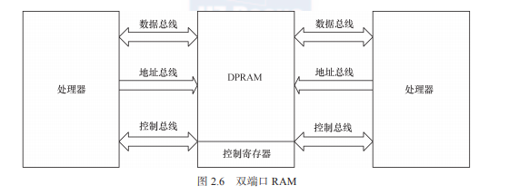	

DPRAM 的优点是通信速度快、实时性强、接口简单，而且两边处理器都可主动进行数 据传输。除了双端口 RAM 以外，目前 IDT 等芯片厂商还推出了多端口 RAM，可以供 3 个 以上的处理器互通数据。

2. CAM：内容寻址 RAM

   CAM 是以内容进行寻址的存储器，是一种特殊的存储阵列 RAM，它的主要工作机制就 是同时将一个输入数据项与存储在 CAM 中的所有数据项自动进行比较，判别该输入数据项与 CAM 中存储的数据项是否相匹配，并输出该数据项对应的匹配信息。如图 2.7 所示，在 CAM 中，输入 的是所要查询的数据，输出的是数据 地址和匹配标志。若匹配（即搜寻到数 据），则输出数据地址。CAM 用于数据 检索的优势是软件无法比拟的，它可 以极大地提高系统性能。

3. FIFO：先进先出队列

   FIFO 存储器的特点是先进先出， 进 出 有 序，FIFO 多用于数据缓冲。 FIFO 和 DPRAM 类似，具有两个访问 端口，但是 FIFO 两边的端口并不对等，某一时刻只能设置为一边作为输入，一边作为输出。

   如果 FIFO 的区域共有 n 个字节，我们只能通过循环 n 次读取同一个地址才能将该片区 域读出，不能指定偏移地址。对于有 n 个数据的 FIFO，当循环读取 m 次之后，下一次读时 会自动读取到第 m + 1 个数据，这是由 FIFO 本身的特性决定的。

   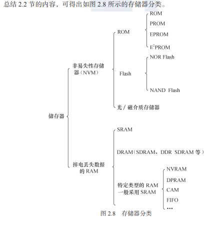	

### 2.3　接口与总线

#### 2.3.1　串口

RS-232、RS-422 与 RS-485 都是串行数据接口标准，最初都是由电子工业协会（EIA）制 订并发布的。

RS-232 在 1962 年发布，命名为 EIA-232-E。之后发布的 RS-422 定义了一种平衡通信接 口，它是一种单机发送、多机接收的单向、平衡传输规范，被命名为 TIA/EIA-422-A 标准。 RS-422 改进了 RS-232 通信距离短、速率低的缺点。为进一步扩展应用范围，EIA 又于 1983 年在 RS-422 的基础上制定了 RS-485 标准，增加了多点、双向通信能力，即允许多个发送器 连接到同一条总线上，同时增加了发送器的驱动能力和冲突保护特性，并扩展了总线共模范 围，被命名为 TIA/EIA-485-A 标准。

1969 年发布的 RS-232 修改版 RS-232C 是嵌入式系统中应用最广泛的串行接口，它 为连接 DTE（数据终端设备）与 DCE（数据通信设备）而制定。RS-232C 标准接口有 25 条线（4 条数据线、11 条控制线、3 条定时线、7 条备用和未定义线），常用的只有 9 根， 它们是 RTS/CTS（请求发送 / 清除发送流控制）、RxD/TxD（数据收发）、DSR/DTR（数据 终端就绪 / 数据设置就绪流控制）、DCD（数据载波检测，也称 RLSD，即接收线信号检出）、 Ringing-RI（振铃指示）、SG（信号地）信号。RTS/CTS、RxD / TxD、DSR/DTR 等信号 的定义如下。

最简单的 RS-232C 串口只需要连接 RxD、TxD、SG 这 3 个信号，并使用 XON/XOFF 软 件流控。

组成一个 RS-232C 串口的硬件原理如图 2.9 所示，从 CPU 到连接器依次为 CPU、UART （通用异步接收器发送器，作用是完成并 / 串转换）、CMOS/TTL 电平与 RS-232C 电平转换、 DB9/DB25 或自定义连接器。

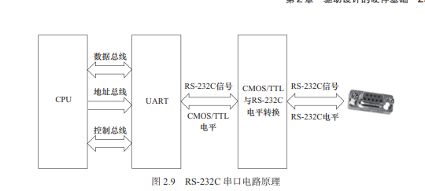	

#### 2.3.2 I2C

I 2 C（内置集成电路）总线是由 Philips 公司开发的两线式串行总线，产生于 20 世纪 80 年 代，用于连接微控制器及其外围设备。I 2 C 总线简单而有效，占用的 PCB（印制电路板）空间 很小，芯片引脚数量少，设计成本低。I 2 C 总线支持多主控（Multi-Mastering）模式，任何能 够进行发送和接收的设备都可以成为主设备。主控能够控制数据的传输和时钟频率，在任意 时刻只能有一个主控。

组成 I 2 C 总线的两个信号为数据线 SDA 和时钟 SCL。为了避免总线信号的混乱，要求各 设备连接到总线的输出端必须是开漏输出或集电极开路输出的结构。总线空闲时，上拉电阻 使 SDA 和 SCL 线都保持高电平。根据开漏输出或集电极开路输出信号的“线与”逻辑，I 2 C 总线上任意器件输出低电平都会使相应总线上的信号线变低。

#### 2.3.3 SPI

SPI（Serial Peripheral Interface，串行外设接口）总线系统是一种同步串行外设接口，它 可以使 CPU 与各种外围设备以串行方式进 行通信以交换信息。一般主控 SoC 作 为 SPI 的“主”，而外设作为 SPI 的“从”。

#### 2.3.4 USB 

USB（通用串行总线）是 Intel、Microsoft 等厂商为解决计算机外设种类的日益增加与有 限的主板插槽和端口之间的矛盾而于 1995 年提出的，它具有数据传输率高、易扩展、支持 即插即用和热插拔的优点，目前已得到广泛应用。

#### 2.3.5	以太网接口

以太网接口由 MAC（以太网媒体接入控制器）和 PHY（物理接口收发器）组成。以太 网 MAC 由 IEEE 802.3 以太网标准定义，实现了数据链路层。常用的 MAC 支持 10Mbit/s 或 100Mbit/s 两种速率。吉比特以太网（也称为千兆位以太网）是快速以太网的下一代技术，将 网速提高到了 1000 Mbit/s。千兆位以太网以 IEEE 802.3z 和 802.3ab 发布，作为 IEEE 802.3 标准的补充。

#### 2.3.6 PCI 和 PCI-E 

PCI（外围部件互连）是由 Intel 于 1991 年推出的一种局部总线，作为一种通用的总线接 口标准，它在目前的计算机系统中得到了非常广泛应用。PCI 总线具有如下特点。

#### 2.3.7 SD 和 SDIO

SD（Secure Digital）是一种关于 Flash 存储卡的标准，也就是一般常见的 SD 记忆卡，在 设计上与 MMC（Multi-Media Card）保持了兼容。SDHC（SD High Capacity）是大容量 SD 卡， 支持的最大容量为 32GB。2009 年发布的 SDXC（SD eXtended Capacity）则支持最大 2TB 大 小的容量。


### 2.4 CPLD 和 FPGA

CPLD（复杂可编程逻辑器件）由完全可编程的与或门阵列以及宏单元构成。

与 CPLD 不同，FPGA（现场可编程门阵列）基于 LUT（查找表）工艺。查找表本质上是 一片 RAM，当用户通过原理图或 HDL（硬件描述语言）描述了一个逻辑电路以后，FPGA 开 发软件会自动计算逻辑电路所有可能的结果，并把结果事先写入 RAM。这样，输入一组信 号进行逻辑运算就等于输入一个地址进行查表以输出对应地址的内容。

### 2.5 原理图分析

原理图分析的含义是指通过阅读电路板的原理图获得各种存储器、外设所使用的硬件资 源、接口和引脚连接关系。若要整体理解整个电路板的硬件组成，原理图的分析方法是以主 CPU 为中心向存储器和外设辐射，步骤如下。

### 2.6　硬件时序分析

### 2.8　仪器仪表使用


## 第３章 Linux 内核及内核编程

### Linus Torvalds 的一番话

```
技术成长的源动力应该是兴趣而非其他，只有兴趣才可以支撑一个人持续不
断地十年如一日地努力与学习。
```

### 3.1 Linux 内核空间与用户空间

现代 CPU 内部往往实现了不同操作模式（级别），不同模式有不同功能，高层程序往往 不能访问低级功能，而必须以某种方式切换到低级模式。

例如，ARM 处理器分为 7 种工作模式。

● 用户模式（usr）：大多数应用程序运行在用户模式下，当处理器运行在用户模式下时， 某些被保护的系统资源是不能访问的。

● 快速中断模式（fiq）：用于高速数据传输或通道处理。

● 外部中断模式（irq）：用于通用的中断处理。

● 管理模式（svc）：操作系统使用的保护模式。

● 数据访问中止模式（abt）：当数据或指令预取中止时进入该模式，可用于虚拟存储及 存储保护。

● 系统模式（sys）：运行具有特权的操作系统任务。

● 未定义指令中止模式（und）：当未定义的指令执行时进入该模式，可用于支持硬件协 处理器的软件仿真。

**ARM Linux 的系统调用实现原理是采用 swi 软中断从用户（usr）模式陷入管理模式（svc）**

又如，x86 处理器包含 4 个不同的特权级，称为 Ring 0 ～ Ring 3。在 Ring0 下，可以执 行特权级指令，对任何 I/O 设备都有访问权等，而 Ring3 则被限制很多操作。

**Linux 系统可充分利用 CPU 的这一硬件特性，但它只使用了两级。**在 Linux 系统中，内 核可进行任何操作，而应用程序则被禁止对硬件的直接访问和对内存的未授权访问。例如， 若使用 x86 处理器，则用户代码运行在特权级 3，而系统内核代码则运行在特权级 0。内核空间和用户空间这两个名词用来区分程序执行的两种不同状态，它们使用不同的地 址空间。**Linux 只能通过系统调用和硬件中断完成从用户空间到内核空间的控制转移。**


### 3.2 Linux 内核的编译及加载

#### 3.2.1 Kconfig 和 Makefile 

**在 Linux 内核中增加程序需要完成以下 3 项工作**。

● 将编写的源代码复制到 Linux 内核源代码的相应目录中。 

● 在目录的 Kconfig 文件中增加关于新源代码对应项目的编译配置选项。

● 在目录的 Makefile 文件中增加对新源代码的编译条目。

1. ##### 实例引导：TTY_PRINTK 字符设备

在讲解 Kconfig 和 Makefile 的语法之前，我们先利用两个简单的实例引导读者对其建立 对具初步的认识。

首先，在 drivers/char 目录中包含了 TTY_PRINTK 设备驱动的源代码 drivers/char/ttyprintk.c。 而在该目录的 Kconfig 文件中包含关于 TTY_PRINTK 的配置项：

```
config TTY_PRINTK
 tristate "TTY driver to output user messages via printk"
 depends on EXPERT && TTY
 default n
 ---help---
 If you say Y here, the support for writing user messages (i.e.
 console messages) via printk is available.
 The feature is useful to inline user messages with kernel
 messages.
 In order to use this feature, you should output user messages
 to /dev/ttyprintk or redirect console to this TTY.
 If unsure, say N.
```

上述 Kconfig 文件的这段脚本意味着只有在 EXPERT 和 TTY 被配置的情况下，才会出 现 TTY_PRINTK 配置项，这个配置项为三态（可编译入内核，可不编译，也可编译为内核模 块，选项分别为“ Y”、“ N”和“ M”），菜单上显示的字符串为“ TTY driver to output user messages via printk”，“ help”后面的内容为帮助信息。图 3.10 显示了 TTY_PRINTK 菜单以 及 help 在运行 make menuconfig 时的情况

除了布尔（bool）配置项外，还存在一种布尔配置选项，它意味着要么编译入内核，要么 不编译，选项为“Y”或“N”。

在目录的 Makefile 中关于 TTY_PRINTK 的编译项为：

```
obj-$(CONF iG_TTY_PRINTK) += ttyprintk.o
```

上述脚本意味着如果 TTY_PRINTK 配置选项被选择为“ Y”或“ M”，即 obj-$(CONFIG_ TTY_PRINTK) 等同于 obj-y 或 obj-m，则编译 ttyprintk.c，选“ Y”时会直接将生成的目标代 码连接到内核，选“ M”时则会生成模块 ttyprintk.ko ；如果 TTY_PRINTK 配置选项被选择 为“N”，即 obj-$(CONFIG_TTY_PRINTK) 等同于 obj-n，则不编译 ttyprintk.c。

一般而言，驱动开发者会在内核源代码的 drivers 目录内的相应子目录中增加新设备驱动 的源代码或者在 arch/arm/mach-xxx 下新增加板级支持的代码，同时增加或修改 Kconfig 配置 脚本和 Makefile 脚本，具体执行完全仿照上述过程即可。

2. ##### Makefile

这里主要对内核源代码各级子目录中的 kbuild（内核的编译系统）Makefile 进行简单介绍， 这部分是内核模块或设备驱动开发者最常接触到的。

Makefile 的语法包括如下几个方面。

（1）目标定义

目标定义就是用来定义哪些内容要作为模块编译，哪些要编译并链接进内核。

例如：

```
obj-y += foo.o
```

表示要由 foo.c 或者 foo.s 文件编译得到 foo.o 并链接进内核（无条件编译，所以不需要 Kconfig 配置选项），而 obj-m 则表示该文件要作为模块编译。obj-n 形式的目标不会被编译。

更常见的做法是根据 make menuconfig 后生成的 config 文件的 CONFIG_ 变量来决定文件 的编译方式，如：

```
obj-$(CONF iG_ISDN) += isdn.o
obj-$(CONF iG_ISDN_PPP_BSDCOMP) += isdn_bsdcomp.o
```

除了具有 obj- 形式的目标以外，还有 lib-y library 库、hostprogs-y 主机程序等目标，但 是这两类基本都应用在特定的目录和场合下。

（2）多文件模块的定义。

最简单的 Makefile 仅需一行代码就够了。如果一个模块由多个文件组成，会稍微复杂一 些，这时候应采用模块名加 -y 或 -objs 后缀的形式来定义模块的组成文件，如下：

模块的名字为 ext2，由 balloc.o、dir.o、file.o 等多个目标文件最终链接生成 ext2.o 直至 ext2.ko 文件，并且是否包括 xattr.o、acl.o 等则取决于内核配置文件的配置情况，例如，如果 CONFIG_ EXT2_FS_POSIX_ACL 被选择，则编译 acl.c 得到 acl.o 并最终链接进 ext2。

（3）目录层次的迭代

如下例：

```
obj-$(CONF iG_EXT2_FS) += ext2/
```

当 CONFIG_EXT2_FS 的值为 y 或 m 时，kbuild 将会把 ext2 目录列入向下迭代的目 标中。


3. Kconfig

内核配置脚本文件的语法也比较简单，主要包括如下几个方面。

（1）配置选项

大多数内核配置选项都对应 Kconfig 中的一个配置选项（config）：

```
conf ig MODVERSIONS
 bool "Module versioning support"
 help
 Usually, you have to use modules compiled with your kernel.
 Saying Y here makes it ...
```

“ config”关键字定义新的配置选项，之后的几行代码定义了该配置选项的属性。配 置选项的属性包括类型、数据范围、输入提示、依赖关系、选择关系及帮助信息、默认 值等。

 每个配置选项都必须指定类型，类型包括 bool、tristate、string、hex 和 int，其中 tristate 和 string 是两种基本类型，其他类型都基于这两种基本类型。类型定义后可以 紧跟输入提示，下面两段脚本是等价的

```
bool “Networking support”
和
bool
prompt "Networking support"
```

● 输入提示的一般格式为：

```
prompt <prompt> [if <expr>]
```

● 默认值的格式为：

```
default <expr> [if <expr>]
```

如果用户不设置对应的选项，配置选项的值就是默认值。

● 依赖关系的格式为：

```
depends on（或者 requires） <expr>
```

如果定义了多重依赖关系，它们之间用“ &&”间隔。依赖关系也可以应用到该菜单中 所有的其他选项（同样接受 if 表达式）内，下面两段脚本是等价的：

```
bool "foo" if BAR
default y if BAR
或
depends on BAR
bool "foo"
default y
```

● 选择关系（也称为反向依赖关系）的格式为：

```
select <symbol> [if <expr>]
```

A 如果选择了 B，则在 A 被选中的情况下，B 自动被选中。

● 数据范围的格式为：

```
range <symbol> <symbol> [if <expr>]
```

 Kconfig 中的 expr（表达式）定义为：

```
<expr> ::= <symbol>
 <symbol> '=' <symbol>
 <symbol> '!=' <symbol>
 '(' <expr> ')'
 '!' <expr>
 <expr> '&&' <expr>
 <expr> '||' <expr> 
```

也就是说，expr 是由 symbol、两个 symbol 相等、两个 symbol 不等以及 expr 的赋值、 非、与或运算构成。而 symbol 分为两类，一类是由菜单入口配置选项定义的非常数 symbol， 另一类是作为 expr 组成部分的常数 symbol。比如，SHDMA_R8A73A4 是一个布尔配置选项， 表达式“ ARCH_R8A73A4 && SH_DMAE != n”暗示只有当 ARCH_R8A73A4 被选中且 SH_ DMAE 没有被选中的时候，才可能出现这个 SHDMA_R8A73A4。

```
conf ig SHDMA_R8A73A4
 def_bool y
 depends on ARCH_R8A73A4 && SH_DMAE != n
```

● 为 int 和 hex 类型的选项设置可以接受的输入值范围，用户只能输入大于等于第一个 symbol，且小于等于第二个 symbol 的值。

● 帮助信息的格式为：

```
help（或 ---help---）
 开始
 …
 结束
```

帮助信息完全靠文本缩进识别结束。“ ---help---”和“ help”在作用上没有区别，设计 “---help---”的初衷在于将文件中的配置逻辑与给开发人员的提示分开。

（2）菜单结构

配置选项在菜单树结构中的位置可由两种方法决定。第一种方式为：

```
menu "Network device support"
 depends on NET
conf ig NETDEVICES
 …
endmenu
```

所有处于“ menu”和“ endmenu”之间的配置选项都会成为“ Network device support” 的子菜单，而且，所有子菜单（config）选项都会继承父菜单（menu）的依赖关系，比如， “Network device support”对“NET”的依赖会被加到配置选项 NETDEVICES 的依赖列表中。

注意：menu 后面跟的“Network device support”项仅仅是 1 个菜单，没有对应真实的配 置选项，也不具备 3 种不同的状态。这是它和 config 的区别。

另一种方式是通过分析依赖关系生成菜单结构。如果菜单项在一定程度上依赖于前面的 选项，它就能成为该选项的子菜单。如果父选项为“ n”，子选项不可见；如果父选项可见， 子选项才可见。例如：

```
conf ig MODULES
 bool "Enable loadable module support"
conf ig MODVERSIONS
 bool "Set version information on all module symbols"
 depends on MODULES
comment "module support disabled"
 depends on !MODULES
```

MODVERSIONS 直接依赖 MODULES，只有 MODULES 不为“n”时，该选项才可见。

除此之外，Kconfig 中还可能使用“ choices ... endchoice”、“ comment”、“ if...endif”这 样的语法结构。其中“choices ... endchoice”的结构为：

```
choice
<choice options>
<choice block>
endchoice"
```

它定义一个选择群，其接受的选项（choice options）可以是前面描述的任何属性，例如， LDD6410 的 VGA 输出分辨率可以是 1 024×768 或 者 800×600， 在 drivers/video/samsung/ Kconfig 中就定义了如下 choice：

```
choice
depends on FB_S3C_VGA
prompt "Select VGA Resolution for S3C Framebuffer"
default FB_S3C_VGA_1024_768
conf ig FB_S3C_VGA_1024_768
 bool "1024*768@60Hz"
---help---
 TBA
conf ig FB_S3C_VGA_640_480
 bool "640*480@60Hz"
 ---help---
 TBA
endchoice
```

上述例子中，prompt 配合 choice 起到提示作用。

用 Kconfig 配 置脚本和 Makefile 脚 本 编 写 的 更 详 细 信 息， 可 以 分 别 参 见 内 核 文 档 Documentation 目录内的 kbuild 子目录下的 Kconfig-language.txt 和 Makefiles.txt 文件。

##### 4.应用实例：在内核中新增驱动代码目录和子目录

下面来看一个综合实例，假设我们要在内核源代码 drivers 目录下为 ARM 体系结构新增 如下用于 test driver 的树形目录：

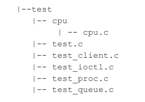	

在内核中增加目录和子目录时，我们需为相应的新增目录创建 Makefile 和 Kconfig 文件， 而新增目录的父目录中的 Kconfig 和 Makefile 也需修改，以便新增的 Kconfig 和 Makefile 能 被引用。

在新增的 test 目录下，应该包含如下 Kconfig 文件：

#

TEST driver conf iguration

```
#
menu "TEST Driver "
comment " TEST Driver"
conf ig CONF iG_TEST
 bool "TEST support "
conf ig CONF iG_TEST_USER
 tristate "TEST user-space interface"
 depends on CONF iG_TEST
endmenu
```

由于 test driver 对于内核来说是新功能，所以需首先创建一个菜单 TEST Driver。然后， 显示“ TEST support”，等待用户选择；接下来判断用户是否选择了 TEST Driver，如果选择了（CONFIG_TEST=y），则进一步显示子功能：用户接口与 CPU 功能支持；由于用户接口功 能可以被编译成内核模块，所以这里的询问语句使用了 tristate。

了（CONFIG_TEST=y），则进一步显示子功能：用户接口与 CPU 功能支持；由于用户接口功 能可以被编译成内核模块，所以这里的询问语句使用了 tristate。

```
source "drivers/test/Kconf ig"
```

脚本中的 source 意味着引用新的 Kconfig 文件。

在新增的 test 目录下，应该包含如下 Makefile 文件：

```
# drivers/test/Makef ile
#
# Makef ile for the TEST.
#
obj-$(CONF iG_TEST) += test.o test_queue.o test_client.o
obj-$(CONF iG_TEST_USER) += test_ioctl.o
obj-$(CONF iG_PROC_FS) += test_proc.o
obj-$(CONF iG_TEST_CPU) += cpu/

```

该脚本根据配置变量的取值，构建 obj-* 列表。由于 test 目录中包含一个子目录 cpu，因 此当 CONFIG_TEST_CPU=y 时，需要将 cpu 目录加入列表中。

test 目录中的 cpu 子目录也需包含如下 Makefile：

```
# drivers/test/test/Makef ile
#
# Makef ile for the TEST CPU
#
obj-$(CONF iG_TEST_CPU) += cpu.o
```

为了使得编译命令作用到能够整个 test 目录，test 目录的父目录中 Makefile 也需新增如 下脚本：

```
obj-$(CONF iG_TEST) += test/
```

在 drivers/Makefile 中加入 obj-$(CONFIG_TEST) += test/，使得用户在进行内核编译时能 够进入 test 目录。

增加了 Kconfig 和 Makefile 之后的新 test 树形目录为：

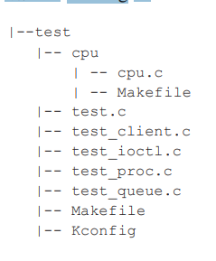	

#### 3.4.3 Linux 内核的引导

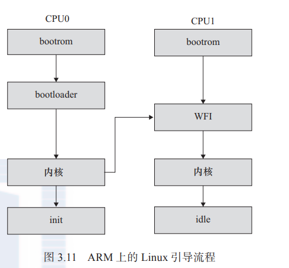	

引导 Linux 系统的过程包括很多阶段，这里将以引导 ARM Linux 为例来进行讲解（见 图 3.11）。一般的 SoC 内嵌入了 bootrom，上电时 bootrom 运行。对于 CPU0 而言，bootrom 会 去引导 bootloader，而其他 CPU 则判断自己是 不是 CPU0，进入 WFI 的状态等待 CPU0 来唤 醒它。CPU0 引导 bootloader，bootloader 引导 Linux 内核，在内核启动阶段，CPU0 会发中 断唤醒 CPU1，之后 CPU0 和 CPU1 都投入运 行。CPU0 导致用户空间的 init 程序被调用， init 程序再派生其他进程，派生出来的进程再 派生其他进程。CPU0 和 CPU1 共担这些负 载，进行负载均衡。

bootrom 是各个 SoC 厂家根据自身情 况 编 写 的， 目 前 的 SoC 一般都具有从 SD、 eMMC、NAND、USB 等 介 质 启 动 的 能 力， 这证明这些 bootrom 内部的代码具备读 SD、 NAND 等能力。

嵌入式 Linux 领域最著名的 bootloader 是 U-Boot，其代码仓库位于 http://git.denx.de/ u-boot.git/。早前，bootloader 需要将启动信息以 ATAG 的形式封装，并且把 ATAG 的地址填 充在 r2 寄存器中，机型号填充在 r1 寄存器中，详见内核文档 Documentation/arm/booting。在 ARM Linux 支持设备树（Device Tree）后，bootloader 则需要把 dtb 的地址放入 r2 寄存器中。 当然，ARM Linux 也支持直接把 dtb 和 zImage 绑定在一起的模式（内核 ARM_APPENDED_ DTB 选项“ Use appended device tree blob to zImage”），这样 r2 寄存器就不再需要填充 dtb 地 址了。

类似 zImage 的内核镜像实际上是由没有压缩的解压算法和被压缩的内核组成，所以在 bootloader 跳入 zImage 以后，它自身的解压缩逻辑就把内核的镜像解压缩出来了。关于内 核启动，与我们关系比较大的部分是每个平台的设备回调函数和设备属性信息，它们通常 包装在 DT_MACHINE_START 和 MACHINE_END 之 间， 包 含 reserve()、map_io()、init_ machine()、init_late()、smp 等回调函数或者属性。这些回调函数会在内核启动过程中被调用。 后续章节会进一步介绍。

用户空间的 init 程序常用的有 busybox init、SysVinit、systemd 等，它们的职责类似，把 整个系统启动，最后形成一个进程树，比如 Ubuntu 上运行的 pstree:


### 3.5 Linux 下的 C 编程特点

#### 3.5.1 Linux 编码风格

Linux 有独特的编码风格，在内核源代码下存在一个文件 Documentation/CodingStyle， 进行了比较详细的描述。

Linux 程序的命名习惯和 Windows 程序的命名习惯及著名的匈牙利命名法有很大的 不同。

在 Windows 程序中，习惯以如下方式命名宏、变量和函数：

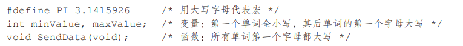	

这种命名方式在程序员中非常盛行，意思表达清晰且避免了匈牙利法的臃肿，单词之间 通过首字母大写来区分。通过第 1 个单词的首字母是否大写可以区分名称属于变量还是属 于函数，而看到整串的大写字母可以断定为宏。实际上，Windows 的命名习惯并非仅限于 Windows 编程，许多领域的程序开发都遵照此习惯。

但是 Linux 不以这种习惯命名，对于上面的一段程序，在 Linux 中它会被命名为：

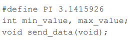	

在上述命名方式中，下划线大行其道，不按照 Windows 所采用的用首字母大写来区分单词的方式。Linux 的命名习惯与 Windows 命名习惯各有千秋，但是既然本书和本书的读者立 足于编写 Linux 程序，代码风格理应与 Linux 开发社区保持一致。

Linux 的代码缩进使用“TAB”。

Linux 中代码括号“{”和“}”的使用原则如下。

1）对于结构体、if/for/while/switch 语句，“{”不另起一行，例如：

```
struct var_data {
 int len;
 char data[0];
};
if (a == b) {
 a = c;
 d = a;
}
for (i = 0; i < 10; i++) {
 a = c;
 d = a;
}
```

2）如果 if、for 循环后只有 1 行，不要加“{”和“}”，例如：

```
for (i = 0; i < 10; i++) {
 a = c;
}
应该改为：
for (i = 0; i < 10; i++)
 a = c;
```

3）if 和 else 混用的情况下，else 语句不另起一行，例如：

```
if (x == y) {
 ...
} else if (x > y) {
 ...
} else {
 ...
}
```

4）对于函数，“{”另起一行，譬如：

```
int add(int a, int b)
{
 return a + b;
}
```

在 switch/case 语句方面，Linux 建议 switch 和 case 对齐，例如：

```
switch (suff ix) {
case 'G':
case 'g':
 mem <<= 30;
 break;
case 'M':
case 'm':
 mem <<= 20;
 break;
case 'K':
case 'k':
 mem <<= 10;
 /* fall through */
default:
 break;
}
```

内核下的 Documentation/CodingStyle 描述了 Linux 内核对编码风格的要求，内核下的 scripts/checkpatch.pl 提供了 1 个检查代码风格的脚本。如果使用 scripts/checkpatch.pl 检查包 含如下代码块的源程序：

```
for (i = 0; i < 10; i++) {
 a = c;
}
```

就会产生“WARNING: braces {} are not necessary for single statement blocks”的警告。 另外，请注意代码中空格的应用，譬如“ forٮ)iٮ=ٮ0; ٮiٮ>ٮ10; ٮi++)ٮ“}语句中的 。都是空格

在工程阶段，一般可以在 SCM 软件的服务器端使能 pre-commit hook，自动检查工程师 提交的代码是否符合 Linux 的编码风格，如果不符合，则自动拦截。git 的 pre-commit hook 可以运行在本地代码仓库中，如 Ben Dooks 完成的一个版本：

```
#!/bin/sh
#
# pre-commit hook to run check-patch on the output and stop any commits
# that do not pass. Note, only for git-commit, and not for any of the
# other scenarios
#
# Copyright 2010 Ben Dooks, <ben-linux@fluff.org>
if git rev-parse --verify HEAD 2>/dev/null >/dev/null
then
 against=HEAD
else
 # Initial commit: diff against an empty tree object
 against=4b825dc642cb6eb9a060e54bf8d69288fbee4904
f i
git diff --cached $against -- | ./scripts/checkpatch.pl --no-signoff -
```


#### 3.5.2 GNU C 与 ANSI C

Linux 上可用的 C 编译器是 GNU C 编译器，它建立在自由软件基金会的编程许可证的基 础上，因此可以自由发布。GNU C 对标准 C 进行一系列扩展，以增强标准 C 的功能。

\1. 零长度和变量长度数组

GNU C 允许使用零长度数组，在定义变长对象的头结构时，这个特性非常有用。例如：

```
struct var_data {
 int len;
 char data[0];
};
```

char data[0] 仅仅意味着程序中通过 var_data 结构体实例的 data[index] 成员可以访 问 len 之后的第 index 个地址，它并没有为 data[] 数 组 分 配 内 存， 因 此 sizeof(struct var_ data)=sizeof(int)。

假设 struct var_data 的数据域就保存在 struct var_data 紧接着的内存区域中，则通过如下 代码可以遍历这些数据：

```
struct var_data s;
...
for (i = 0; i < s.len; i++)
 printf("%02x", s.data[i]);
```

GNU C 中也可以使用 1 个变量定义数组，例如如下代码中定义的“double x[n]”：

```
int main (int argc, char *argv[])
{
 int i, n = argc;
 double x[n];
 for (i = 0; i < n; i++)
 x[i] = i;
 return 0;
}
```


\2. case 范围

GNU C 支持 case x…y 这样的语法，区间 [x,y] 中的数都会满足这个 case 的条件，请看 下面的代码：

```
switch (ch) {
case '0'... '9': c -= '0';
 break;
case 'a'... 'f': c -= 'a' - 10;
 break;
case 'A'... 'F': c -= 'A' - 10;
 break;
}
```

代码中的 case '0'... '9' 等价于标准 C 中的：

```
case '0': case '1': case '2': case '3': case '4':
case '5': case '6': case '7': case '8': case '9':
```


\3. 语句表达式

GNU C 把包含在括号中的复合语句看成是一个表达式，称为语句表达式，它可以出现在 任何允许表达式的地方。我们可以在语句表达式中使用原本只能在复合语句中使用的循环、 局部变量等，例如：

```
#def ine min_t(type,x,y) \
(｛type _ _x =(x);type _ _y = (y); _ _x<_ _y? _ _x: _ _y; })
int ia, ib, mini;
float fa, fb, minf;
mini = min_t(int, ia, ib);
minf = min_t(float, fa, fb);
```

因为重新定义了 _ _xx 和 _ _y 这两个局部变量，所以用上述方式定义的宏将不会有副作 用。在标准 C 中，对应的如下宏则会产生副作用：

```
#def ine min(x,y) ((x) < (y) ? (x) : (y))
```

代码 min(++ia,++ib) 会展开为 ((++ia) < (++ib) ? (++ia): (++ib))，传入宏的“参数”增加 两次。

\4. typeof 关键字

typeof(x) 语句可以获得 x 的类型，因此，可以借助 typeof 重新定义 min 这个宏：

```
#def ine min(x,y) ({ \
 const typeof(x) _x = (x); \
 const typeof(y) _y = (y); \
 (void) (&_x == &_y); \
 _x < _y ? _x : _y; })
```

我们不需要像 min_t(type,x,y) 那个宏那样把 type 传入，因为通过 typeof(x)、typeof(y) 可 以获得 type。代码行 (void) (&_x == &_y) 的作用是检查 _x 和 _y 的类型是否一致。

\5. 可变参数宏

标准 C 就支持可变参数函数，意味着函数的参数是不固定的，例如 printf() 函数的原 型为：

```
int printf( const char *format [, argument]... );
```

而在 GNU C 中，宏也可以接受可变数目的参数，例如：

```
#def ine pr_debug(fmt,arg...) \
 printk(fmt,##arg)
```

这里 arg 表示其余的参数，可以有零个或多个参数，这些参数以及参数之间的逗号构成 arg 的值，在宏扩展时替换 arg，如下列代码：

```
pr_debug("%s:%d",f ilename,line)
```

会被扩展为：

```
printk("%s:%d", f ilename, line)
```

使用“##”是为了处理 arg 不代表任何参数的情况，这时候，前面的逗号就变得多余了。使用“##”之后，GNU C 预处理器会丢弃前面的逗号，这样，下列代

```
pr_debug("success!\n")
```

会被正确地扩展为：

```
printk("success!\n")
```

而不是：

```
printk("success!\n",)
```

这正是我们希望看到的。


\6. 标号元素

标准 C 要求数组或结构体的初始化值必须以固定的顺序出现，在 GNU C 中，通过指定 索引或结构体成员名，允许初始化值以任意顺序出现。

指定数组索引的方法是在初始化值前添加“ [INDEX] =”，当然也可以用“ [FIRST ... LAST] =”的形式指定一个范围。例如，下面的代码定义了一个数组，并把其中的所有元素 赋值为 0：

```
unsigned char data[MAX] = { [0 ... MAX-1] = 0 };
```

下面的代码借助结构体成员名初始化结构体：

```
struct f ile_operations ext2_f ile_operations = {
 llseek: generic_f ile_llseek,
 read: generic_f ile_read,
 write: generic_f ile_write,
 ioctl: ext2_ioctl,
 mmap: generic_f ile_mmap,
 open: generic_f ile_open,
 release: ext2_release_f ile,
 fsync: ext2_sync_f ile,
};
```

但是，Linux 2.6 推荐类似的代码应该尽量采用标准 C 的方式：

```
struct f ile_operations ext2_f ile_operations = {
 .llseek = generic_f ile_llseek,
 .read = generic_f ile_read,
 .write = generic_f ile_write,
 .aio_read = generic_f ile_aio_read,
 .aio_write = generic_f ile_aio_write,
 .ioct = ext2_ioctl,
 .mmap = generic_f ile_mmap,
 .open = generic_f ile_open,
 .release = ext2_release_f ile,
 .fsync = ext2_sync_f ile,
 .readv = generic_f ile_readv,
 .writev = generic_f ile_writev,
 .sendf ile = generic_f ile_sendf ile,
};
```

\7. 当前函数名

GNU C 预定义了两个标识符保存当前函数的名字，_ _FUNCTION_ _ 保存函数在源码中 的名字，_ _PRETTY_FUNCTION_ _ 保存带语言特色的名字。在 C 函数中，这两个名字是相 同的。

```
void example()
{
 printf("This is function:%s", _ _FUNCTION_ _);
}
```

代码中的 _ _FUNCTION_ _ 意味着字符串“ example”。C99 已经支持 _ _func_ _ 宏，因 此建议在 Linux 编程中不再使用 _ _FUNCTION_ _，而转而使用 _ _func_ _：

\8. 特殊属性声明

GNU C 允许声明函数、变量和类型的特殊属性，以便手动优化代码和定制代码检查的 方法。要指定一个声明的属性，只需要在声明后添加 _ _attribute_ _ (( ATTRIBUTE ))。其 中 ATTRIBUTE 为属性说明，如果存在多个属性，则以逗号分隔。GNU C 支持 noreturn、 format、section、aligned、packed 等十多个属性。

noreturn 属性作用于函数，表示该函数从不返回。这会让编译器优化代码，并消除不必 要的警告信息。例如：

```
# def ine ATTRIB_NORET _ _attribute_ _((noreturn)) ....
asmlinkage NORET_TYPE void do_exit(long error_code) ATTRIB_NORET;
```

format 属性也用于函数，表示该函数使用 printf、scanf 或 strftime 风格的参数，指定 format 属性可以让编译器根据格式串检查参数类型。例如：

```
asmlinkage int printk(const char * fmt, ...) _ _attribute_ _ ((format (printf, 1, 2)));
```

上述代码中的第 1 个参数是格式串，从第 2 个参数开始都会根据 printf() 函数的格式串规 则检查参数。

unused 属性作用于函数和变量，表示该函数或变量可能不会用到，这个属性可以避免编 译器产生警告信息。

ligned 属性用于变量、结构体或联合体，指定变量、结构体或联合体的对齐方式，以字 节为单位，例如：

```
struct example_struct {
 char a;
 int b;
 long c;
} _ _attribute_ _((aligned(4)));
```

表示该结构类型的变量以 4 字节对齐。

packed 属性作用于变量和类型，用于变量或结构体成员时表示使用最小可能的对齐，用 于枚举、结构体或联合体类型时表示该类型使用最小的内存。例如：

```
struct example_struct {
 char a;
 int b;
 long c _ _attribute_ _((packed));
};
```

```
编译器对结构体成员及变量对齐的目的是为了更快地访问结构体成员及变量占据的内
存。例如，对于一个 32 位的整型变量，若以 4 字节方式存放（即低两位地址为 00），
则 CPU 在一个总线周期内就可以读取 32 位；否则，CPU 需要两个总线周期才能读
取 32 位。
```

\9. 内建函数

GNU C 提供了大量内建函数，其中大部分是标准 C 库函数的 GNU C 编译器内建版本， 例如 memcpy() 等，它们与对应的标准 C 库函数功能相同。

不属于库函数的其他内建函数的命名通常以 _ _builtin 开始，如下所示。

● 内建函数 _ _builtin_return_address (LEVEL) 返回当前函数或其调用者的返回地址，参 数 LEVEL 指定调用栈的级数，如 0 表示当前函数的返回地址，1 表示当前函数的调 用者的返回地址。

 内建函数 _ _builtin_constant_p(EXP) 用于判断一个值是否为编译时常数，如果参数 EXP 的值是常数，函数返回 1，否则返回 0。

例如，下面的代码可检测第 1 个参数是否为编译时常数以确定采用参数版本还是非参数 版本：

```
#def ine test_bit(nr,addr) \
(_ _builtin_constant_p(nr) ? \
constant_test_bit((nr),(addr)) : \
variable_test_bit((nr),(addr)))
```

● 内建函数 _ _builtin_expect(EXP, C) 用于为编译器提供分支预测信息，其返回值是整数 表达式 EXP 的值，C 的值必须是编译时常数。

Linux 内核编程时常用的 likely() 和 unlikely() 底层调用的 likely_notrace()、unlikely_ notrace() 就是基于 _ _builtin_expect(EXP, C) 实现的。

```
#def ine likely_notrace(x) __builtin_expect(!!(x), 1)
#def ine unlikely_notrace(x) __builtin_expect(!!(x), 0)
```

若代码中出现分支，则即可能中断流水线，我们可以通过 likely() 和 unlikely() 暗示分支 容易成立还是不容易成立，例如：

```
if (likely(!IN_DEV_ROUTE_LOCALNET(in_dev)))
 if (ipv4_is_loopback(saddr))
 goto e_inval;
```

在使用 gcc 编译 C 程序的时候，如果使用“-ansi –pedantic”编译选项，则会告诉编译器 不使用 GNU 扩展语法。例如对于如下 C 程序 test.c：

```
struct var_data {
 int len;
 char data[0];
};
struct var_data a;
```

如果使用“-ansi –pedantic”编译选项，编译会报警：

```
gcc -ansi -pedantic -c test.c
test.c:3: warning: ISO C forbids zero-size array 'data'

```

3.5.3 do { } while(0) 语句

在 Linux 内核中，经常会看到 do {} while(0) 这样的语句，许多人开始都会疑惑，认为 do {} while(0) 毫无意义，因为它只会执行一次，加不加 do {} while(0) 效果是完全一样的， 其实 do {} while(0) 的用法主要用于宏定义中。

这里用一个简单的宏来演示：

```
#def ine SAFE_FREE(p) do{ free(p); p = NULL;} while(0)
```

假设这里去掉 do...while(0)，即定义 SAFE_DELETE 为：

```
#def ine SAFE_FREE(p) free(p); p = NULL;
```

那么以下代码：

```
if(NULL != p)
 SAFE_DELETE(p)
else
 .../* do something */
```

展开的代码中存在两个问题：

1）因为 if 分支后有两个语句，导致 else 分支没有对应的 if，编译失败。

2）假设没有 else 分支，则 SAFE_FREE 中的第二个语句无论 if 测试是否通过，都会执行。

的确，将 SAFE_FREE 的定义加上 {} 就可以解决上述问题了，即：

```
#def ine SAFE_FREE(p) { free(p); p = NULL;}
```

这样，代码：

```
if(NULL != p)
 SAFE_DELETE(p)
else
 ... /* do something */
```

但是，在 C 程序中，在每个语句后面加分号是一种约定俗成的习惯，那么，如下代码：

```
if(NULL != p)
 SAFE_DELETE(p);
else
 ... /* do something */
```

将被扩展为：

```
if(NULL != p)
 { free(p); p = NULL; };
else
 ... /* do something */
```

这样，else 分支就又没有对应的 if 了，编译将无法通过。假设用了 do {} while(0) 语句， 情况就不一样了，同样的代码会被展开为：

```
if(NULL != p)
 do{ free(p); p = NULL;} while(0);
else
 ... /* do something */
```

而不会再出现编译问题。do{} while(0) 的使用完全是为了保证宏定义的使用者能无编译错误 地使用宏，它不对其使用者做任何假设。


3.5.4 goto 语句

用不用 goto 一直是一个著名的争议话题，Linux 内核源代码中对 goto 的应用非常广泛， 但是一般只限于错误处理中，其结构如：

```
if(register_a()!=0)
 goto err;
if(register_b()!=0)
 goto err1;
if(register_c()!=0)
 goto err2;
if(register_d()!=0)
 goto err3;
...
err3:
 unregister_c();
err2:
 unregister_b();
err1:
 unregister_a();
err:
 return ret; 
```

这种将 goto 用于错误处理的用法实在是简单而高效，只需保证在错误处理时注销、资源 释放等，与正常的注册、资源申请顺序相反。


### 3.6　工具链

在 Linux 的编程中，通常使用 GNU 工具链编译 Bootloader、内核和应用程序。GNU 组 织维护了 GCC、GDB、glibc、Binutils 等， 分 别 见 于 https://gcc.gnu.org/，https://www.gnu. org/software/gdb/, https://www.gnu.org/software/libc/、https://www.gnu.org/software/binutils/。

建立交叉工具链的过程相当烦琐，一般可以通过类似 crosstool-ng 这样的工具来做。

crosstool-ng 也采用了与内核相似的 menuconfig 配置方法。在官网 http://www.crosstool-ng. org/ 上下载 crosstool-ng 的源代码并编译安装后，运行 ct-ng menuconfig，会出现如图 3.12 的 配置菜单。在里面我们可以选择目标机处理器型号，支持的内核版本号等。

当然，也可以直接下载第三方编译好的、开放的、针对目标处理器的交叉工具链，如 在 http://www.mentor.com/embedded-software/sourcery-tools/sourcery-codebench/editions/liteedition/ 上可以下载针对 ARM、MIPS、高通 Hexagon、Altera Nios II、Intel、AMD64 等处理 器的工具链，在 http://www.linaro.org/downloads/ 可以下载针对 ARM 的工具链。

目前，在 ARM Linux 的开发中，人们趋向于使用 Linaro（http://www.linaro.org/）工具链 团队维护的 ARM 工具链，它以每月一次的形式发布新的版本，编译好的可执行文件可从网 址 http://www.linaro.org/downloads/ 下载。Linaro 是 ARM Linux 领域中最著名最具技术成就 的开源组织，其会员包括 ARM、Broadcom、Samsung、TI、Qualcomm 等，国内的海思、中兴、 全志和中国台湾的 MediaTek 也是它的会员。

一个典型的 ARM Linux 工具链包含 arm-linux-gnueabihf-gcc（后续工具省略前缀）、strip、 gcc、objdump、ld、gprof、nm、readelf、addr2line 等。用 strip 可以删除可执行文件中的符 号表和调试信息等来实现缩减程序体积的目的。gprof 在编译过程中在函数入口处插入计数器 以收集每个函数的被调用情况和被调用次数，检查程序计数器并在分析时找出与程序计数器 对应的函数来统计函数占用的时间。objdump 是反汇编工具。nm 则用于显示关于对象文件、 可执行文件以及对象文件库里的符号信息。其中，前缀中的“ hf”显示该工具链是完全的硬 浮点，由于目前主流的 ARM 芯片都自带 VFP 或者 NEON 等浮点处理单元（FPU），所以对硬 浮点的需求就更加强烈。Linux 的浮点处理可以采用完全软浮点，也可以采用与软浮点兼容， 但是使用 FPU 硬件的 softfp，以及完全硬浮点。具体的 ABI（Application Binary Interface，应 用程序二进制接口）通过 -mfloat-abi= 参数指定，3 种情况下的参数分别是 -mfloat-abi=soft/ softfp/hard。

在以前，主流的工具链采用“与软浮点兼容，但是使用 FPU 硬件的 softfp”。 softfp 使用了硬件的 FPU，但是函数的参数仍然使用整型寄存器来传递，完全硬浮点则直接使用 FPU 的寄存器传递参数。

关注其中加粗的行，可以看出前面的汇编使用 s0 和 s1 传递参数，后者则仍然使用 ARM 的 r0 和 r1。测试显示一个含有浮点运算的程序若使用 hard ABI 会 比 softfp ABI 快 5% ～ 40%，如果浮点负载重，结果可能会快 200% 以上。


## 第四章 linux内核模块


### 4.1 linux内核模块简介

lsmod可以查看已经加载的模块，它实际上是读取并分析/proc/modules文件。内核已加载的模块的信息也存在于sys/modle目录下

### 4.2 linux内核模块程序结构

1. 模块加载
2. 模块卸载
3. 模块许可证声明
4. 模块参数
5. 模块导出符号
6. 模块作者信息


## 第五章 111p

（细读）

## 第六章 字符设备驱动

### 6.1字符设备驱动结构

